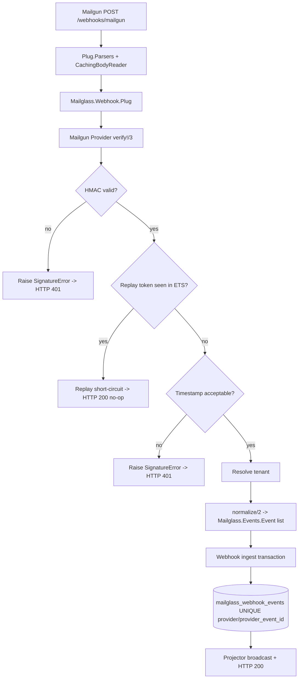

# Phase 15: Mailgun Webhook Provider - Research

**Researched:** 2026-04-28
**Domain:** Mailgun webhook verification, replay defense, and normalized event mapping
**Confidence:** HIGH

<user_constraints>
## User Constraints (from CONTEXT.md)

### Locked Decisions
### Signature and Replay Strategy
- **D-01:** Implement Mailgun verification natively with `:crypto` HMAC-SHA256 over `timestamp <> token`, using the signing fields embedded in the JSON body. Do not add a third-party Mailgun webhook dependency.
- **D-02:** Replay protection should use a supervised local ETS cache as the primary guard inside `verify!/3`, with Mailgun `token` as the replay key. This matches mailglass's existing OTP/ETS style and keeps replay rejection off the DB hot path.
- **D-03:** Mailgun `token` should also become the durable `provider_event_id` written into `mailglass_webhook_events`, so the existing UNIQUE `(provider, provider_event_id)` constraint remains a secondary backstop for restarts and cross-node duplicates.
- **D-04:** Timestamp validation is required, but it is a sanity/expiry guard rather than the primary replay defense. Do not transplant Stripe/Svix-style aggressive 300-second recency as the default because Mailgun does not document the same retry-signing semantics. Default to a configurable, generous expiration window that is compatible with Mailgun retries, while keeping a strict future-skew check.
- **D-05:** Detected Mailgun replay must NOT be modeled as a normal `SignatureError` that becomes HTTP `401`. Mailgun retries non-`200`/non-`406` responses for hours, so replay handling must short-circuit with a non-retrying outcome. Prefer `200` as an idempotent no-op, aligned with the existing duplicate-ingest behavior.

### Route and Config Surface
- **D-06:** Keep `mailglass_webhook_routes "/webhooks"` behavior stable. Mailgun support should be opt-in via an explicit `providers: [...]` list rather than silently expanding the zero-arg default mount set.
- **D-07:** Installer/docs should do the thinking for adopters: when Mailgun is selected, emit the explicit provider list and config snippet, rather than asking adopters to infer the required router changes themselves.

### Event Mapping Breadth
- **D-08:** Use a broader but conservative normalized core, not a minimal three-event mapping. Mailgun should contribute stable lifecycle signal where semantics are clear, while preserving raw provider fields for anything ambiguous.
- **D-09:** Map stable Mailgun lifecycle states into the existing normalized taxonomy:
  - `accepted` -> `:queued`
  - `delivered` -> `:delivered`
  - `failed` with `severity: "temporary"` -> `:deferred`
  - `failed` with `severity: "permanent"` and recipient/MTA terminal failures -> `:bounced`
  - `failed` with `severity: "permanent"` and suppression/policy-style reasons -> `:rejected`
  - `opened` -> `:opened`
  - `clicked` -> `:clicked`
  - `complained` -> `:complained`
  - `unsubscribed` -> `:unsubscribed`
- **D-10:** Do not overfit every Mailgun nuance into a fake cross-provider abstraction. When reason mapping is genuinely ambiguous, preserve the raw Mailgun reason/details in metadata and fall back conservatively instead of inventing precise normalized meanings.

### Developer Experience Defaults
- **D-11:** Downstream agents should bias toward agent-led research and recommended defaults, not bounce gray-area analysis back to the user unless a decision is likely to materially affect public API, product shape, or long-term project direction.

### Claude's Discretion
- Exact module names and supervision shape for the Mailgun replay cache.
- Exact config key names for signing key and replay/timestamp tolerances.
- Exact internal representation of ambiguous Mailgun failure reasons in metadata.
- Final choice of replay short-circuit plumbing (`:ok` sentinel vs dedicated replay outcome type) so long as it avoids retry amplification and preserves clear telemetry/logging.

### Deferred Ideas (OUT OF SCOPE)
- Cluster-wide replay rejection before ingest (for example via Redis or another distributed cache) — out of scope for Phase 15 unless needed to satisfy a later milestone.
- Additional helper APIs for "all configured providers" route mounting — avoid new macro surface unless later UX evidence justifies it.
- Provider-specific analytics or richer Mailgun-only event projections beyond the stable normalized core.
</user_constraints>

<phase_requirements>
## Phase Requirements

| ID | Description | Research Support |
|----|-------------|------------------|
| MAILGUN-01 | Webhook plug verifies HMAC-SHA256 signature using `timestamp`, `token`, and webhook signing key. | Use native `:crypto.mac/4` against `signature.timestamp <> signature.token`, sourced from the JSON body, with the Mailgun HTTP signing key from config. [CITED: https://documentation.mailgun.com/docs/mailgun/user-manual/events/webhooks] |
| MAILGUN-02 | Token caching mechanism prevents replay attacks for previously verified tokens. | Use a supervised local ETS cache keyed by Mailgun token, with DB uniqueness on `(provider, provider_event_id)` as restart backstop. Mailgun explicitly recommends local token caching to prevent replay. [CITED: https://documentation.mailgun.com/docs/mailgun/user-manual/events/webhooks] [VERIFIED: codebase grep] |
| MAILGUN-03 | Webhook maps Mailgun events to `mailglass` normalized taxonomy. | Map `accepted`, `delivered`, `opened`, `clicked`, `complained`, `unsubscribed`, and `failed` using `event-data.event`, `severity`, and reason metadata, preserving ambiguous provider details in metadata. [CITED: https://documentation.mailgun.com/docs/mailgun/user-manual/webhooks/webhooks] [CITED: https://documentation.mailgun.com/docs/mailgun/user-manual/events/events] [CITED: https://documentation.mailgun.com/docs/mailgun/user-manual/reporting/metric-definitions] |
</phase_requirements>

## Project Constraints (from CLAUDE.md)

- Use the existing internal `Mailglass.Webhook.Provider` behaviour and keep the verifier `Conn`-free. [VERIFIED: codebase grep]
- Do not add a Node toolchain or unrelated third-party dependency for this phase; the repo standard is low-dependency native OTP/Phoenix code. [VERIFIED: codebase grep]
- Treat errors as typed public API; match on structs and atoms, not messages. [CITED: /Users/jon/projects/mailglass/CLAUDE.md]
- Never put PII in telemetry or logs; webhook telemetry/logging must stay limited to provider, status, reason, counts, IDs, and timings. [CITED: /Users/jon/projects/mailglass/CLAUDE.md] [VERIFIED: codebase grep]
- Multi-tenancy remains first-class; webhook tenant resolution still runs after verification. [CITED: /Users/jon/projects/mailglass/CLAUDE.md] [VERIFIED: codebase grep]
- Do not recover forged webhook requests into business success paths, but do preserve idempotent duplicate behavior where the project already treats duplicates as `200`. [CITED: /Users/jon/projects/mailglass/CLAUDE.md] [VERIFIED: codebase grep]
- Only `Mailglass.Config` should define validated runtime config shape; provider config additions belong there. [CITED: /Users/jon/projects/mailglass/CLAUDE.md] [VERIFIED: codebase grep]
- `Mailglass.Clock.utc_now/0` is the only valid wall-clock source. [CITED: /Users/jon/projects/mailglass/CLAUDE.md] [VERIFIED: codebase grep]

## Summary

Mailgun’s current webhook contract is a JSON payload with top-level `"signature"` and `"event-data"` objects, where authenticity is verified by HMAC-SHA256 over `timestamp <> token` using the account webhook signing key. Mailgun explicitly documents local token caching as the replay defense and warns against being too aggressive with timestamp recency because webhook processing delays can occur outside its control. [CITED: https://documentation.mailgun.com/docs/mailgun/user-manual/events/webhooks]

This repo already has the right extension points for the phase: `Mailglass.Webhook.Provider` separates verification from normalization, `Mailglass.Webhook.Plug` centralizes response behavior, `Mailglass.Webhook.WebhookEvent` already enforces UNIQUE `(provider, provider_event_id)`, and the codebase already uses supervised ETS table owners plus `Mailglass.Clock` for testable time-sensitive logic. [VERIFIED: codebase grep]

The planning-critical nuance is response semantics. Mailgun retries webhook POSTs for non-`200` and non-`406` responses for hours, so replay detection cannot fall through the current generic `SignatureError -> 401` path. Replays should short-circuit as successful no-ops, while true signature failures remain unauthorized. [CITED: https://documentation.mailgun.com/docs/mailgun/user-manual/events/webhooks] [VERIFIED: codebase grep]

**Primary recommendation:** Implement `Mailglass.Webhook.Providers.Mailgun` plus a supervised ETS replay cache, add a replay-aware `200` short-circuit in `Mailglass.Webhook.Plug`, keep Mailgun router support explicit via `providers: [:mailgun]`, and extend config/docs/tests around those exact seams. [CITED: https://documentation.mailgun.com/docs/mailgun/user-manual/events/webhooks] [VERIFIED: codebase grep]

## Architectural Responsibility Map

| Capability | Primary Tier | Secondary Tier | Rationale |
|------------|-------------|----------------|-----------|
| Mailgun signature verification | API / Backend | — | Verification depends on the raw request body, secret config, and OTP crypto, all of which already live in the provider layer. [CITED: https://documentation.mailgun.com/docs/mailgun/user-manual/events/webhooks] [VERIFIED: codebase grep] |
| Replay token cache | API / Backend | Database / Storage | The fast path should reject replays in-process via ETS, while the existing DB uniqueness constraint remains the durable fallback across restarts. [CITED: https://documentation.mailgun.com/docs/mailgun/user-manual/events/webhooks] [VERIFIED: codebase grep] |
| Duplicate/replay HTTP response policy | API / Backend | — | `Mailglass.Webhook.Plug` owns status-code mapping today, and Mailgun retry behavior makes this tier responsible for retry amplification control. [CITED: https://documentation.mailgun.com/docs/mailgun/user-manual/events/webhooks] [VERIFIED: codebase grep] |
| Event normalization | API / Backend | Database / Storage | Mapping from provider payload to `Mailglass.Events.Event` is provider-module logic, while normalized rows are persisted later in ingest. [CITED: https://documentation.mailgun.com/docs/mailgun/user-manual/events/events] [VERIFIED: codebase grep] |
| Provider event dedupe persistence | Database / Storage | API / Backend | `mailglass_webhook_events` already owns durable uniqueness for `provider_event_id`; the provider must supply a stable key. [VERIFIED: codebase grep] |
| Router opt-in and installer snippets | Frontend Server (SSR) | API / Backend | Phoenix router macros and generated installer snippets define the public mount surface even though request handling occurs in backend modules. [VERIFIED: codebase grep] |
| Runtime config schema | API / Backend | — | Provider config is validated centrally in `Mailglass.Config`, not ad hoc in controllers or docs. [VERIFIED: codebase grep] |

## Standard Stack

### Core
| Library | Version | Purpose | Why Standard |
|---------|---------|---------|--------------|
| Erlang/OTP `:crypto` | OTP 28 locally; project targets OTP-compatible Elixir `~> 1.18`. [VERIFIED: local runtime] [VERIFIED: codebase grep] | Compute Mailgun’s HMAC-SHA256 signature natively with no new dependency. [CITED: https://documentation.mailgun.com/docs/mailgun/user-manual/events/webhooks] | Existing providers already use native OTP crypto; this keeps the verifier dependency-free and consistent with the repo’s house style. [VERIFIED: codebase grep] |
| Erlang/OTP `:ets` | OTP 28 locally. [VERIFIED: local runtime] | Hold replay tokens in a supervised in-memory cache. [CITED: https://documentation.mailgun.com/docs/mailgun/user-manual/events/webhooks] | The codebase already uses supervised ETS owners for hot-path state and tests know how to work with that pattern. [VERIFIED: codebase grep] |
| `plug` | 1.19.1, published 2025-12-09. [VERIFIED: mix hex.info] [VERIFIED: hex.pm API] | `Mailglass.Webhook.Plug` owns status-code behavior and raw-body request handling integration. [VERIFIED: codebase grep] | Already locked and current on Hex in this repo; no new web layer should be introduced. [VERIFIED: mix hex.info] |
| `phoenix` | 1.8.5, published 2026-03-05. [VERIFIED: mix hex.info] [VERIFIED: hex.pm API] | Router macro integration for explicit Mailgun route mounting. [VERIFIED: codebase grep] | Existing webhook surface is a Phoenix router macro; extending that surface is the standard path. [VERIFIED: codebase grep] |

### Supporting
| Library | Version | Purpose | When to Use |
|---------|---------|---------|-------------|
| `jason` | 1.4.4, published 2024-07-26. [VERIFIED: mix hex.info] [VERIFIED: hex.pm API] | Decode the Mailgun JSON payload for signature field extraction and normalization. [CITED: https://documentation.mailgun.com/docs/mailgun/user-manual/events/webhooks] | Use inside the Mailgun provider because Mailgun’s current webhook payload is JSON, unlike Postmark Basic Auth or SendGrid header-driven verification. [CITED: https://documentation.mailgun.com/docs/mailgun/user-manual/events/webhooks] |
| `nimble_options` | 1.1.1, published 2024-05-25. [VERIFIED: mix hex.info] [VERIFIED: hex.pm API] | Extend validated runtime config for Mailgun signing key and replay/timestamp tolerances. [VERIFIED: codebase grep] | Use in `Mailglass.Config` for additive provider config keys. [VERIFIED: codebase grep] |
| `Mailglass.Clock` | repo-local module. [VERIFIED: codebase grep] | Time comparisons for timestamp expiry and future skew checks. [VERIFIED: codebase grep] | Use anywhere timestamp logic is implemented so tests can freeze time. [VERIFIED: codebase grep] |

### Alternatives Considered
| Instead of | Could Use | Tradeoff |
|------------|-----------|----------|
| Native `:crypto` verification | Third-party Mailgun webhook library | Rejected because the phase context explicitly forbids a new dependency and the official algorithm is a small HMAC over `timestamp <> token`. [CITED: https://documentation.mailgun.com/docs/mailgun/user-manual/events/webhooks] |
| Local ETS replay cache | DB-first replay table or distributed cache | DB-first adds hot-path write latency and distributed cache is explicitly deferred out of scope; ETS + DB uniqueness matches the locked design. [VERIFIED: codebase grep] |
| Explicit `providers: [:mailgun]` opt-in | Expanding `mailglass_webhook_routes "/webhooks"` defaults | Changing the zero-arg default would be a public router behavior change and contradict the phase context. [VERIFIED: codebase grep] |

**Installation:**
```bash
# No new package is recommended for this phase.
# Reuse the existing Phoenix/Plug/Jason/NimbleOptions stack already locked in mix.lock.
```

## Architecture Patterns

### System Architecture Diagram



### Recommended Project Structure
```text
lib/mailglass/webhook/
├── providers/mailgun.ex            # Mailgun verify!/3 + normalize/2
├── providers/mailgun_replay_cache.ex  # ETS-backed replay API
├── providers/mailgun_replay_cache/
│   ├── supervisor.ex               # Optional isolated supervisor wrapper
│   └── table_owner.ex              # ETS named table owner
├── plug.ex                         # Replay-aware response branch
└── router.ex                       # :mailgun validation + explicit opt-in support

test/mailglass/webhook/
├── providers/mailgun_test.exs      # verify!/3 + normalize/2 unit coverage
├── plug_mailgun_test.exs           # replay/response integration cases
└── router_test.exs                 # compile-time provider list validation

test/support/fixtures/webhooks/mailgun/
└── *.json                          # payload-only Mailgun webhook fixtures
```

### Pattern 1: Verify JSON Body Before Tenant Resolution
**What:** Decode the raw JSON body once inside the Mailgun provider, extract `signature.timestamp`, `signature.token`, and `signature.signature`, verify HMAC, then perform replay/timestamp checks before any tenant lookup. [CITED: https://documentation.mailgun.com/docs/mailgun/user-manual/events/webhooks] [VERIFIED: codebase grep]

**When to use:** Always for Mailgun webhook requests because Mailgun signs values embedded in the JSON payload, not HTTP headers. [CITED: https://documentation.mailgun.com/docs/mailgun/user-manual/events/webhooks]

**Example:**
```elixir
# Source: https://documentation.mailgun.com/docs/mailgun/user-manual/events/webhooks
def verify!(raw_body, _headers, config) do
  payload = Jason.decode!(raw_body)
  signing_key = fetch_signing_key!(config)

  %{"signature" => %{"timestamp" => ts, "token" => token, "signature" => sig}} = payload

  expected =
    :crypto.mac(:hmac, :sha256, signing_key, ts <> token)
    |> Base.encode16(case: :lower)

  unless Plug.Crypto.secure_compare(expected, sig) do
    raise SignatureError.new(:bad_signature, provider: :mailgun)
  end

  :ok
end
```

### Pattern 2: Replay Cache as Fast Path, DB Uniqueness as Backstop
**What:** Insert the Mailgun token into a local ETS table after signature verification and reject previously seen tokens as replay; continue to persist the same token as `provider_event_id` so DB uniqueness still protects restarts and race windows. [CITED: https://documentation.mailgun.com/docs/mailgun/user-manual/events/webhooks] [VERIFIED: codebase grep]

**When to use:** Use on every verified Mailgun request. ETS is for hot-path replay suppression; the DB unique index is for crash/restart/double-insert durability. [VERIFIED: codebase grep]

**Example:**
```elixir
# Source: Mailgun replay guidance + existing ETS table-owner pattern
case Mailglass.Webhook.Providers.MailgunReplayCache.put_new(token, received_at) do
  :ok -> :ok
  :replay -> {:replay, token}
end
```

### Pattern 3: Conservative Failure Mapping
**What:** Normalize stable lifecycle states directly, but for `failed` events use `severity` and provider reason details to choose between `:deferred`, `:bounced`, and `:rejected`, preserving the raw Mailgun fields in metadata when semantics are not exact. [CITED: https://documentation.mailgun.com/docs/mailgun/user-manual/events/events] [CITED: https://documentation.mailgun.com/docs/mailgun/user-manual/reporting/metric-definitions]

**When to use:** Any `event-data.event == "failed"` webhook. [CITED: https://documentation.mailgun.com/docs/mailgun/user-manual/events/events]

### Anti-Patterns to Avoid
- **Replay as `401`:** This turns harmless duplicates into provider retries for hours and contradicts the existing idempotent duplicate posture. [CITED: https://documentation.mailgun.com/docs/mailgun/user-manual/events/webhooks] [VERIFIED: codebase grep]
- **Using `event-data.id` as durable dedupe key:** Mailgun documents that event IDs are unique only within a day; Anymail also normalizes on the webhook token instead. [CITED: https://documentation.mailgun.com/docs/mailgun/user-manual/events/event-structure] [CITED: https://anymail.dev/en/v14.0/esps/mailgun/] 
- **Aggressive 300-second default tolerance:** Mailgun explicitly warns not to be too aggressive because delays can happen outside its control. [CITED: https://documentation.mailgun.com/docs/mailgun/user-manual/events/webhooks]
- **Changing zero-arg router defaults:** `mailglass_webhook_routes "/webhooks"` currently means Postmark + SendGrid only, and tests already encode that contract. [VERIFIED: codebase grep]
- **Using `System.system_time/1` or `DateTime.utc_now/0` in verifier code:** This bypasses the project’s clock abstraction and weakens testability. [CITED: /Users/jon/projects/mailglass/CLAUDE.md] [VERIFIED: codebase grep]

## Don't Hand-Roll

| Problem | Don't Build | Use Instead | Why |
|---------|-------------|-------------|-----|
| Mailgun signature verification | Generic abstraction layer or third-party dependency | Native `:crypto.mac/4` + repo-standard `SignatureError` flow | The official algorithm is a simple HMAC over `timestamp <> token`, and the phase context explicitly prefers native crypto. [CITED: https://documentation.mailgun.com/docs/mailgun/user-manual/events/webhooks] |
| Cross-node replay cache | Distributed replay system in this phase | Local supervised ETS + DB uniqueness backstop | Distributed replay is explicitly deferred; the phase only needs single-node fast-path defense plus durable uniqueness. [VERIFIED: codebase grep] |
| Exact cross-provider failure taxonomy for every Mailgun reason | Broad custom translation matrix | Conservative normalized mapping plus raw metadata retention | Mailgun exposes nuanced failure reasons and even treats some soft bounces as permanent metrics later; over-normalizing would create false precision. [CITED: https://documentation.mailgun.com/docs/mailgun/user-manual/reporting/metric-definitions] |
| Automatic router/provider inference | Magic installer/router behavior | Explicit `providers: [...]` list in router and generated snippets | The current public route surface is explicit and stable; silent expansion would be surprising API behavior. [VERIFIED: codebase grep] |

**Key insight:** The hard part of this phase is not cryptography; it is fitting Mailgun’s retry and failure semantics into the project’s existing response, dedupe, config, and taxonomy contracts without regressing public behavior. [CITED: https://documentation.mailgun.com/docs/mailgun/user-manual/events/webhooks] [VERIFIED: codebase grep]

## Common Pitfalls

### Pitfall 1: Parsing Mailgun Like a Header-Signed Provider
**What goes wrong:** The implementation looks for signature headers instead of decoding the JSON body’s `"signature"` object. [CITED: https://documentation.mailgun.com/docs/mailgun/user-manual/events/webhooks]
**Why it happens:** Existing providers in this repo verify from headers or auth headers, so it is easy to cargo-cult the wrong extraction path. [VERIFIED: codebase grep]
**How to avoid:** Decode raw JSON first in the Mailgun provider and extract `timestamp`, `token`, and `signature` from `payload["signature"]`. [CITED: https://documentation.mailgun.com/docs/mailgun/user-manual/events/webhooks]
**Warning signs:** Tests pass only when handcrafted headers are present, or `verify!/3` never inspects decoded body fields. [VERIFIED: codebase grep]

### Pitfall 2: Treating Replay as Authentication Failure
**What goes wrong:** Replays return `401`, causing Mailgun to retry instead of converging on idempotent success. [CITED: https://documentation.mailgun.com/docs/mailgun/user-manual/events/webhooks]
**Why it happens:** `Mailglass.Webhook.Plug` currently rescues `SignatureError` into `401`, and replay can look superficially like another verify failure. [VERIFIED: codebase grep]
**How to avoid:** Distinguish replay from signature failure in `verify!/3`/plug plumbing and return `200` for replay no-ops. [VERIFIED: codebase grep]
**Warning signs:** Duplicate requests generate warning logs tagged like forgery failures or trigger repeated provider retries. [CITED: https://documentation.mailgun.com/docs/mailgun/user-manual/events/webhooks]

### Pitfall 3: Choosing the Wrong Durable Event ID
**What goes wrong:** `event-data.id` is persisted as `provider_event_id`, which can collide across days. [CITED: https://documentation.mailgun.com/docs/mailgun/user-manual/events/event-structure]
**Why it happens:** `event-data.id` looks canonical, but Mailgun only documents it as unique within a day. [CITED: https://documentation.mailgun.com/docs/mailgun/user-manual/events/event-structure]
**How to avoid:** Persist the Mailgun webhook token as `provider_event_id` and keep `event-data.id` in metadata for diagnostics. [CITED: https://anymail.dev/en/v14.0/esps/mailgun/] [VERIFIED: codebase grep]
**Warning signs:** Dedupe logic depends on `event-data.id` or fixture assertions ignore the token entirely. [VERIFIED: codebase grep]

### Pitfall 4: Overconfident Failure Mapping
**What goes wrong:** All permanent failures get mapped to `:bounced`, losing the distinction between true recipient failures and suppression/policy rejects. [CITED: https://documentation.mailgun.com/docs/mailgun/user-manual/reporting/metric-definitions]
**Why it happens:** Mailgun’s higher-level webhook list uses `temporary_fail`/`permanent_fail`, but event data and metrics expose richer reason/severity nuance. [CITED: https://documentation.mailgun.com/docs/mailgun/user-manual/webhooks/webhooks] [CITED: https://documentation.mailgun.com/docs/mailgun/user-manual/reporting/metric-definitions]
**How to avoid:** Map only stable reason families and preserve raw reason fields whenever the cross-provider meaning is ambiguous. [CITED: https://documentation.mailgun.com/docs/mailgun/user-manual/reporting/metric-definitions]
**Warning signs:** Tests assert exact normalized meaning for undocumented reason strings. [CITED: https://documentation.mailgun.com/docs/mailgun/user-manual/reporting/metric-definitions]

## Code Examples

Verified patterns from official sources and the current codebase:

### Mailgun HMAC Verification
```elixir
# Source: https://documentation.mailgun.com/docs/mailgun/user-manual/events/webhooks
expected_sig =
  :crypto.mac(:hmac, :sha256, signing_key, timestamp <> token)
  |> Base.encode16(case: :lower)

Plug.Crypto.secure_compare(expected_sig, provided_signature)
```

### Supervised ETS Table Owner Pattern
```elixir
# Source: existing mailglass ETS owner pattern
def init(:ok) do
  :ets.new(:mailglass_mailgun_replay, [
    :set,
    :public,
    :named_table,
    read_concurrency: true,
    write_concurrency: :auto
  ])

  {:ok, %{}}
end
```

### Router Opt-In for Mailgun
```elixir
# Source: existing router macro contract + phase context
scope "/" do
  pipe_through :mailglass_webhooks
  mailglass_webhook_routes "/webhooks", providers: [:postmark, :sendgrid, :mailgun]
end
```

## State of the Art

| Old Approach | Current Approach | When Changed | Impact |
|--------------|------------------|--------------|--------|
| Mailgun legacy webhook formats | Current preferred payload is JSON with top-level `"signature"` and `"event-data"` objects. [CITED: https://anymail.dev/en/v14.0/esps/mailgun/] [CITED: https://documentation.mailgun.com/docs/mailgun/user-manual/events/webhooks] | New Mailgun webhooks were introduced in late June 2018. [CITED: https://anymail.dev/en/v14.0/esps/mailgun/] | Plan against the JSON body contract, not legacy form fields. |
| Domain-only webhook thinking | Mailgun now documents both account-level and domain-level webhook APIs, with dedupe across levels by event type. [CITED: https://documentation.mailgun.com/docs/mailgun/api-reference/send/mailgun/account-webhooks] | Current API docs as of 2026-04-28. [CITED: https://documentation.mailgun.com/docs/mailgun/api-reference/send/mailgun/account-webhooks] | Docs/installer should not assume a single configuration surface outside the app; host apps may configure either level. |
| Generic “soft bounce stays temporary forever” assumption | Mailgun metrics classify some soft-bounce families as permanent failed outcomes after retries or policy handling. [CITED: https://documentation.mailgun.com/docs/mailgun/user-manual/reporting/metric-definitions] | Current metrics docs as of 2026-04-28. [CITED: https://documentation.mailgun.com/docs/mailgun/user-manual/reporting/metric-definitions] | Keep normalized mapping conservative and retain raw reason fields. |

**Deprecated/outdated:**
- Legacy Mailgun webhook payload handling should not drive new implementation decisions for this phase. [CITED: https://anymail.dev/en/v14.0/esps/mailgun/]

## Assumptions Log

All claims in this research were verified or cited — no user confirmation needed.

## Open Questions

1. **How should replay be surfaced internally in `Mailglass.Webhook.Plug`?**
   - What we know: replay cannot become a normal `SignatureError -> 401`, and the phase context allows either a sentinel or dedicated replay outcome type. [VERIFIED: codebase grep]
   - What's unclear: the cleanest internal API shape for keeping telemetry/logging explicit without widening public API unnecessarily. [VERIFIED: codebase grep]
   - Recommendation: plan a small internal contract first, then thread it through `verify_with_telemetry!/4` and `do_call/3` before touching docs or fixtures. [VERIFIED: codebase grep]

## Environment Availability

| Dependency | Required By | Available | Version | Fallback |
|------------|------------|-----------|---------|----------|
| Elixir | provider, plug, tests | ✓ | 1.19.5 [VERIFIED: local runtime] | — |
| Erlang/OTP | `:crypto`, `:ets` | ✓ | 28 / erts-16.3 [VERIFIED: local runtime] | — |
| Mix | test and verification aliases | ✓ | 1.19.5 [VERIFIED: local runtime] | — |
| PostgreSQL | `mix verify.webhooks` DB drop/create + ingest tests | ✓ | 14.17; localhost:5432 accepting connections [VERIFIED: local runtime] | — |

**Missing dependencies with no fallback:**
- None. [VERIFIED: local runtime]

**Missing dependencies with fallback:**
- None. [VERIFIED: local runtime]

## Validation Architecture

### Test Framework
| Property | Value |
|----------|-------|
| Framework | ExUnit on Elixir 1.19.5. [VERIFIED: local runtime] [VERIFIED: codebase grep] |
| Config file | `config/test.exs`. [VERIFIED: codebase grep] |
| Quick run command | `mix test test/mailglass/webhook --warnings-as-errors` [VERIFIED: codebase grep] |
| Full suite command | `mix verify.webhooks` [VERIFIED: codebase grep] |

### Phase Requirements → Test Map
| Req ID | Behavior | Test Type | Automated Command | File Exists? |
|--------|----------|-----------|-------------------|-------------|
| MAILGUN-01 | Verify JSON-body HMAC using `timestamp`, `token`, and signing key. [CITED: https://documentation.mailgun.com/docs/mailgun/user-manual/events/webhooks] | unit + integration | `mix test test/mailglass/webhook/providers/mailgun_test.exs test/mailglass/webhook/plug_mailgun_test.exs --warnings-as-errors` | ❌ Wave 0 |
| MAILGUN-02 | Reject replayed tokens without turning them into retryable failures. [CITED: https://documentation.mailgun.com/docs/mailgun/user-manual/events/webhooks] | integration | `mix test test/mailglass/webhook/plug_mailgun_test.exs --warnings-as-errors` | ❌ Wave 0 |
| MAILGUN-03 | Normalize Mailgun events into the Anymail taxonomy used by mailglass. [CITED: https://documentation.mailgun.com/docs/mailgun/user-manual/events/events] | unit | `mix test test/mailglass/webhook/providers/mailgun_test.exs --warnings-as-errors` | ❌ Wave 0 |

### Sampling Rate
- **Per task commit:** `mix test test/mailglass/webhook/providers/mailgun_test.exs test/mailglass/webhook/plug_mailgun_test.exs --warnings-as-errors`
- **Per wave merge:** `mix test test/mailglass/webhook --warnings-as-errors`
- **Phase gate:** `mix verify.webhooks`

### Wave 0 Gaps
- [ ] `test/mailglass/webhook/providers/mailgun_test.exs` — covers MAILGUN-01 and MAILGUN-03 with fixture-driven verify/normalize cases.
- [ ] `test/mailglass/webhook/plug_mailgun_test.exs` — covers MAILGUN-02 replay `200` short-circuit, signature-failure `401`, and config errors.
- [ ] `test/support/fixtures/webhooks/mailgun/*.json` — payload-only fixtures for accepted, delivered, failed, opened, clicked, complained, and unsubscribed.
- [ ] `test/support/webhook_case.ex` — extend helper surface to build Mailgun-signed conns using raw JSON body fields.

## Security Domain

### Applicable ASVS Categories

| ASVS Category | Applies | Standard Control |
|---------------|---------|-----------------|
| V2 Authentication | yes | Verify Mailgun-origin authenticity with HMAC-SHA256 using the webhook signing key. [CITED: https://documentation.mailgun.com/docs/mailgun/user-manual/events/webhooks] |
| V3 Session Management | no | Webhooks are stateless and do not use browser sessions in the project router pipeline. [VERIFIED: codebase grep] |
| V4 Access Control | no | This phase authenticates provider callbacks rather than authorizing user actions. [CITED: https://documentation.mailgun.com/docs/mailgun/user-manual/events/webhooks] |
| V5 Input Validation | yes | Decode JSON carefully, validate required `signature` fields, and preserve unknown provider fields as metadata rather than trusting shape assumptions. [CITED: https://documentation.mailgun.com/docs/mailgun/user-manual/events/webhooks] |
| V6 Cryptography | yes | Use OTP `:crypto.mac/4`; never hand-roll HMAC math. [CITED: https://documentation.mailgun.com/docs/mailgun/user-manual/events/webhooks] |

### Known Threat Patterns for Mailgun webhook ingest

| Pattern | STRIDE | Standard Mitigation |
|---------|--------|---------------------|
| Forged webhook payload | Spoofing | Verify HMAC over `timestamp <> token` with the Mailgun signing key before tenant resolution or persistence. [CITED: https://documentation.mailgun.com/docs/mailgun/user-manual/events/webhooks] |
| Replay of a previously valid webhook | Tampering | Cache tokens in ETS and treat repeats as `200` no-ops; persist token as durable unique `provider_event_id`. [CITED: https://documentation.mailgun.com/docs/mailgun/user-manual/events/webhooks] [VERIFIED: codebase grep] |
| Timestamp abuse | Spoofing | Enforce future-skew rejection and configurable expiry using `Mailglass.Clock.utc_now/0`, but keep the default generous because Mailgun warns about external delays. [CITED: https://documentation.mailgun.com/docs/mailgun/user-manual/events/webhooks] [VERIFIED: codebase grep] |
| Payload or PII leakage in logs/telemetry | Information Disclosure | Keep logs/telemetry to provider, status, reason, counts, IDs, and timings only. [CITED: /Users/jon/projects/mailglass/CLAUDE.md] [VERIFIED: codebase grep] |
| Route-surface expansion by surprise | Elevation of Privilege | Keep Mailgun route support explicit via `providers: [...]` and installer-generated config snippets. [VERIFIED: codebase grep] |

## Sources

### Primary (HIGH confidence)
- `lib/mailglass/webhook/provider.ex`, `plug.ex`, `router.ex`, `webhook_event.ex`, `providers/postmark.ex`, `providers/sendgrid.ex`, `providers/resend.ex`, `lib/mailglass/config.ex`, `test/support/webhook_case.ex`, `test/mailglass/webhook/*.exs` - current project extension points, response semantics, config schema, and test harness. [VERIFIED: codebase grep]
- Mailgun Webhooks guide - payload format, verification algorithm, replay guidance, retry behavior, TLS client certificate note. https://documentation.mailgun.com/docs/mailgun/user-manual/events/webhooks
- Mailgun Events introduction and Event Structure - tracked event names and `event-data.id` uniqueness scope. https://documentation.mailgun.com/docs/mailgun/user-manual/events/events ; https://documentation.mailgun.com/docs/mailgun/user-manual/events/event-structure
- Mailgun Tracking Failures and Metric Definitions - permanent vs temporary semantics, suppression/policy reason families, and retry-related interpretation. https://documentation.mailgun.com/docs/mailgun/user-manual/tracking-messages/tracking-failures ; https://documentation.mailgun.com/docs/mailgun/user-manual/reporting/metric-definitions
- Mailgun Account Webhooks API - account/domain webhook support and cross-level dedupe semantics. https://documentation.mailgun.com/docs/mailgun/api-reference/send/mailgun/account-webhooks
- Hex package metadata for `plug`, `phoenix`, `jason`, and `nimble_options`. [VERIFIED: mix hex.info] [VERIFIED: hex.pm API]

### Secondary (MEDIUM confidence)
- Anymail Mailgun integration docs - confirms mature normalization practice of using Mailgun webhook token as normalized event ID and documents legacy-vs-current webhook format. https://anymail.dev/en/v14.0/esps/mailgun/

### Tertiary (LOW confidence)
- None.

## Metadata

**Confidence breakdown:**
- Standard stack: HIGH - no new dependency is recommended, and all referenced versions/config surfaces were verified locally or via Hex. [VERIFIED: mix hex.info] [VERIFIED: local runtime] [VERIFIED: codebase grep]
- Architecture: HIGH - the repo already exposes the exact seams this phase needs, and Mailgun’s official webhook contract is explicit. [VERIFIED: codebase grep] [CITED: https://documentation.mailgun.com/docs/mailgun/user-manual/events/webhooks]
- Pitfalls: HIGH - the main risks are directly supported by Mailgun retry/replay docs and by current repo behavior/tests. [CITED: https://documentation.mailgun.com/docs/mailgun/user-manual/events/webhooks] [VERIFIED: codebase grep]

**Research date:** 2026-04-28
**Valid until:** 2026-05-28
