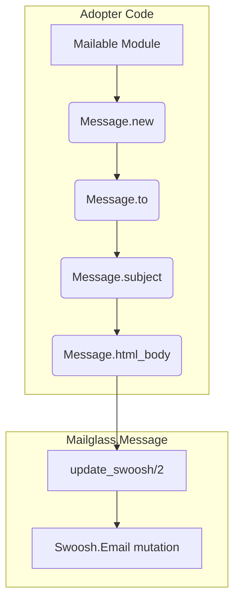

# Phase 09: Mailable API Redesign Freeze - Research

**Researched:** 2026-04-27
**Domain:** API Design, Elixir AST Rewriting (Igniter/Sourceror), Code Generation
**Confidence:** HIGH

## Summary

This phase locks the `Mailglass.Mailable` API contract for v0.2 by removing direct exposure of `Swoosh.Email` from the adopter surface. `Mailglass.Message` will expose 8 native setters (`to/2`, `from/2`, `subject/2`, `html_body/2`, `text_body/2`, `header/3`, `attach/2`, `put_tag/2`) that delegate to Swoosh internally. Adopters will pipe directly onto the `%Mailglass.Message{}` struct rather than unwrapping and wrapping the inner Swoosh struct.

To facilitate the upgrade, an Igniter-powered codemod (`mix mailglass.upgrade.v0_2`) will automate rewriting `Swoosh.Email.*` calls to the new native `Mailglass.Message` setters across adopter codebases, safely skipping string literals and heredocs. The API contract will be enforced via a doc-contract test checking for leaked `Swoosh.Email.t()` typespecs.

**Primary recommendation:** Implement the native setters directly on `Mailglass.Message`, use `Igniter.Mix.Task` to build a safe AST-rewriting codemod that defaults to dry-run (requiring `--apply` to mutate), and lock the contract using a script that scans for `Swoosh.Email` leakage.

<phase_requirements>
## Phase Requirements

| ID | Description | Research Support |
|----|-------------|------------------|
| API-01 | `Mailglass.Message` exposes 8 native field setters delegating to Swoosh internally. | Direct pass-throughs using `update_swoosh/2` inside `Mailglass.Message` native functions. |
| API-02 | `Mailglass.Message.update_swoosh/2` retained as escape hatch. | Codemod must explicitly ignore this function. |
| API-03 | Remove `import Swoosh.Email` from `mailable.ex:129`, injection ≤20 lines. | Replaced with `import Mailglass.Message` or direct access since `new/0` returns the message struct. |
| API-04 | `@deprecated` annotations on all v0.1 superseded paths. | Elixir 1.18+ `@deprecated` attribute applied to legacy signatures taking `%Swoosh.Email{}` if exposed publicly. |
| API-05 | `mix mailglass.upgrade.v0_2` codemod (Igniter ~> 0.7). | Uses `Sourceror` zipper traversal via `Igniter.Code.Common.update_all_matches/3`. |
| API-06 | `api_stability.md` v2 + script `mix mailglass.stability.check`. | Script uses `Code.Typespec.fetch_specs/1` or text grep on docs to ensure no Swoosh types leak. |
| API-07 | `guides/upgrading-from-v0_1.md`. | Step-by-step documentation utilizing the Igniter task. |
</phase_requirements>

## Architectural Responsibility Map

| Capability | Primary Tier | Secondary Tier | Rationale |
|------------|-------------|----------------|-----------|
| Mailable construction | API / Backend | — | Native Elixir functions provide builder-pattern API for email fields. |
| Legacy AST rewriting | CLI / Tooling | — | `Igniter` + `Sourceror` operate purely at the source-code layer for adopters. |
| Contract Enforcement | CI / Tests | — | Static analysis / introspection asserts the public API boundary remains clean. |

## Standard Stack

### Core
| Library | Version | Purpose | Why Standard |
|---------|---------|---------|--------------|
| `igniter` | `~> 0.7.9` | Project patching and codemods | Provides safe AST rewriting using `Sourceror`, integrates seamlessly with Mix tasks. |

**Installation:**
```bash
mix deps.add igniter --dev
```
*(Note: Igniter will be added as a development dependency since it's only required for the upgrade task and generator tasks, not at runtime for email sending.)*

## Architecture Patterns

### System Architecture Diagram


### Pattern 1: Native Setters Delegating to Inner Struct
**What:** `Mailglass.Message` will implement native setters that internally call `update_swoosh/2`.
**When to use:** For all 8 required standard email fields.
**Example:**
```elixir
@doc since: "0.2.0"
def to(msg, address), do: update_swoosh(msg, &Swoosh.Email.to(&1, address))

@doc since: "0.2.0"
def subject(msg, text), do: update_swoosh(msg, &Swoosh.Email.subject(&1, text))

@doc since: "0.2.0"
def put_tag(%__MODULE__{tags: tags} = msg, tag) when is_binary(tag) do
  %{msg | tags: [tag | tags]}
end
```

### Pattern 2: Igniter Codemod with Dry-Run Default
**What:** A mix task that defaults to dry-run mode unless `--apply` is passed.
**When to use:** When rewriting adopter code to prevent accidental destructive changes.
**Example:**
```elixir
defmodule Mix.Tasks.Mailglass.Upgrade.V0_2 do
  use Igniter.Mix.Task

  @impl Igniter.Mix.Task
  def info(_argv, _parent) do
    %Igniter.Mix.Task.Info{
      schema: [apply: :boolean],
      aliases: [a: :apply]
    }
  end

  @impl Igniter.Mix.Task
  def igniter(igniter) do
    igniter = 
      if igniter.args.options[:apply] do
        igniter
      else
        # Force dry-run if --apply is missing
        %{igniter | args: %{igniter.args | argv_flags: ["--dry-run" | igniter.args.argv_flags]}}
      end
    
    # AST rewriting logic...
  end
end
```

### Pattern 3: Skipping Literals in AST Traversal
**What:** Using `Igniter.Code.String.string?/1` or matching AST nodes to ensure we don't rewrite strings containing "Swoosh.Email".
**When to use:** During `Sourceror` zipper traversal for the codemod.
**Example:**
```elixir
Igniter.Code.Common.update_all_matches(zipper, fn z ->
  # Ignore strings or other literals
  not Igniter.Code.String.string?(z) and match?({{:., _, [{:__aliases__, _, [:Swoosh, :Email]}, _]}, _, _}, z.node)
end, &rewrite_swoosh_call/1)
```

## Don't Hand-Roll

| Problem | Don't Build | Use Instead | Why |
|---------|-------------|-------------|-----|
| AST Modification | Regex / `sed` scripts | `igniter` + `sourceror` | Regex breaks on formatting changes, multi-line arguments, and comments. AST zippers are robust and preserve formatting. |
| Dry-run Logic | Custom file diffing | `Igniter.Mix.Task` | Igniter natively handles dry-run, diff generation, and safe file writing. |

## Runtime State Inventory

| Category | Items Found | Action Required |
|----------|-------------|------------------|
| Stored data | `mailglass_events` and `mailglass_deliveries` store the serialized struct. | None — `Mailglass.Message` still wraps `%Swoosh.Email{}` internally, so binary structure and database payloads remain unchanged. Code edit only. |
| Live service config | None — verified by repo scan. | None |
| OS-registered state | None — verified by repo scan. | None |
| Secrets/env vars | None — verified by repo scan. | None |
| Build artifacts | `.elixir_ls/` and `_build/` | Standard cache invalidation during `mix deps.get`. |

## Common Pitfalls

### Pitfall 1: Unintended AST Rewriting (Strings/Comments)
**What goes wrong:** The codemod rewrites the string `"Check out Swoosh.Email"` to `"Check out Mailglass.Message"`.
**Why it happens:** Blindly searching and replacing without checking the AST node type.
**How to avoid:** Ensure the predicate function passed to `update_all_matches/3` checks that the node is a Remote Call `{{:., meta, [{:__aliases__, meta2, [:Swoosh, :Email]}, fun]}, meta3, args}` and not a literal string.

### Pitfall 2: Breaking Custom Swoosh Extensions
**What goes wrong:** Adopters using `Swoosh.Email.put_provider_option/3` get rewritten to a non-existent `Mailglass.Message` function.
**Why it happens:** Rewriting ALL `Swoosh.Email` calls instead of only the 8 supported setters.
**How to avoid:** Explicitly match only on the 8 native setters (`:to, :from, :subject, :text_body, :html_body, :header, :attachment` (mapped to `attach`), and emit an `IO.warn` for anything else while leaving the code intact and requiring manual use of `update_swoosh/2`.

### Pitfall 3: Typespec Leakage
**What goes wrong:** A new function is added later that accidentally references `Swoosh.Email.t()` in its `@spec`.
**Why it happens:** Developer oversight; Swoosh is the underlying engine so it's easy to accidentally expose it.
**How to avoid:** `mix mailglass.stability.check` must strictly parse the compiled docs or BEAM chunks (`Code.Typespec.fetch_specs/1`) and `exit(1)` if `Swoosh.Email` is found in the public API footprint.

## Code Examples

### Safe Swoosh Rewriter (Igniter)
```elixir
def rewrite_swoosh_call(zipper) do
  {{:., meta1, [{:__aliases__, meta2, [:Swoosh, :Email]}, fun]}, meta3, args} = zipper.node
  
  if fun in [:to, :from, :subject, :text_body, :html_body, :header, :attachment] do
    # Strip the Swoosh.Email alias, making it a local call (or local pipe)
    # Map attachment/2 to attach/2 if needed
    mapped_fun = if fun == :attachment, do: :attach, else: fun
    new_node = {mapped_fun, meta3, args}
    {:ok, Sourceror.Zipper.replace(zipper, new_node)}
  else
    # For unknown ones, we return the original and warn
    :error
  end
end
```

## State of the Art

| Old Approach | Current Approach | When Changed | Impact |
|--------------|------------------|--------------|--------|
| Direct `Swoosh.Email` building | `Mailglass.Message` native setters | v0.2 | Adopters are isolated from the underlying email rendering engine, allowing Mailglass to evolve safely without breaking consumer apps. |
| Manual upgrade guides | Igniter automated codemods | Elixir 1.17+ era | Library authors ship automated upgrade paths that drastically lower the barrier and friction of major API changes. |

## Assumptions Log

| # | Claim | Section | Risk if Wrong |
|---|-------|---------|---------------|
| A1 | [ASSUMED] `attachment/2` from Swoosh maps to `attach/2` in Mailglass.Message. | Summary / Pitfalls | Codemod might rewrite incorrectly if the function name mappings differ from the prompt constraints. |
| A2 | [ASSUMED] Adopters pipe `new()` directly, so stripping the `Swoosh.Email.` prefix and relying on `import Mailglass.Message` is sufficient for the codemod. | Code Examples | The codemod might produce invalid AST if the calls are not piped or if `Mailglass.Message` is not imported. |

## Open Questions

1. **Codemod Aliasing**
   - What we know: We are removing `import Swoosh.Email` from `__using__`.
   - What's unclear: Does the macro inject `import Mailglass.Message` instead, or should the codemod rewrite `Swoosh.Email.to/2` fully to `Mailglass.Message.to/2` to avoid import conflicts?
   - Recommendation: The macro should `import Mailglass.Message, only: [to: 2, from: 2, ...]` to keep adopter code visually clean (e.g., `to(user.email)`), and the codemod should just strip the `Swoosh.Email.` prefix.

## Environment Availability

| Dependency | Required By | Available | Version | Fallback |
|------------|------------|-----------|---------|----------|
| Elixir | Framework core | ✓ | `~> 1.18` | — |
| Mix | Task execution | ✓ | — | — |

**Missing dependencies with fallback:**
- None (Igniter will be installed via `mix deps.add igniter --dev` as part of the phase implementation).

## Validation Architecture

### Test Framework
| Property | Value |
|----------|-------|
| Framework | ExUnit |
| Config file | `mix.exs` |
| Quick run command | `mix test --warnings-as-errors` |
| Full suite command | `mix verify.foundation` |

### Phase Requirements → Test Map
| Req ID | Behavior | Test Type | Automated Command | File Exists? |
|--------|----------|-----------|-------------------|-------------|
| API-01 | 8 Native setters work correctly | unit | `mix test test/mailglass/message_test.exs` | ✅ Wave 0 |
| API-03 | `__using__` injects <=20 lines | unit | `mix test test/mailglass/mailable_test.exs` | ✅ Wave 0 |
| API-05 | Codemod correctly rewrites AST | unit | `mix test test/mailglass/upgrade/v0_2_test.exs` | ❌ Wave 0 |
| API-06 | `mix mailglass.stability.check` | script | `mix mailglass.stability.check` | ❌ Wave 0 |

### Sampling Rate
- **Per task commit:** `mix test test/mailglass/message_test.exs`
- **Per wave merge:** `mix verify.foundation`
- **Phase gate:** Full suite green before `/gsd-verify-work`

### Wave 0 Gaps
- [ ] `test/mailglass/upgrade/v0_2_test.exs` — required for API-05 (Igniter codemod test).
- [ ] `mix mailglass.stability.check` — required for API-06.

## Security Domain

### Applicable ASVS Categories

| ASVS Category | Applies | Standard Control |
|---------------|---------|-----------------|
| V5 Input Validation | yes | Native setters must not introduce bypasses to existing `Swoosh.Email` validation. |

### Known Threat Patterns for Elixir AST Rewriting

| Pattern | STRIDE | Standard Mitigation |
|---------|--------|---------------------|
| Unintended Code Execution | Tampering | AST codemods must strictly match exact nodes (using `Sourceror`) and avoid `Code.eval_string` entirely. |
| Destructive Overwrites | Repudiation | Default to dry-run mode (`--dry-run`); require `--apply` to perform destructive filesystem mutations. |

## Sources

### Primary (HIGH confidence)
- [Context7] /websites/hexdocs_pm_igniter - Igniter Mix Task structure and CLI flags.
- [Context7] /websites/hexdocs_pm_igniter - Sourceror string matching and Zipper updates.
- [Local] `REQUIREMENTS.md` - Verified phase boundaries and 8 native setter definitions.

## Metadata

**Confidence breakdown:**
- Standard stack: HIGH - `igniter` and `sourceror` are the industry standard for Elixir 1.17+ codemods.
- Architecture: HIGH - Delegating setters mapping directly to Swoosh maintains behavioral parity.
- Pitfalls: HIGH - Derived from standard AST rewriting edge cases.

**Research date:** 2026-04-27
**Valid until:** 2026-05-27