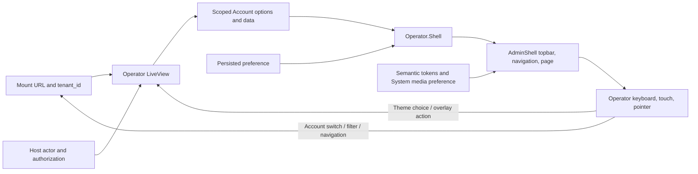

# Phase 168: Shared Workspace and Usable Baseline - Research

**Researched:** 2026-10-07  
**Domain:** Phoenix LiveView/HEEx shared admin shell, accessible interaction and rendered UI acceptance  
**Confidence:** HIGH for repository seams and locked design constraints; MEDIUM for estimated validation duration; rendered baseline remains unverified.

<user_constraints>
## User Constraints (from CONTEXT.md)

### Locked Decisions

### Navigation and Account context

- **D-01:** Keep familiar section navigation and make the selected Account and its switcher visible in the shared operator context on desktop and narrow screens. Account scope must remain apparent when page filters are collapsed. Preserve meaningful active navigation and show destinations only when configured and available for the current mount.
- **D-02:** Present host-supplied Account names with stable scope underneath. Preserve `tenant_id` URL identity and the existing switching semantics: retain compatible filters and clear selections belonging to the previous Account. Moving the selector does not broaden authorization or make developer preview an account-scoped production surface.

### Reading hierarchy and domain language

- **D-03:** Establish comfortable shared typography and spacing for essential labels, headings, values, and supporting text. Adapt composition to available width and zoom; choose layout according to the task and content. The current 12px label and 14px body tokens are source observations to evaluate, not approved target sizes.
- **D-04:** Lead with clear names and essential facts. Keep exact identifiers and diagnostic values available in readable investigation detail without requiring hover. Truncation must have an accessible way to obtain the full value on touch and keyboard; summaries need not repeat raw IDs everywhere.
- **D-05:** Use coherent domain nouns, action labels, and specific recovery copy across shared patterns. Carry forward the equal engineer/support audience and the product distinctions between dispatch and delivery, requested and completed work, replay and resend. Exact technical evidence remains available where it helps the task.

### Appearance preference

- **D-06:** Carry forward one unambiguous Light, Dark, or System preference across Admin and preview chrome, navigation, and reload. System remains the selected preference when OS appearance changes; effective light/dark appearance must not silently replace that selection. Email content/device appearance remains a separate concern owned by the preview and recipient phases.

### Shared controls and feedback

- **D-07:** Consolidate applicable default, hover, focus, pressed, selected, disabled, busy, and validation states through existing shared components. Make status understandable beyond color and retain discoverable common actions with usable keyboard and touch targets.
- **D-08:** Establish consistent overlay behavior, including meaningful names, focus containment where required, dismissal, and return of focus. Inspect representative current Quick view and confirmation interactions before changing presentation. Preserve exact-target, action-time authorization, recent-auth, and confirmation semantics.
- **D-09:** Give prompt feedback with restrained, purposeful motion. Routine investigation and LiveView updates must not replay decorative entrances or block work. Honor reduced motion and keep essential status understandable without animation. Apply relevant Kowalski guidance within the existing stack.

### Reproducible baseline and acceptance

- **D-10:** Before UI edits, reconcile the preserved local workspace with the previously merged cleanup source, retaining unrelated work. Identify the checkout/revision and assets actually served by the preview. Build a compact before/after inventory naming route, fixture, theme, viewport, interaction state, and observed issue. Reuse deterministic demo/browser fixtures; source inspection and historical screenshots are not current rendered proof.
- **D-11:** Carry the milestone's bounded acceptance into this phase: representative desktop/mobile, light/dark/System, keyboard/touch, zoom, reduced motion, and applicable adverse/long-content states. Use existing focused checks and direct rendered inspection, with one batched review, corrective batch, and confirmation round per coherent slice; extend for a concrete unresolved blocker. Keep generated assets with their source and correct obsolete presentation assertions alongside their replacement behavior.

### Agent's Discretion

- The owner accepted the recommendations without corrections. Determine exact type sizes, spacing, breakpoints, Account placement within the shared frame, control composition, and motion values in the UI design contract, guided by working rendered screens.
- Reuse and consolidate existing components/tokens. Remove superseded rules when replacing them. Quick view styling kept outside the primary stylesheet to avoid a parity check is a consolidation candidate; the acceptance check should describe the intended behavior.
- Continue code-first with Impeccable in Operate mode, existing Mailglass branding, LiveView/HEEx, and the prebuilt asset model. Reuse existing research; perform targeted research only for a concrete unresolved implementation question.
- Routine reversible implementation choices follow the project's decisive research posture. Scope, public contracts, and user trust boundaries remain governed by the approved milestone.

### Deferred Ideas (OUT OF SCOPE)

No new ideas were introduced during confirmation. No pending todos matched this phase.

Existing milestone boundaries remain: full outbound/inbound/preview/recipient journeys belong to Phases 169–172; delivery evidence belongs to Phase 173; interactive browser unsubscribe submission, retention, native HEEx assigns changes, absence detection, and CI redesign remain deferred as recorded in the approved scope.
</user_constraints>

## Summary

Use the existing `MailglassAdmin.AdminShell`, `Operator.Shell`, shared components, and LiveView consumers. The key integration is to move Account scope into the shared operator header while preserving the two existing routes' different filter models. The topbar is shared with developer preview, so Account scope belongs only to operator mounts; theme preference can continue to be shared. `[VERIFIED: .planning/phases/168-shared-workspace-and-usable-baseline/168-CONTEXT.md:72-89; mailglass_admin/lib/mailglass_admin/admin_shell.ex:29-51; mailglass_admin/lib/mailglass_admin/operator/shell.ex:176-216]`

The source already provides a URL-preserving same-surface Account switch helper and scoped zero/one/many resolution. Preserve those seams and extend presentation/state tests rather than creating a second scope system. The current theme picker has real radio semantics and persisted preference, but its text labels are screen-reader-only; make the approved visible labels and selection state visible while keeping the persisted preference distinct from the effective system color scheme. `[VERIFIED: mailglass_admin/lib/mailglass_admin/operator/shell.ex:97-115; mailglass_admin/lib/mailglass_admin/operator_live.ex:123-132,859-862; mailglass_admin/lib/mailglass_admin/components.ex:347-385; mailglass_admin/lib/mailglass_admin/theme.ex:31-63]`

The plan must begin with workspace reconciliation and a source-identified rendered before baseline; neither is completed by this research. The local checkout has preserved WIP and unrelated changes. No application, preview, or tests were run in this research turn. `[VERIFIED: git status --short; git rev-parse HEAD; .planning/phases/168-shared-workspace-and-usable-baseline/168-CONTEXT.md:39-42; .planning/phases/168-shared-workspace-and-usable-baseline/168-UI-SPEC.md:31-36]`

**Primary recommendation:** Reconcile the current preserved checkout with the merged cleanup source, capture the demo baseline before edits, then implement the shared Account context/theme/control refinements in the existing shell and representative operator consumers. Preserve mount path, scope, host authorization, tri-state theme, and prebuilt asset contracts; validate with focused ExUnit tests, the existing browser suite, rebuilt CSS, and the approved manual viewport/theme/interaction matrix. `[VERIFIED: .planning/phases/168-shared-workspace-and-usable-baseline/168-CONTEXT.md:16-50; .planning/phases/168-shared-workspace-and-usable-baseline/168-UI-SPEC.md:23-43,140-150]`

## Architectural Responsibility Map

| Capability | Primary Tier | Secondary Tier | Rationale |
|------------|-------------|----------------|-----------|
| Account scope, switch URL and server-side operator data | API / Backend (LiveView) | Browser / Client | LiveView resolves permitted Account options and scoped data; the browser presents the selector and URL. Do not infer authorization from selector options. `[VERIFIED: mailglass_admin/lib/mailglass_admin/operator_live.ex:123-132,859-870; mailglass_admin/docs/operator-trust.md:1-45]` |
| Shared navigation and current-surface indicator | Frontend Server (SSR) | Browser / Client | `Operator.Shell` composes configured nav paths and renders shared desktop/mobile variants. `[VERIFIED: mailglass_admin/lib/mailglass_admin/operator/shell.ex:45-63,176-216]` |
| Effective theme and persisted preference | Frontend Server (SSR) | Browser / Client | Cookie/root theme selection persists the preference; CSS resolves System to effective light/dark. `[VERIFIED: mailglass_admin/lib/mailglass_admin/theme.ex:6-20,31-63; mailglass_admin/lib/mailglass_admin/layouts.ex:62-80; mailglass_admin/assets/css/app.css:22-27,60-65]` |
| Shared control styling, typography and motion | Browser / Client | Frontend Server (SSR) | HEEx components emit classes and semantic states; `app.css` owns shared token definitions. `[VERIFIED: mailglass_admin/lib/mailglass_admin/components.ex:33-49,347-385; mailglass_admin/assets/css/app.css:97-144,450-493]` |
| Quick view and confirmation focus behavior | Browser / Client | Frontend Server (SSR) | LiveView emits dialogs and handles key actions; browser focus, dismissal, and focus return require rendered interaction acceptance. `[VERIFIED: mailglass_admin/lib/mailglass_admin/operator/quick_view.ex:35-60,135-146; mailglass_admin/lib/mailglass_admin/operator/replay_modal.ex:17-43; mailglass_admin/lib/mailglass_admin/operator_live.ex:274-325]` |

## Standard Stack

### Core

| Library / system | Version | Purpose | Why Standard |
|------------------|---------|---------|--------------|
| Phoenix.Component / HEEx and Phoenix LiveView | Existing repository versions; no upgrade or added package is in scope | Shared shell, operator screens, controls, URL patches and overlay interactions | Locked phase stack and current component ownership. `[VERIFIED: .planning/phases/168-shared-workspace-and-usable-baseline/168-UI-SPEC.md:23-29; .planning/phases/168-shared-workspace-and-usable-baseline/168-CONTEXT.md:59-69]` |
| Tailwind v4 with vendored daisyUI utilities | Existing repository versions; no added package | Theme-aware shared tokens and utility styling | Existing first-party token/CSS pipeline. `[VERIFIED: .planning/phases/168-shared-workspace-and-usable-baseline/168-UI-SPEC.md:23-29; mailglass_admin/assets/css/app.css:1-24,97-144]` |
| Vendored Heroicons plugin and self-hosted Mailglass fonts | Existing assets | Inline icons and shared type system | Existing asset model; keep bundled assets mount-relative and committed. `[VERIFIED: .planning/phases/168-shared-workspace-and-usable-baseline/168-UI-SPEC.md:23-29; mailglass_admin/assets/css/app.css:146-180]` |

### Supporting

| Existing surface | Purpose | When to Use |
|------------------|---------|-------------|
| `MailglassAdmin.Components` | Shared controls, labels, navigation, theme picker and state patterns | Extend/reuse a shared pattern instead of adding another local implementation. `[VERIFIED: mailglass_admin/lib/mailglass_admin/components.ex:1-31,347-385]` |
| `MailglassAdmin.Operator.Accounts` and `Operator.Shell` | Host label mapping, selection display, same-surface switch URLs and cross-surface scope | Use for Account label/ID presentation and URL transitions; keep preview out of production Account scoping. `[VERIFIED: mailglass_admin/lib/mailglass_admin/operator/accounts.ex:1-75; mailglass_admin/lib/mailglass_admin/operator/shell.ex:45-63,97-115]` |
| `mix mailglass_admin.assets.build` | Builds the checked-in admin CSS bundle from source | Run after stylesheet/token edits; keep `priv/static/app.css` with the source change. `[VERIFIED: mailglass_admin/assets/css/app.css:1-9; mailglass_admin/mix.exs:206-213]` |

### Alternatives Considered

| Instead of | Could Use | Tradeoff |
|------------|-----------|----------|
| Existing HEEx controls and tokens | New component library/registry or client build stack | Explicitly outside approved scope; adds runtime/tooling and contract surface without resolving a demonstrated gap. `[VERIFIED: .planning/phases/168-shared-workspace-and-usable-baseline/168-UI-SPEC.md:23-29; .planning/phases/168-shared-workspace-and-usable-baseline/168-CONTEXT.md:44-50]` |

**Installation:** None. The design contract specifies manual first-party HEEx and existing vendored assets; do not add packages. `[VERIFIED: .planning/phases/168-shared-workspace-and-usable-baseline/168-UI-SPEC.md:23-29]`

## Package Legitimacy Audit

Not applicable: this phase adds no external packages or package installation step. `[VERIFIED: .planning/phases/168-shared-workspace-and-usable-baseline/168-UI-SPEC.md:23-29]`

## Architecture Patterns

### System Architecture Diagram



The authorized actor and URL are inputs to LiveView; the Account options and selected `tenant_id` drive scoped reads and shell labels. Account navigation updates the URL, which remains the source for deep-linkable scope. `[VERIFIED: mailglass_admin/lib/mailglass_admin/operator_live.ex:113-166; mailglass_admin/lib/mailglass_admin/inbound_live.ex:154-205; mailglass_admin/lib/mailglass_admin/operator/shell.ex:97-115]`

### Recommended Project Structure

Keep work in existing modules and consumers rather than adding a parallel shell or style layer. `[VERIFIED: .planning/phases/168-shared-workspace-and-usable-baseline/168-CONTEXT.md:72-89]`

```text
mailglass_admin/lib/mailglass_admin/
├── admin_shell.ex                 # shared application frame
├── operator/shell.ex              # operator navigation and Account context
├── operator_live.ex               # health/deliveries consumer and URL state
├── inbound_live.ex                # inbound consumer of shared operator shell
├── components.ex                  # shared controls and theme picker
└── operator/quick_view.ex         # delivery detail overlay
mailglass_admin/assets/css/app.css # shared tokens, theme, focus and motion
mailglass_admin/priv/static/app.css # rebuilt adopter-facing bundle
```

### Pattern 1: Keep Account changes in existing URL/scope helpers

**What:** Put the selected Account and selector in operator chrome, but route a switch through the existing `tenant_switch_path/2`, and keep the current zero/one/many decision in the LiveView. `[VERIFIED: mailglass_admin/lib/mailglass_admin/operator/shell.ex:97-115; mailglass_admin/lib/mailglass_admin/operator_live.ex:123-132,859-862; mailglass_admin/lib/mailglass_admin/inbound_live.ex:154-205]`

**When to use:** Same-surface Account changes on Health, Deliveries, and Inbound. Cross-surface navigation should keep only shared Account scope; a same-surface switch should retain compatible filters and remove the prior Account's selected record ID. `[VERIFIED: mailglass_admin/lib/mailglass_admin/operator/shell.ex:45-63,97-115,148-156]`

**Example:** Existing regression behavior already asserts an exact URL transformation: `[VERIFIED: mailglass_admin/test/mailglass_admin/operator/shell_test.exs:81-94]`

```elixir
assert Shell.tenant_switch_path(
         "/ops/mail?tenant_id=alpha&delivery_id=old-id&provider=postmark&theme=dark",
         "beta"
       ) == "/ops/mail?tenant_id=beta&provider=postmark"
```

The topbar should show a host label plus stable `tenant_id`, and the selector must remain usable when filters collapse. Keep the no-activity, unselected chooser, single-account canonicalization, explicit unselected route and missing-label fallback distinct. The option list is presentation data, not permission. `[VERIFIED: .planning/phases/168-shared-workspace-and-usable-baseline/168-UI-SPEC.md:68-108; mailglass_admin/lib/mailglass_admin/operator/accounts.ex:24-75; mailglass_admin/lib/mailglass_admin/operator_live.ex:493-500,859-862]`

### Pattern 2: Keep theme preference and effective scheme separate

**What:** Continue to persist one `System`, `Light`, or `Dark` choice and use the existing root theme and CSS path. Make each option's text label visible and its selected state visually distinct; do not derive the checked preference from the currently effective OS scheme. `[VERIFIED: .planning/phases/168-shared-workspace-and-usable-baseline/168-UI-SPEC.md:124-139; mailglass_admin/lib/mailglass_admin/theme.ex:31-63; mailglass_admin/lib/mailglass_admin/layouts.ex:62-80; mailglass_admin/lib/mailglass_admin/components.ex:347-385]`

**Current mismatch to close:** `theme_picker/1` uses `title={option.label}` plus screen-reader-only text. Those are accessible names but not the approved visible `System`, `Light`, and `Dark` labels. Its radio selection contract and cookie persistence already exist, and system CSS is represented by the absence of an explicit root `data-theme`. `[VERIFIED: mailglass_admin/lib/mailglass_admin/components.ex:362-385; mailglass_admin/lib/mailglass_admin/theme.ex:47-53; mailglass_admin/lib/mailglass_admin/layouts/root.html.heex:1-2; mailglass_admin/test/mailglass_admin/components_test.exs:476-548]`

### Pattern 3: Consolidate overlay presentation without changing action semantics

**What:** Inspect Quick view and confirmation in the browser before styling changes; preserve dialog title/semantics, Escape and existing dismissal, focus containment/return, exact target, action-time authorization and recent-auth rules. Move `.mg-detail-panel` positioning into `app.css` as the approved consolidation candidate, then revise the parity assertion that currently documents inline placement and rebuild the checked-in bundle. `[VERIFIED: .planning/phases/168-shared-workspace-and-usable-baseline/168-UI-SPEC.md:41-48,140-150; mailglass_admin/lib/mailglass_admin/layouts/root.html.heex:24-48; mailglass_admin/lib/mailglass_admin/operator/quick_view.ex:35-60,135-146; mailglass_admin/lib/mailglass_admin/operator/replay_modal.ex:17-43]`

**When to use:** Only the shared presentation/focus behavior needed for this phase; do not add destructive actions or redesign outbound/inbound recovery journeys owned by later phases. `[VERIFIED: .planning/phases/168-shared-workspace-and-usable-baseline/168-CONTEXT.md:7-14,34-37; .planning/phases/168-shared-workspace-and-usable-baseline/168-UI-SPEC.md:41-48]`

### Anti-Patterns to Avoid

- Do not leave Account selection solely inside the collapsed filter form. `[VERIFIED: mailglass_admin/lib/mailglass_admin/operator_live.ex:708-743; mailglass_admin/lib/mailglass_admin/operator/filters_form.ex:17-31; mailglass_admin/lib/mailglass_admin/inbound_live.ex:502-508]`
- Do not widen authorization, scope records from an untrusted client-side option list, or make preview a production Account surface. `[VERIFIED: mailglass_admin/docs/operator-trust.md:1-45; .planning/phases/168-shared-workspace-and-usable-baseline/168-CONTEXT.md:18-26]`
- Do not duplicate theme choice in local storage or replace System preference when OS appearance changes. `[VERIFIED: mailglass_admin/lib/mailglass_admin/theme.ex:6-20,31-63; mailglass_admin/test/mailglass_admin/components_test.exs:540-548]`
- Do not preserve duplicate inline and stylesheet positioning rules solely to keep an obsolete token parity assertion green. `[VERIFIED: mailglass_admin/lib/mailglass_admin/layouts/root.html.heex:24-48; mailglass_admin/test/mailglass_admin/token_parity_test.exs:5-17; .planning/phases/168-shared-workspace-and-usable-baseline/168-CONTEXT.md:44-50]`
- Do not use historical screenshots, DOM-only tests, or previous scores as evidence of the current rendered baseline. `[VERIFIED: .planning/phases/168-shared-workspace-and-usable-baseline/168-UI-SPEC.md:31-36,248; .planning/research/v2.9/SCOPE.md:45-55]`

## Don't Hand-Roll

| Problem | Don't Build | Use Instead | Why |
|---------|-------------|-------------|-----|
| Account switch URL/scoping | New tenant query/path builder or permission inference from UI options | `Operator.Shell.tenant_switch_path/2`, existing scoped LiveView reads and host authorization | The helper already preserves compatible query values and removes old record selections; server checks remain the access boundary. `[VERIFIED: mailglass_admin/lib/mailglass_admin/operator/shell.ex:97-115,148-156; mailglass_admin/lib/mailglass_admin/operator_live.ex:123-166; mailglass_admin/docs/operator-trust.md:1-45]` |
| Theme persistence and system mode | Browser storage, a second theme cookie or a binary toggle | `MailglassAdmin.Theme`, existing controller/root mapping and `Components.theme_picker/1` | Existing flow preserves URL state and preference on reload; system is a preference separate from effective palette. `[VERIFIED: mailglass_admin/lib/mailglass_admin/theme.ex:6-63; mailglass_admin/lib/mailglass_admin/controllers/theme_controller.ex:11-45; mailglass_admin/lib/mailglass_admin/components.ex:347-385]` |
| Focus and motion primitives | New JS hook or CSS animation convention | Existing LiveView JS focus sentinels and named focus/motion tokens | Current overlays already have dialog, focus, Escape and reduce-motion infrastructure; accept remaining behavior through browser inspection. `[VERIFIED: mailglass_admin/lib/mailglass_admin/operator/quick_view.ex:35-60,135-146; mailglass_admin/lib/mailglass_admin/operator/replay_modal.ex:17-43; mailglass_admin/assets/css/app.css:253-276,450-493]` |
| Icon/font assets and built stylesheet | Remote assets or hand-editing compiled output | Vendored icons, self-hosted fonts, `mix mailglass_admin.assets.build` | Mountable asset serving and bundle parity are existing integration contracts. `[VERIFIED: mailglass_admin/assets/css/app.css:1-24,146-180; mailglass_admin/lib/mailglass_admin/controllers/assets.ex:1-33; mailglass_admin/mix.exs:206-213]` |

**Key insight:** The hard work is keeping server-owned scope and browser-visible context synchronized through mounted routes and LiveView patches; a visually separate selector must still use the existing URL and authorization path. `[VERIFIED: mailglass_admin/lib/mailglass_admin/operator/shell.ex:45-63,97-115; mailglass_admin/lib/mailglass_admin/operator_live.ex:113-166; mailglass_admin/docs/operator-trust.md:1-45]`

## Common Pitfalls

### Pitfall 1: Account disappears when filters collapse

**What goes wrong:** An operator can no longer see or change scope at narrow widths because Account is rendered in the filter panel.  
**Why it happens:** `FiltersForm.fields/1` currently includes Account; the filter panel is hidden on narrow screens behind a toggle.  
**How to avoid:** Put selected Account identity and switcher in operator topbar; remove the duplicate Account filter only after same-surface switch behavior and clear-filter semantics are preserved.  
**Warning signs:** Account name/ID only visible after opening filters; selector and filter can disagree. `[VERIFIED: mailglass_admin/lib/mailglass_admin/operator/filters_form.ex:17-31; mailglass_admin/lib/mailglass_admin/operator_live.ex:708-743; mailglass_admin/lib/mailglass_admin/inbound_live.ex:502-508]`

### Pitfall 2: A switch changes visible Account before scoped data commits

**What goes wrong:** New Account name is shown above old Account records, or selecting a listed tenant is treated as authorization.  
**How to avoid:** Keep switching server/URL-backed; preserve the committed old scope while pending or rejected; only render new Account label with its successfully scoped data. Preserve the existing explicit unselected and permitted-but-unlisted states. `[VERIFIED: .planning/phases/168-shared-workspace-and-usable-baseline/168-UI-SPEC.md:124-139; mailglass_admin/lib/mailglass_admin/operator_live.ex:123-166; mailglass_admin/lib/mailglass_admin/operator/accounts.ex:61-75]`

### Pitfall 3: System preference is confused with effective dark/light palette

**What goes wrong:** OS appearance changes make the wrong radio selected, or theme changes fail across shell, navigation, preview, and reload.  
**How to avoid:** Test selected preference separately from rendered scheme, including OS changes and reload with System selected; keep email preview/device theme independent. `[VERIFIED: .planning/phases/168-shared-workspace-and-usable-baseline/168-UI-SPEC.md:124-139; mailglass_admin/lib/mailglass_admin/theme.ex:31-63; mailglass_admin/test/mailglass_admin/operator/shell_test.exs:97-124; mailglass_admin/e2e/flows.spec.js:664-715]`

### Pitfall 4: Inline Quick view CSS survives after shared token work

**What goes wrong:** Root layout and `app.css` compete for positioning, or the token parity test protects old placement rather than intent.  
**How to avoid:** Consolidate positioning once in `app.css`, update only the obsolete placement assertion while retaining theme/token checks, rebuild `priv/static/app.css`, and inspect the result at mobile and desktop widths. `[VERIFIED: mailglass_admin/lib/mailglass_admin/layouts/root.html.heex:24-48; mailglass_admin/test/mailglass_admin/token_parity_test.exs:5-17,93-105; mailglass_admin/mix.exs:206-213]`

### Pitfall 5: Structural checks are mistaken for focus/visual proof

**What goes wrong:** Tests confirm markup and Escape close behavior but miss actual focus trapping/return, clipping, OS scheme changes, touch reachability or zoom reflow.  
**How to avoid:** Keep ExUnit and Playwright coverage, then perform the UI-SPEC direct-browser matrix on real routes and inspect images/interaction states. `[VERIFIED: mailglass_admin/e2e/flows.spec.js:271-370,655-715; .planning/phases/168-shared-workspace-and-usable-baseline/168-UI-SPEC.md:140-150]`

## Code Examples

### Preserve selected scope while switching Accounts

The current URL helper's regression example is the implementation contract to retain when moving the switcher. `[VERIFIED: mailglass_admin/test/mailglass_admin/operator/shell_test.exs:81-94]`

```elixir
assert Shell.tenant_switch_path(
         "/ops/mail?tenant_id=alpha&delivery_id=old-id&provider=postmark&theme=dark",
         "beta"
       ) == "/ops/mail?tenant_id=beta&provider=postmark"
```

### Existing asset build command

Run from `mailglass_admin/`; it rebuilds the checked-in bundle from the source stylesheet. `[VERIFIED: mailglass_admin/assets/css/app.css:1-9; mailglass_admin/mix.exs:206-213; mailglass_admin/test/mailglass_admin/token_parity_test.exs:11-17]`

```bash
mix mailglass_admin.assets.build
```

## Environment Availability

| Dependency | Required By | Available | Version | Fallback |
|------------|------------|-----------|---------|----------|
| Elixir/Mix | Focused ExUnit and asset build | Yes | Host `Elixir 1.20.4-otp-29`; project toolchain gate is Elixir 1.18.4 / OTP 27 | Run focused tests in the existing gating-toolchain container if host mismatch matters. `[VERIFIED: command -v and elixir --version; Makefile:29-39]` |
| Docker / Compose | Deterministic demo and demo browser evidence | Yes | Docker 29.5.2; Compose command availability not independently version-checked | Use already-running documented demo only if its served source/revision is first identified. `[VERIFIED: command -v and docker --version; Makefile:25-27,84-106]` |
| Browser | Direct rendered baseline and acceptance | Chromium binary available; app/browser not started | `chromium` path found; browser build not queried | Use documented demo plus browser; run Playwright as the existing suite where installed. `[VERIFIED: command -v chromium; guides/run-the-demo.md; mailglass_admin/playwright.config.cjs:1-45]` |
| Node/Playwright | Existing opt-in `mailglass_admin/e2e/` suite only | Node/npm shims are present; Playwright installation not checked | Not verified | Manual direct-browser review remains required by the UI contract. The product stylesheet build uses the existing Mix task and does not add a Node runtime dependency. `[VERIFIED: command -v node/npm; mailglass_admin/package.json:1-10; mailglass_admin/assets/css/app.css:1-9]` |

No app, browser, or external services were started in this research turn. Demo availability at review time remains unknown; inspect the actual served source before relying on an already-running preview. `[VERIFIED: .planning/phases/168-shared-workspace-and-usable-baseline/168-UI-SPEC.md:31-36]`

## Validation Architecture

Nyquist validation is enabled in `.planning/config.json`. `[VERIFIED: .planning/config.json:21-30]`

### Test Framework

| Property | Value |
|----------|-------|
| Framework | ExUnit via Mix for component and LiveView checks; Playwright is the existing opt-in browser suite. `[VERIFIED: mailglass_admin/test/mailglass_admin/operator_live_test.exs:1-15; mailglass_admin/playwright.config.cjs:1-45]` |
| Config file | `mailglass_admin/playwright.config.cjs` for browser checks; Mix configuration is package-owned. `[VERIFIED: mailglass_admin/playwright.config.cjs:1-45; mailglass_admin/mix.exs:191-213]` |
| Quick focused command (cwd `mailglass_admin/`) | `mix test test/mailglass_admin/admin_shell_test.exs test/mailglass_admin/components_test.exs test/mailglass_admin/operator/shell_test.exs test/mailglass_admin/operator_live_test.exs test/mailglass_admin/inbound_live_test.exs --seed 1` — estimated 30–120s; not timed this session. `[VERIFIED: mailglass_admin/test/mailglass_admin/admin_shell_test.exs; mailglass_admin/test/mailglass_admin/components_test.exs; mailglass_admin/test/mailglass_admin/operator/shell_test.exs; mailglass_admin/test/mailglass_admin/operator_live_test.exs; mailglass_admin/test/mailglass_admin/inbound_live_test.exs]` |
| Asset contract command (cwd `mailglass_admin/`) | `mix test test/mailglass_admin/token_parity_test.exs test/mailglass_admin/bundle_test.exs --seed 1` — estimated under 30s; not timed this session. `[VERIFIED: mailglass_admin/test/mailglass_admin/token_parity_test.exs; mailglass_admin/test/mailglass_admin/bundle_test.exs]` |
| Browser suite | `npm run test:operator-browser` from `mailglass_admin/` (builds assets and uses the configured browser server); execution time not measured. `[VERIFIED: mailglass_admin/package.json:1-10; mailglass_admin/playwright.config.cjs:19-45]` |

### Phase Requirements → Test Map

| Req ID | Behavior | Test Type | Automated Command | Existing coverage |
|--------|----------|------------|-------------------|------------------|
| UXF-01 | Source/route/fixture/theme/viewport inventory and before/after rendered proof | Manual + browser | Direct browser using documented demo; `make demo` (not run in planning) | Demo/browser fixtures exist; no current baseline evidence. `[VERIFIED: .planning/phases/168-shared-workspace-and-usable-baseline/168-UI-SPEC.md:31-36; guides/run-the-demo.md]` |
| UXF-02 | Active navigation and selected Account/scope preservation | LiveView + browser | Focused command above; existing `operator.spec.js` | URL switch, clear-filter and zero/one/many behaviors have LiveView coverage; shared visible selected-Account topbar behavior remains to implement. `[VERIFIED: mailglass_admin/test/mailglass_admin/operator/shell_test.exs:48-95; mailglass_admin/test/mailglass_admin/operator_live_test.exs:1071-1129; mailglass_admin/test/mailglass_admin/inbound_live_test.exs:27-55]` |
| UXF-03 | Type/spacing hierarchy at narrow/desktop/zoom | Browser/manual | Existing browser suite plus source-identified review | Existing 320px checks and token definitions; 390/768/1440 and 200% zoom direct review are acceptance gaps. `[VERIFIED: mailglass_admin/e2e/flows.spec.js:271-343; mailglass_admin/assets/css/app.css:107-144; .planning/phases/168-shared-workspace-and-usable-baseline/168-UI-SPEC.md:140-150]` |
| UXF-04 | Applicable shared-control states and visible labels | Component + LiveView + browser | Focused command above | Component state contracts exist; visible theme labels and newly shared Account control need proof. `[VERIFIED: mailglass_admin/test/mailglass_admin/components_test.exs:476-555; mailglass_admin/test/mailglass_admin/operator/shell_test.exs:150-180]` |
| UXF-05 | One persistent preference; System follows OS without replacing preference | LiveView + browser/manual | Focused command above; existing `flows.spec.js` theme suite | Radio/cookie and cross-surface behavior exist; OS change/reload with System explicitly checked in rendered browser is required. `[VERIFIED: mailglass_admin/lib/mailglass_admin/theme.ex:6-63; mailglass_admin/e2e/flows.spec.js:664-715; .planning/phases/168-shared-workspace-and-usable-baseline/168-UI-SPEC.md:124-139]` |
| UXF-06 | Consistent domain language and cause-specific explanations | Component + LiveView | Focused command above | `voice_test`, LiveView and component tests exist; update only copy assertions intentionally superseded by the accepted wording. `[VERIFIED: mailglass_admin/test/mailglass_admin/voice_test.exs:1-30; mailglass_admin/test/mailglass_admin/operator_live_test.exs:1071-1110]` |
| UXF-07 | Keyboard/touch nav and overlay names/focus containment/return | Browser/manual | Existing Playwright overlay tests plus direct keyboard/touch pass | Escape, panel stacking and focus sentinels are covered structurally/browser-wise; confirm trigger focus return, keyboard cycle, touch and focus-visible behavior in rendered review. `[VERIFIED: mailglass_admin/e2e/flows.spec.js:345-352,549-592; mailglass_admin/lib/mailglass_admin/operator/quick_view.ex:35-60,135-146]` |
| UXF-08 | Prompt feedback, reduced motion and no repeated investigation animation | Browser/manual + focused LiveView checks | Existing flow tests and direct reduced-motion browser review | Global reduced-motion CSS exists; repeated LiveView update/status behavior and overlay timing require applicable current inspection. `[VERIFIED: mailglass_admin/assets/css/app.css:450-493; mailglass_admin/e2e/flows.spec.js:549-648; .planning/phases/168-shared-workspace-and-usable-baseline/168-UI-SPEC.md:140-150]` |

### Sampling Rate and Gaps

- Per code slice: run the focused component/LiveView checks above; preserve existing safety assertions while replacing any obsolete presentation-only assertion. `[VERIFIED: .planning/research/v2.9/SCOPE.md:45-55]`
- After CSS source changes: run `mix mailglass_admin.assets.build`, then the token-parity and bundle tests; keep the generated `priv/static/app.css` with its source change. `[VERIFIED: mailglass_admin/mix.exs:206-213; mailglass_admin/test/mailglass_admin/token_parity_test.exs:11-17]`
- Per coherent UI slice: one batched rendered inspection, one corrective batch and one confirmation review; extend only for a concrete blocker. `[VERIFIED: .planning/phases/168-shared-workspace-and-usable-baseline/168-UI-SPEC.md:140-150]`
- Direct rendered review must cover 320, 390, 768 and 1440 CSS px; Light, Dark and System with OS change/reload; keyboard/touch; 200% zoom; reduced motion; selected/unselected Account; long names/IDs; and applicable empty, busy, validation and error states. Use a representative matrix, not every fixture crossed with every dimension. `[VERIFIED: .planning/phases/168-shared-workspace-and-usable-baseline/168-UI-SPEC.md:140-150]`
- No Wave 0 framework install is required. Focused test files already exist; the visible Account shell behavior and full current rendered acceptance are gaps to close during execution. `[VERIFIED: mailglass_admin/test/mailglass_admin/admin_shell_test.exs; mailglass_admin/test/mailglass_admin/operator_live_test.exs; mailglass_admin/test/mailglass_admin/inbound_live_test.exs; mailglass_admin/test/mailglass_admin/components_test.exs]`

## Security Domain

**Current standard reference:** OWASP ASVS 5.0.0 is the latest stable version listed by OWASP. ASVS v5 renumbered categories; use v5 IDs below rather than the older V2/V3/V4/V5/V6 labels in the generic template. `[CITED: https://owasp.org/projects/asvs; https://github.com/OWASP/ASVS/blob/v5.0.0/5.0/docs_en/OWASP_Application_Security_Verification_Standard_5.0.0_en.csv]`

| ASVS v5 category | Applies | Phase control |
|------------------|---------|---------------|
| V1 Encoding and Sanitization | Yes | Keep labels and host-provided values in HEEx text/attribute contexts; encode URL query/path values through existing URI helpers. `[CITED: https://github.com/OWASP/ASVS/blob/v5.0.0/5.0/docs_en/OWASP_Application_Security_Verification_Standard_5.0.0_en.csv]` `[VERIFIED: mailglass_admin/lib/mailglass_admin/operator/shell.ex:103-115; mailglass_admin/lib/mailglass_admin/operator/accounts.ex:24-59]` |
| V2 Validation and Business Logic | Yes | Account switching must use server-side selection and the existing permitted actor/data contract; UI validation never establishes security. `[CITED: https://github.com/OWASP/ASVS/blob/v5.0.0/5.0/docs_en/OWASP_Application_Security_Verification_Standard_5.0.0_en.csv]` `[VERIFIED: mailglass_admin/lib/mailglass_admin/operator_live.ex:123-166; mailglass_admin/docs/operator-trust.md:1-45]` |
| V3 Web Frontend Security | Yes | Preserve safe DOM rendering and current cookie/session behavior; theme preference is not authorization. `[CITED: https://github.com/OWASP/ASVS/blob/v5.0.0/5.0/docs_en/OWASP_Application_Security_Verification_Standard_5.0.0_en.csv]` `[VERIFIED: mailglass_admin/lib/mailglass_admin/theme.ex:15-20; mailglass_admin/lib/mailglass_admin/controllers/theme_controller.ex:11-45]` |
| V6 Authentication | Inherited only | Host application owns login/authentication; do not add or alter an auth path. `[CITED: https://github.com/OWASP/ASVS/blob/v5.0.0/5.0/docs_en/OWASP_Application_Security_Verification_Standard_5.0.0_en.csv]` `[VERIFIED: PRODUCT.md:29-35; mailglass_admin/docs/operator-trust.md:1-45]` |
| V7 Session Management | Inherited only | Retain host session and recent-auth behavior on any existing confirmation path. `[CITED: https://github.com/OWASP/ASVS/blob/v5.0.0/5.0/docs_en/OWASP_Application_Security_Verification_Standard_5.0.0_en.csv]` `[VERIFIED: .planning/phases/168-shared-workspace-and-usable-baseline/168-UI-SPEC.md:140-150; mailglass_admin/docs/operator-trust.md:1-45]` |
| V8 Authorization | Yes | Scope data using the host actor and preserve action-time authorization; the visible list is not permission evidence. `[CITED: https://github.com/OWASP/ASVS/blob/v5.0.0/5.0/docs_en/OWASP_Application_Security_Verification_Standard_5.0.0_en.csv]` `[VERIFIED: mailglass_admin/lib/mailglass_admin/operator_live.ex:123-166; mailglass_admin/lib/mailglass_admin/operator/replay_modal.ex:17-43]` |
| V11 Cryptography | No new crypto | This phase changes presentation only; do not introduce custom cryptography or weaken signed/action behavior. `[CITED: https://github.com/OWASP/ASVS/blob/v5.0.0/5.0/docs_en/OWASP_Application_Security_Verification_Standard_5.0.0_en.csv]` `[VERIFIED: .planning/phases/168-shared-workspace-and-usable-baseline/168-CONTEXT.md:18-37]` |

## Project Constraints (from AGENTS.md)

No repository-root `AGENTS.md` was present in the required project context inventory; `CLAUDE.md` is the project guide. Keep the existing Elixir/HEEx and prebuilt-asset model, retain host-owned authorization and `tenant_id` scope, avoid client-side auth inference, and commit source changes with rebuilt static assets. `[VERIFIED: CLAUDE.md:1-14,35-58; PRODUCT.md:29-35; mailglass_admin/assets/css/app.css:1-9]`

## Workspace Reconciliation and Baseline Prerequisite

The current checkout is `b58255985cdecbc6de6c9a5e8ca42980f120c5d3`; read-only status showed two deleted handoff files, modified `.planning/config.json`, and modified `mailglass_admin/test/mailglass_admin/voice_test.exs`. The cleanup workspace at `/private/tmp/mailglass-ci-cleanup-20261007` reports `28795c09bc1f2acb4fa3455b4a640cdbed8ed104`. These are identifiers observed in this research session, not approval to reset, checkout, or reconcile files. `[VERIFIED: git rev-parse HEAD; git status --short; git -C /private/tmp/mailglass-ci-cleanup-20261007 rev-parse HEAD]`

Plan the first task to reconcile the preserved workspace against the merged cleanup source while retaining those unrelated edits/deletions, then identify the exact checkout/revision and asset response used by the preview. Only after that capture a before inventory. Use the deterministic AtlasDesk demo with Northstar Logistics and the approved operator/inbound routes; if optional Inbound is not configured, record that fact rather than treating its route as a failure. `[VERIFIED: .planning/phases/168-shared-workspace-and-usable-baseline/168-UI-SPEC.md:31-36; PRODUCT.md:25-28; .planning/research/v2.9/SCOPE.md:57-60]`

Record for each specimen: served source/revision and asset identity, host/login route, fixture/persona, URL, theme plus OS scheme when System is selected, CSS viewport and browser zoom, interaction state, and observed issue. Current rendered output is not captured by this research. `[VERIFIED: .planning/phases/168-shared-workspace-and-usable-baseline/168-UI-SPEC.md:31-36]`

## Phase Requirements

| ID | Description | Research Support |
|----|-------------|------------------|
| UXF-01 | The maintainer can reproduce the current and refined primary workflows from a documented source, route, fixture, theme, and viewport, with a compact inventory of components/states and observed issues. | Workspace reconciliation, source-identified baseline, demo routes, and validation matrix. `[VERIFIED: .planning/REQUIREMENTS.md:12]` |
| UXF-02 | An operator can identify the current surface and selected account and navigate the existing workspace without losing the intended account scope or encountering misleading active navigation. | Shared shell and surface nav; existing URL helper and one-account canonicalization; visible Account selector remains implementation gap. `[VERIFIED: .planning/REQUIREMENTS.md:13]` |
| UXF-03 | A user can read essential labels, values, headings, and supporting text with a coherent shared type/spacing hierarchy at supported narrow and desktop widths and at browser zoom. | Existing token sources plus 320/390/768/1440, 200% zoom rendered checks. `[VERIFIED: .planning/REQUIREMENTS.md:14]` |
| UXF-04 | A user can recognize and operate shared controls with consistent default, focus, hover, pressed, selected, disabled, busy, and validation states where applicable. | Shared component inventory, test files and state matrix; visible theme labels need implementation and rendered proof. `[VERIFIED: .planning/REQUIREMENTS.md:15]` |
| UXF-05 | A user can choose Light, Dark, or System with one unambiguous selected preference and consistent appearance across navigation, reload, and OS changes while System is selected. | Existing tri-state persisted theme seam; direct browser OS-change/reload check. `[VERIFIED: .planning/REQUIREMENTS.md:16]` |
| UXF-06 | A user encounters consistent domain names, action labels, explanations, and recovery copy across the workspace, with exact technical detail available where it supports investigation. | Approved copywriting contract and source voice/LiveView tests; preserve cause-specific recovery copy. `[VERIFIED: .planning/REQUIREMENTS.md:17; .planning/phases/168-shared-workspace-and-usable-baseline/168-UI-SPEC.md:103-123]` |
| UXF-07 | A user can complete shared navigation and overlay interactions by keyboard or touch, with meaningful names, visible focus, correct focus containment/return, usable targets, and status cues beyond color. | Existing dialog/focus primitives and Playwright suite; direct keyboard/touch and focus-return inspection. `[VERIFIED: .planning/REQUIREMENTS.md:18; mailglass_admin/e2e/flows.spec.js:345-352,549-592]` |
| UXF-08 | A user receives prompt, understandable interaction feedback without repeated or blocking motion during routine investigation, including under reduced motion and LiveView updates. | Existing reduced-motion rules; inspect routine LiveView patches and status behavior in browser. `[VERIFIED: .planning/REQUIREMENTS.md:19; mailglass_admin/assets/css/app.css:450-493]` |

## Assumptions Log

| # | Claim | Section | Risk if Wrong |
|---|-------|---------|---------------|
| A1 | Host's `mix` alias and dependency cache will support the focused commands without the gating-toolchain container. | Validation Architecture | Medium; use the already defined toolchain wrapper if host compatibility or database setup fails. |
| A2 | The demo browser preview can be served from the checkout selected after reconciliation with the deterministic Northstar fixture. | Workspace Reconciliation and Baseline | High; if not, UXF-01 baseline is invalid until the served source and fixture are corrected. |

## Open Questions

1. **Which exact reconciled checkout and static bundle will the demo/browser serve?** Current and cleanup workspace revisions differ; UI-SPEC makes source identity a prerequisite. Decide during the first reconciliation/baseline task and record it with the capture. `[VERIFIED: git rev-parse HEAD; git -C /private/tmp/mailglass-ci-cleanup-20261007 rev-parse HEAD; .planning/phases/168-shared-workspace-and-usable-baseline/168-UI-SPEC.md:31-36]`
2. **Will the optional Inbound mount be configured in the demo after reconciliation?** The design contract says inspect the route only where configured; record availability in the environment/baseline inventory. `[VERIFIED: .planning/phases/168-shared-workspace-and-usable-baseline/168-UI-SPEC.md:31-36; mailglass_admin/lib/mailglass_admin/surface_nav.ex:40-43]`

## Sources

### Primary (HIGH confidence)

- Phase 168 `CONTEXT.md`, `UI-SPEC.md`, `ROADMAP.md`, and UXF requirements — locked boundary, interaction contract and acceptance dimensions.
- Current operator shell/LiveViews/components/theme sources, Account/helper source, focused ExUnit tests and existing Playwright flows — implementation and verification seams.
- Project docs `PRODUCT.md`, `mailglass_admin/docs/operator-trust.md`, `guides/run-the-demo.md`, and `.planning/research/v2.9/SCOPE.md` — host ownership, operator trust and repeatable evaluation boundaries.
- [OWASP ASVS v5.0.0 official source](https://github.com/OWASP/ASVS/tree/v5.0.0/5.0/docs_en) — current category IDs; applicable categories listed above.

### Secondary (MEDIUM confidence)

- Host CLI availability probe — current tools and versions; no app startup or tests were performed.

## Metadata

**Confidence breakdown:**
- Standard stack: HIGH — copied from the locked UI contract and confirmed in current files.
- Architecture: HIGH — shell, URL, scope and theme seams are directly read in source.
- Pitfalls: HIGH — grounded in current implementation and documented acceptance; rendered behavior remains unverified.
- Validation durations: MEDIUM — estimates only; no tests were run.

**Research date:** 2026-10-07  
**Valid until:** 2026-11-06 (stable existing stack; re-check served workspace and live preview at execution).
