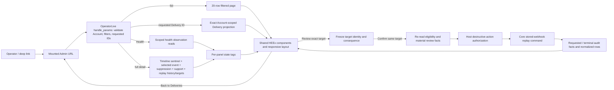

<user_constraints>
## User Constraints (from CONTEXT.md)

### Locked Decisions

## Implementation Decisions

### Journey and information hierarchy

- **D-01 — One coherent investigation:** Retain Health → Deliveries → Quick view → full detail → recovery → return. Health identifies a recorded concern; the list locates a delivery; Quick view confirms identity and recorded state; full detail explains evidence; confirmation reviews the action. Engineers and support/on-call remain equal primary audiences. Lead with ordinary domain language and provide exact technical evidence at the point it helps.
- **D-02 — Task-appropriate composition:** Retain a native comparison table where the fields fit and cards at narrow widths. Preserve Phase 168's 16px body/14px label scale; reduce repeated framing before reducing text. Place existing filters above results, keep the applied window/context visible when collapsed, and retain explicit Apply/Clear behavior. Detail should read as identity/state → timeline → current suppression → clearly scoped Account webhook evidence, with discoverable replay eligibility and review action. Exact breakpoint, spacing, and action placement belong in UI-SPEC.
- **D-03 — Filter meaning:** Preserve provider, event, window, and page semantics. Name the event filter for what it queries: the latest recorded event, including applicable audit event types. Do not imply it searches all historical events or computes delivery success. Preserve valid custom positive window deep links while guarding malformed, unsupported-shaped, and numerically unsafe inputs. Keep draft and committed filter values distinct; reveal invalid fields and retain useful input.

### Health and evidence handoffs

- **D-04 — Observation scope and window:** Keep the validated URL window, currently defaulting to seven days/168 hours, and display the actual interval consistently. Recorded processing failures count persisted failed/dead webhook rows by receipt time; unmatched evidence counts unresolved event records in the interval; replay/reconcile counts describe recorded audit facts. Active suppression counts describe currently active records, independently of the observation window. Provider/event delivery filters do not silently constrain Account metrics. Counts must identify their unit; suppression records are not a recipient count.
- **D-05 — Honest uncertainty:** Available zero, empty in the requested window, missing selection, read unavailable, partial evidence, and retained stale data are distinct states. Zero counts support only a limited observation statement. Remove universal healthy claims. Display actual last-checked information where supplied; disconnection or failed refresh must not create fresh or zero evidence. Keep useful unaffected panels visible when another read fails. Provider absence detection, health scoring, and invented age thresholds remain deferred.
- **D-06 — Matching destinations:** A metric's action must open evidence of that same kind. Failed webhook processing leads to failed-webhook evidence; unmatched records lead to unmatched evidence. Name a single latest/oldest example as an example. An active-suppression total may have a separately named historical suppressed-delivery link, but the populations must remain distinguishable. Existing exact support links must retain and resolve their requested Account-scoped object, or explain its unavailability; a newer exemplar must never silently replace it. Standalone support evidence remains usable when there are no matching deliveries.

### Identity, navigation, and refreshing

- **D-07 — Exact selection:** Resolve a requested delivery by selected Account and exact ID independently of list page, provider/event filters, or time window. Explain when a valid delivery is outside current results. Keep requested identity independently of the loaded row so a temporary failure or list reorder does not erase it. Malformed IDs and missing/foreign IDs receive recoverable, non-disclosing states. Activity-derived Account options remain navigation aids and never become an authorization allowlist.
- **D-08 — Return and history:** Preserve Account, committed filters, and page through Quick view/full-detail handoffs. Explicit Back to deliveries clears selection, full-detail mode, and exact support focus and returns to the list; it must not reopen Quick view. Browser Back/Forward reflects actual deliberate navigation. Keep page-relative previous/next and position only when the selected delivery is on that page. Account switching clears all object/evidence IDs, page, and transient confirmation, retaining only compatible filter/category context. Preserve custom mounts and established URL compatibility.
- **D-09 — Live state:** Retain existing Account-scoped PubSub invalidation and reread persisted facts. Provide a supported refresh/retry path. Preserve selection, useful filter drafts, focus, and review identity through refresh; do not drop a selected delivery merely because its latest event stops matching the list. Do not label all panels continuously live: delivery notifications do not establish complete support/suppression freshness. Keep current synchronous bounded reads unless measured blocking justifies targeted async with protection against results from an old Account/request.

### Recorded state and timeline

- **D-10 — Separate facts:** Preserve existing domain atoms and projections. Present local dispatch/handoff, provider observations, and replay/reconcile audit facts according to their meaning. A latest audit event must not become a delivery outcome, and an unrecognized event must not fall through to a confident success. Dispatch establishes provider handoff; provider-reported delivery establishes receiving-mail-server acceptance. Tracking observations do not establish human reading. Keep earlier adverse history visible. Do not invent a new lifecycle inference engine or require per-row ledger scans.
- **D-11 — Source and time:** Classify replay by its explicit event types, not the mere presence of `webhook_event_id` metadata. Show source and exact stored time with a correct label. Current webhook ingestion/replay commonly records local Mailglass time; show provider occurrence time only when actually stored and attributed. Keep missing values unavailable. Provide readable UTC values and useful stored precision; a copy affordance uses a semantic control, leaves the original value visible, and reports success/failure accessibly.
- **D-12 — Bounded history with reachable selected evidence:** Preserve chronological ordering and the current first-100 timeline presentation, using a 101st row through the existing limit option to establish overflow. Explicitly disclose additional undisplayed events. Keep latest replay evidence separately available through existing replay-history data. If an existing exact event/support link targets an event outside the displayed slice, show that scoped selected fact separately with its relationship to the slice; do not substitute a visible row or declare it absent. A narrow internal exact read is permitted to repair this existing handoff. General history pagination/search/export is deferred. Do not describe the existing unbounded ReplayHistory query as bounded.

### Suppression and Account context

- **D-13 — Association:** Keep selected-delivery ledger facts, a current matching suppression, and Account-wide support facts visibly separate. Show association to this delivery, another delivery, or no established delivery only when recorded linkage proves it. Do not attach an unlinked Account exemplar to whichever delivery happens to be selected. Replace generic Support cards and misleading multi-record action labels with concrete subject and scope.
- **D-14 — Current suppression truth:** Show the current matching recorded suppression's scope, reason, source, and expiry when available, explicitly distinguishing it from historical suppression events. Existing reads select one active Ecto match; neither a displayed match nor no match proves the full configured-store/provider policy. Address/domain scope spans streams within this Account; it is not cross-Account global scope. Correct the reader's policy-removal classification to the public command behavior: complaint/unsubscribe removal is blocked; policy removal is supported. Expiry and removal eligibility are separate facts. Offer accurate host/API investigation guidance without a new Admin mutation or a promise that removing one record permits delivery.

### Exact-target recovery and trust

- **D-15 — Review the actual request:** Keep the existing modal and zero/one/many candidate behavior. Zero explains unavailability; one displays an explicit reviewed target; many require a deliberate choice. Prefer Review webhook replay for the opener and Confirm replay for submission. Show Account, delivery linkage, provider, stored webhook/request identity, and received time. Explain that replay reprocesses the stored request through current normalization and may record events or update delivery/suppression records for its contents within the Account. A provider batch can affect multiple deliveries. Correct outbound Mailbox-routing copy and do not imply a new outbound send or provider receipt.
- **D-16 — Bind confirmation to reviewed identity:** Freeze the exact reviewed webhook ID even when there is one candidate. At confirmation re-resolve current Account/delivery eligibility and membership of that same target, then run the existing host action-time authorization immediately before execution. Disappearance, replacement, or materially changed reviewed facts require refreshed review; never substitute a different candidate. Preserve host-owned recent-auth semantics, selected context, and useful denial/stale guidance. No new package authorization policy or account allowlist.
- **D-17 — One local submission:** Retain visible pending feedback and disabled confirmation, and enforce a server-side consumed/open-review guard against duplicate queued confirmations. Dismissal must not imply cancellation of a submitted command. Existing transactions/idempotency retain their scope; do not promise exactly-once across tabs/operators or add automatic retries, distributed locks, or a public nonce API for this UI refinement.
- **D-18 — Truthful outcomes:** Requested is a recorded request, not completion. New work means newly recorded normalized event rows; no change means no new normalized rows, while audit records can still be written. These outcomes do not establish mail delivery, event linkage, or cleared Health counts. Show known counts only where the existing result supports them. A requested record with no terminal fact means completion has not been recorded; do not call it indefinitely running or infer failure. Keep command feedback and persisted evidence distinct when refresh/audit persistence fails; never promise a terminal audit without evidence. Preserve earlier history and selected Account/delivery after supported failure or denial.
- **D-19 — Recovery boundaries:** Replay and background reconciliation remain separate. Reconcile links existing unmatched evidence; it is not a generic delivery-detail repair action. Guidance must point to supported host/provider investigation or existing maintenance documentation according to the cause. Correct the trust guide's mixed inbound/outbound wording while preserving common exact-target, session, and authorization guarantees. No resend, batch recovery UI, manual reconcile UI, or suppression-removal control is introduced.

### Accessibility, visual consistency, and performance

- **D-20 — Semantic interactions:** Use native table structure with an explicit link/button for opening a delivery; optional row clicking may enhance pointer use. Do not implement a partial ARIA grid. Keep filter disclosures named and expanded state accurate. Scope keyboard shortcuts so inputs, copy buttons, scrolling, and other controls retain their native keys. Preserve the shared dialog focus hook, inspect background interaction containment, and restore focus to the originating visible control or a logical visible fallback after reflow/removal. Announce changed identity and outcomes once, not the full timeline on every update.
- **D-21 — Coherent visual language:** Carry forward the current brandbook, Phase 168 tokens/type, 44px interaction target baseline, and Light/Dark/System behavior. Use neutral treatment for policy/no-change information, actual failure treatment for failures, and established sensitive-action styling for confirmation. A successful replay/no-change count must not appear as an error merely because it is nonzero. No new theme, density setting, icon vocabulary, component library, or visual identity is needed.
- **D-22 — Immediate frequent work:** Record navigation, keyboard work, filter application, and live patches remain immediate. Remove repeated timeline choreography. Retain only brief purposeful occasional overlay motion under the shared reduced-motion rules. Show local pending state for real pending work and placeholders only where content is actually absent. Avoid optimistic replay completion, fabricated progress, value replacement during copying, and decorative work that delays investigation.

### Architecture, privacy, and acceptance

- **D-23 — Small compatible boundaries:** Keep data/domain queries in core via Mailglass.Repo and explicit tenancy/schema-prefix handling, presentation in shared Admin presenters/components, and interaction state in LiveView. Preserve existing stable operator query signatures, returns, atoms, ordering, and pagination. UI load-state tags belong at the Admin boundary. Any required exact-read seam must be explicitly classified/exported for sibling use without silently expanding the stable adopter API. Avoid broad rescue-to-empty handling; handle known unavailable reads narrowly and keep programming/configuration failures observable to maintainers.
- **D-24 — Bounded ordinary work:** Retain the 20-row paginated list, deterministic ordering, and small Quick view projection. Load heavy detail only when requested; avoid per-row support/history queries. Handle out-of-range pages distinctly from empty Accounts. Existing COUNT/OFFSET and replay-history costs remain disclosed; source inspection is not a performance measurement. Add caching, indexes, streaming, async, or query restructuring only for demonstrated cost needed by this journey. No new frontend toolchain, dependency, host configuration, migration campaign, or architectural rewrite.
- **D-25 — Relevant safe detail:** Preserve masking in list/Quick view and existing authorization for detailed evidence. Render only explicitly chosen diagnostic fields; metadata is not uniformly safe. Keep raw/signed webhook bodies, sessions, and arbitrary errors out of UI, URLs, client logs, and telemetry. Host actor identifiers may themselves be identifying; do not enrich them or describe them as automatically anonymous. Exact values help investigation without creating a raw-payload browser/export feature.
- **D-26 — Connected acceptance:** Capture current rendered output and source/fixture/route/theme/viewport before edits, then use focused core/LiveView/browser acceptance for the actual connected journey. Cover off-page/out-of-window exact links, Account changes, preserved filters/history, empty/unavailable/stale distinctions, matching Health destinations, timeline overflow/exact selection, suppression scope/expiry, zero/one/many/replaced/denied replay targets, duplicate submit, and all recorded outcomes. Include long/non-ASCII data, representative desktop/mobile/intermediate widths, keyboard/touch, zoom, themes, reduced motion, and relevant disconnect/latency/copy failures. Reuse the bounded inspection → corrective batch → confirmation cycle. Update misleading old assertions with their replacement behavior; preserve substantive trust checks. Keep generated assets with source. Source research here is not runtime proof.

### the agent's Discretion

### Agent's Discretion

- The owner delegated routine choices and adoption of the coherent synthesis. Exact layout values, extraction boundaries, safe field allowlists, wording refinements, and fixture organization can be resolved in UI design/planning within these decisions.
- Use Impeccable Operate and relevant Kowalski guidance with the incumbent code-first world. The current brandbook and shipped Phase 168 implementation govern conflicts with historical prompts.
- Further research should resolve a named implementation uncertainty. The three tracks examined 36 comparisons and converged; generic framework/dashboard research is no longer useful. No pending todos matched Phase 169.

### Deferred Ideas (OUT OF SCOPE)

## Deferred Ideas

- General timeline pagination/search/export, comprehensive failed-webhook queues, new recipient/subject search, saved filters, and bulk recovery are separate capabilities.
- Resend, suppression mutation UI, manual reconciliation UI, new provider timestamps/backfills, provider absence detection, raw-body reveal/retention, and new policy/permission knobs remain outside this refinement.
- Framework migration, stream/async/cache rewrites, dependency upgrades, CI architecture changes, and new visual/animation libraries need a demonstrated separate rationale.
- Inbound, preview, recipient output, and final shared documentation/CI delivery retain later-phase ownership. Update directly affected outbound truth documentation in this phase.
- No new backlog work was approved and no pending todos matched. These dispositions record considered alternatives; they do not create roadmap commitments.
</user_constraints>

# Phase 169: Outbound Investigation and Recovery — Research

**Domain:** Phoenix LiveView operator investigation, tenant-scoped Ecto reads, and exact stored-webhook replay
**Confidence:** HIGH for repository seams and locked decisions; MEDIUM for framework patterns verified against official documentation

<phase_requirements>
## Phase Requirements

| ID | Description | Research Support |
|----|-------------|------------------|
| OUTUX-01 | An operator can understand scoped Email health observations and reach the relevant affected work while distinguishing absent, stale, or unavailable evidence from a confirmed healthy outcome. | Correct observation populations/windows and same-kind evidence destinations; independent read states and partial failure behavior. |
| OUTUX-02 | An operator can find/filter/select a delivery, inspect it, and return to the list with relevant account and filter context preserved, including empty, filtered-empty, and invalid-selection states. | URL-backed state plus an Account-scoped exact Delivery read independent of the 20-row page; validated filters and explicit return path. |
| OUTUX-03 | An operator can read a delivery's recorded provider/events timeline, identifiers, and exact times and distinguish dispatch from downstream delivery without relying on color or ambiguous status labels. | Bounded chronological timeline plus selected exact event lookup, source/time labels, allowlisted details, and preserved audit/adverse facts. |
| OUTUX-04 | An operator can understand existing suppression and webhook-failure/unmatched evidence, its relationship to the selected delivery, and the supported next investigation step without implying an unavailable repair action. | Separate current suppression, Delivery ledger, and Account evidence populations; exact focus/linkage and scope-safe guidance. |
| OUTUX-05 | An authorized operator can review one exact eligible stored replay target, confirm its consequence, and understand requested/new-work/no-change/failure outcomes while preserving action-time authorization and account scope. | Freeze reviewed identity, re-resolve and compare the same target, call host authorization at action time, guard consumed review, report command and persisted evidence separately. |
</phase_requirements>

## Summary

Phase 169 is a bounded correctness and interaction refinement of the existing Mailglass Admin outbound workflow. Keep the shared LiveView/HEEx stack and core query ownership. The principal seams already exist in `OperatorLive`, `Mailglass.Operator.*`, `ReplayModal`, and `RepairState`; the gaps are around exact URL selection, independent read outcomes, evidence identity, and safe replay review. [VERIFIED: `169-CONTEXT.md` D-23–26; `mailglass_admin/lib/mailglass_admin/operator_live.ex:1134-1167`; `lib/mailglass/operator/` source files]

**Primary recommendation:** plan a small connected slice that (1) resolves Delivery and support-event IDs under the selected Account independently of list filters/page, (2) gives each evidence panel its own data/empty/loading/unavailable/stale state, and (3) revalidates the frozen replay target and its displayed facts before action-time authorization and execution. Preserve existing public list/query returns and host auth. [VERIFIED: `169-CONTEXT.md` D-05–18, D-23–26; `mailglass_admin/lib/mailglass_admin/operator_live.ex:427-477, 1096-1167`; `mailglass_admin/docs/api_stability.md`]

The approved `169-UI-SPEC.md` is an implementation contract, not proof of rendered behavior. It specifies an outbound-first journey, matching destinations, exact selection, event overflow disclosure, current-suppression limits, replay consequence, and accessibility/theme behavior. The 82 state resolutions are acceptance obligations; source and previous-phase captures are not implementation evidence for this phase. [VERIFIED: `.planning/phases/169-outbound-investigation-and-recovery/169-UI-SPEC.md:15-31, 42-108, 118-220, 222-330`]

## Architectural Responsibility Map

| Capability | Primary Tier | Secondary Tier | Rationale |
|------------|-------------|----------------|-----------|
| Account-scoped health, Delivery, timeline, suppression, webhook and replay reads | API / Backend | Frontend Server (SSR) | Core `Mailglass.Operator.*` owns query/prefix/tenant rules; Admin requests and presents the result. |
| URL selection, filter draft/commit, browser history and return navigation | Frontend Server (SSR) | Browser / Client | `OperatorLive.handle_params/3` owns mutable URL state; LiveView patches maintain same-view history. |
| Panel state, safe rendering, exact-time and copy controls | Frontend Server (SSR) | Browser / Client | Presenters/components provide semantics; browser supports copy and focus without owning evidence truth. |
| Replay eligibility, target revalidation and event/audit persistence | API / Backend | Frontend Server (SSR) | `Mailglass.Webhook.Replay` owns replay; LiveView review invokes host authorization and command. |
| Host operator access and action authorization | API / Backend (host-owned) | Frontend Server (SSR) | Host owns auth/session policy; Admin retains the existing access and destructive-action callbacks. |

## Standard Stack

### Core

| Library / surface | Locked version or boundary | Purpose | Why Standard |
|---|---|---|---|
| Elixir / OTP | Repo toolchain pin: Elixir `1.18.4`, Erlang/OTP `27.3.4.13`; root and Admin `mix.exs` require `~> 1.18` | Core and Admin implementation/runtime | Current project toolchain, no upgrade needed. [VERIFIED: `.tool-versions:1-2`; `mix.exs:20-21`; `mailglass_admin/mix.exs:12-13`] |
| Phoenix | `1.8.14` in root and Admin locks | Host/Admin routing and components | Existing Phoenix app/package. [VERIFIED: `mix.lock:46`; `mailglass_admin/mix.lock:35`] |
| Phoenix LiveView | Root lock `1.1.33`; Admin package lock `1.2.12` | URL-owned outbound interaction and server-rendered updates | Existing `OperatorLive`; note the two lock contexts when reproducing a failure. [VERIFIED: `mix.lock:49`; `mailglass_admin/mix.lock:38`] |
| Ecto / Ecto SQL | Ecto `3.14.2`; Ecto SQL `3.14.0` in Admin lock | Scoped projections, counts, sentinel and exact reads | Existing core `Repo`/`Tenancy` query seam. [VERIFIED: `mailglass_admin/mix.lock:12-13`] |
| Phoenix.Component / HEEx | Included with existing Phoenix stack; no additional component package | Shared components and outbound surfaces | Approved UI-SPEC locks the incumbent server-rendered component stack. [VERIFIED: `169-UI-SPEC.md:15-28`] |
| Tailwind v4 + vendored daisyUI utilities | Existing Admin asset build | Styling through shared tokens/utilities | Existing committed prebuilt asset contract; rebuild bundle with source class changes. [VERIFIED: `169-UI-SPEC.md:17-28`; `mailglass_admin/docs/design-system.md`] |

**Version excerpts (verbatim):** `"phoenix": {:hex, :phoenix, "1.8.14"` [`mailglass_admin/mix.lock:35`]; `"phoenix_live_view": {:hex, :phoenix_live_view, "1.2.12"` [`mailglass_admin/mix.lock:38`]; `"phoenix_live_view": {:hex, :phoenix_live_view, "1.1.33"` [`mix.lock:49`]; `"ecto": {:hex, :ecto, "3.14.2"` [`mailglass_admin/mix.lock:12`]. These lock values—not a proposed upgrade—are the planning baseline. [VERIFIED: cited lock lines]

**Discrete source values used below (verbatim):** Admin defines `@default_window_hours 168` and `@deliveries_per_page 20` [`mailglass_admin/lib/mailglass_admin/operator_live.ex:36-38`]; core summary defines `@default_window_hours 24` [`lib/mailglass/operator/support_summary.ex:14-16`]. Timeline declares `@default_limit 100` and `@max_limit 250` [`lib/mailglass/operator/timeline.ex:11-12`]. The support URL keys are `"support_event_id"` and `"support_webhook_event_id"` [`mailglass_admin/lib/mailglass_admin/operator_live.ex:1551-1559`]. Candidate projection keys are `webhook_event_id`, `provider`, `webhook_timestamp`, `provider_event_id`, `delivery_id`, and `delivery_provider_message_id` [`lib/mailglass/operator/replay_targets.ex:143-151`]. Replay success result keys include `status`, `requested_audit_event_id`, `succeeded_audit_event_id`, `replayed_event_count`, `new_event_count`, and `orphan_event_count` [`lib/mailglass/webhook/replay.ex:26-36`]. Target statuses are `:unavailable`, `:exact`, and `:ambiguous` [`lib/mailglass/operator/replay_targets.ex:154-179`]; current suppression removal classification uses `:complaint`, `:policy`, and `:unsubscribe` [`lib/mailglass/suppression.ex:98-131`]. [VERIFIED: cited source definitions]

### Supporting

| Surface | Version | Purpose | When to Use |
|---|---|---|---|
| Existing `@playwright/test` harness | Package range `^1.59.1` | Connected browser workflow and viewport/focus acceptance | Phase execution only; `mailglass_admin/package.json` locks no new app runtime library. [VERIFIED: `mailglass_admin/package.json:7-10`] |
| Existing `MailglassAdmin.Components` | In-repo | Reuse data states, stat cards, status, timestamp, copy/focus conventions | Use shared component interfaces and tokens; do not add a UI library. [VERIFIED: `169-UI-SPEC.md:118-147`; `components.ex:496-535`] |

### Alternatives Considered

| Instead of | Could Use | Tradeoff |
|---|---|---|
| Existing URL-backed LiveView and query seams | New detail LiveView, client-side router/state, stream/cache rewrite | Adds routes or new state ownership and is outside the bounded compatibility correction. Keep the existing same-view URL/history semantics. [VERIFIED: `169-CONTEXT.md` D-08, D-23–24; [LiveView navigation docs](https://phoenix-live-view.hexdocs.pm/1.2.12/live-navigation.html)] |
| Existing bounded queries plus narrow exact reads | Whole new history/query API, list scan, per-row support reads | A narrow tuple-scoped read repairs exact links without changing list signatures or adding N+1 reads. [VERIFIED: `169-CONTEXT.md` D-07, D-12, D-23–24] |

**Installation:** none. Do not add dependencies, alter the toolchain, or add a frontend build framework for this phase. [VERIFIED: `169-UI-SPEC.md:15-28, 204-208`; `169-CONTEXT.md` D-24]

## Architecture Patterns

### System Architecture Diagram



Data remains Account-scoped in core, including explicit tenant predicates and `Tenancy.scope/1`; Admin maps read outcomes into UI states and carries selected identity separately from result membership. [VERIFIED: `lib/mailglass/operator/deliveries.ex:48-80`; `lib/mailglass/operator/timeline.ex:16-40`; `169-CONTEXT.md` D-23]

### Recommended Project Structure

Keep ownership in existing files unless planning identifies a small shared read boundary:

```text
lib/mailglass/operator/                 # Core scoped reads; Repo + Tenancy + projections
  deliveries.ex                         # Preserve existing list/page signatures and projection
  timeline.ex                           # Existing bounded timeline; add narrowly classified exact read if needed
  support_summary.ex                    # Existing aggregate truth; split only through sibling-only reads to isolate panel failures
  suppressions.ex                       # Current Account-local Ecto match and count
  replay_targets.ex                      # Existing target discovery; retain exact request semantics
  replay_history.ex                      # Existing replay audit read; currently unbounded
mailglass_admin/lib/mailglass_admin/
  operator_live.ex                       # URL state, panel assigns/read-state tags, orchestration, host auth handoff
  operator/                              # HEEx composition/presenters and replay confirmation
mailglass_admin/test/mailglass_admin/    # LiveView and presenter regression cases
mailglass_admin/e2e/                    # Connected operator journey and responsive/focus proof
test/mailglass/operator/                 # Core tenant/prefix/projection semantics
```

The proposed exact Delivery/Event read surface must be explicitly documented as sibling-package-only/internal in the relevant API stability inventory. Do not silently promote a sibling helper or alter a stable page/list return. [VERIFIED: `docs/api_stability.md` stable/internal/sibling-package-only sections; `mailglass_admin/docs/api_stability.md`; `169-CONTEXT.md` D-23]

### Pattern 1: URL identity is independent of list membership

**What:** Keep parsed requested Delivery and support-event IDs as URL-backed assigns. Load the list page as one read and fetch the requested Delivery by `(tenant_id, delivery_id)` in a separate small projection. Keep the selected identity while list filters/page change, a read fails, or the latest event leaves the filter. [VERIFIED: `169-CONTEXT.md` D-07–09; `OperatorLive.handle_params/3` at `:114-181` and `:1134-1167`]

**When to use:** Every exact deep link, including malformed/missing/foreign IDs, off-page or out-of-window selection, support focus, and return navigation.

**Recommended sequence:** validate URL shape before Ecto casting; derive scope only from the selected/host-resolved Account, never the activity option list; fetch by explicit Account plus exact ID under configured `Repo`/prefix scope; classify invalid, not found/foreign, unavailable, and found in Admin; do not encode full recipient/event payloads in URLs. `Ecto.Repo.one/2` returns `nil` for absence and raises on more than one row, so `nil` is not a database-error state. [CITED: [Ecto.Repo 3.14.2 `one/2`](https://ecto.hexdocs.pm/Ecto.Repo.html#c:one/2); VERIFIED: `lib/mailglass/operator/replay_targets.ex:47-53`; `mailglass_admin/lib/mailglass_admin/operator_live.ex:1096-1103`]

**LiveView navigation:** retain `push_patch`/`handle_params` for same-LiveView state. Validate params in `handle_params`, preserve Back/Forward, and only remove `delivery_id`, exact support IDs, and full-detail mode for the explicit Back-to-list action. [CITED: [LiveView 1.2.12 live navigation](https://phoenix-live-view.hexdocs.pm/1.2.12/live-navigation.html); VERIFIED: `mailglass_admin/lib/mailglass_admin/operator_live.ex:114-181, 267-307`]

### Pattern 2: Independent read-state tags at the Admin boundary

**What:** Each Health observation, Delivery list/detail, timeline, current suppression, and Account evidence read has a tagged result and its own retry/unavailability. Keep known last-good data visibly stale on refresh failure. A first read with no data is loading/unavailable; a successful zero is a value; a successful empty timeline is empty; none of these substitutes for another. [VERIFIED: `169-CONTEXT.md` D-05, D-09, D-23; `169-UI-SPEC.md:42-80`]

The current `Components.data_state/1` tags are `[:empty, :error, :permission_denied, :stale]`; current stat display tags include `[:ready, :empty, :loading, :unavailable]`. The rendered component only defines the first four data-state kinds, so use its interface where it fits and a small presenter state for data/partial/loading cases rather than overloading `:empty`. [VERIFIED: `mailglass_admin/lib/mailglass_admin/components.ex:433-436, 496-515` — “`attr(:state, :atom, values: [:ready, :empty, :loading, :unavailable], default: :ready)`”; “`attr(:kind, :atom, values: [:empty, :error, :permission_denied, :stale], required: true)`”]

**Current failure seam:** `assign_overview_state/2` wraps the whole `summarize_tenant` call in broad rescue and converts any exception to `nil`; this collapses all support metrics to unavailable together. Full detail calls timeline, suppression, replay history/targets, and support summary inline, with no separate per-read result assigns. [VERIFIED: `mailglass_admin/lib/mailglass_admin/operator_live.ex:1169-1197, 1071-1127, 1134-1167`]

**Recommendation:** keep the existing stable aggregate/read return contracts for callers; add explicitly sibling-only core reads where a metric-level failure boundary is required, then tag results in Admin. Catch only established data-source unavailability at that boundary; leave query/programming/configuration errors observable. The exact exception-to-tag mapping is not established by current source and needs implementation-time confirmation. [VERIFIED: `169-CONTEXT.md` D-05, D-23; ASSUMED: sibling-only observation API and narrowly mapped failure set]

### Pattern 3: Health names, windows, counts, and destinations share one population

| Observation | Current core population/basis | Required presentation/destination |
|---|---|---|
| Failed processing | Persisted webhook rows whose `status` is in `[:failed, :dead]`, scoped to Account and filtered by `received_at` | Count webhook attempts/rows; destination is failed-webhook evidence, not failed Deliveries. |
| Unmatched events | Unresolved event rows with `needs_reconciliation == true`, no `delivery_id`, and no later reconciliation link, scoped to Account/window | Count Event records; destination is unmatched-event evidence. `oldest`/`latest` is an exemplar, never the full set. |
| Replay outcomes | Replay success/failure audit rows by audit `occurred_at`, split into recorded `failed`, `noop`, and `replayed` result counts | Describe audit facts/results separately from transport and Delivery success. |
| Reconciliation | Reconciled audit rows by `occurred_at`; still-unmatched count uses unresolved event evidence | Do not link an unmatched count to `latest_reconciled`. Reconcile is separate from replay and is not a detail-page repair action. |
| Current suppressions | Current non-expired Ecto suppression rows; independent of health observation interval | Count suppression records, not recipients; show one matching record separately from account count and historical suppressed Events. |

Verbatim source anchors: `@failed_ingest_statuses [:failed, :dead]`; `@replay_types [:webhook_replay_succeeded, :webhook_replay_failed]`; unresolved query predicates include `event.needs_reconciliation == true and is_nil(event.delivery_id)`; `count_active_suppressions/1` filters `is_nil(entry.expires_at) or entry.expires_at > ^now`. [VERIFIED: `lib/mailglass/operator/support_summary.ex:14-16, 37-43, 89-95, 198-217`; `lib/mailglass/operator/suppressions.ex:55-64`]

Pass the validated UI window to observation reads (existing Health context defaults to 168 hours); show the actual `{start}`/`{end}` and basis. The core `SupportSummary` standalone fallback defaults to 24 hours, while current Admin passes its 168-hour default explicitly. Do not display that fallback as the phase window. Active suppression count/state is current-at-read and must not inherit the interval. [VERIFIED: `mailglass_admin/lib/mailglass_admin/operator_live.ex:36-45, 1014-1026, 1175-1181`; `lib/mailglass/operator/support_summary.ex:16, 20-34, 251-255`; `169-CONTEXT.md` D-04]

Replace global “all clear/healthy” logic: `all_clear?/1` checks two counters only, while replay, reconcile, suppression, missing provider signals and unrecorded failures have different coverage. A zero is only “no matching persisted evidence observed” for the named population/window. [VERIFIED: `mailglass_admin/lib/mailglass_admin/operator_live.ex:1632-1634`; `169-CONTEXT.md` D-04–06]

### Pattern 4: Timeline overflow and exact support selection coexist

The current `Timeline.list_delivery_events/2` is chronological and tenant/delivery scoped, defaults to 100 rows, and accepts a bounded limit up to 250. Query `101` rows to detect that at least one later row is outside the displayed first 100; do not infer total overflow from the sentinel. Latest replay evidence is fetched separately by `ReplayHistory`, which has no limit clause, so do not call it bounded. [VERIFIED: `lib/mailglass/operator/timeline.ex:11-39, 56-63`; `lib/mailglass/operator/replay_history.ex:11-41`; `169-UI-SPEC.md:61-68`]

Existing support URL focus stores `support_event_id` / `support_webhook_event_id`, but current presentation can follow moving exemplar rows and the visible timeline may not contain the selected event. Add a narrow exact Event read requiring the tuple `(tenant_id, delivery_id, event_id)` and the configured schema prefix; return only allowlisted diagnostic fields. Keep the selected event in its own “Selected event” region, explain its relationship to the bounded slice, and preserve it through refresh. The existing list projection exposes both `metadata` and `normalized_payload`; never pass either wholesale to the page. [VERIFIED: `mailglass_admin/lib/mailglass_admin/operator_live.ex:1529-1559, 373-399`; `lib/mailglass/operator/timeline.ex:23-39`; `169-UI-SPEC.md:61-72`]

### Pattern 5: Replay is a frozen review followed by a same-target recheck

`ReplayTargets.list_delivery_targets/1` discovers exact candidates from linked event metadata and Account-scoped webhook rows. It returns one of `:unavailable`, `:exact`, or `:ambiguous`; multiple candidates require selection. Keep the single-target case explicitly reviewed too. [VERIFIED: `lib/mailglass/operator/replay_targets.ex:15-31, 68-80, 154-179` — “`status: :unavailable`”, “`status: :exact`”, “`status: :ambiguous`”; `169-UI-SPEC.md:81-92`]

At review time retain an immutable snapshot of the selected `webhook_event_id` plus the facts the UI showed: Account, provider, stored provider event reference, receipt time, and proven Delivery linkage(s). At Confirm, validate the same Account and Delivery, reload membership for that exact webhook ID, compare material reviewed facts, then call the host’s `:destructive_action` authorization immediately before `Replay.execute/1`. If missing, replaced, or changed, require a new review; do not substitute a sole newer candidate. The current `selected_replay_target/2` exact branch returns the candidate regardless of its selected ID, and `confirm_replay` uses assigned targets directly. [VERIFIED: `mailglass_admin/lib/mailglass_admin/operator_live.ex:427-477, 1252-1268`; `lib/mailglass/operator/replay_targets.ex:99-151`; `mailglass_admin/lib/mailglass_admin/operator/destructive_action.ex:15-31`; `169-CONTEXT.md` D-15–17]

Add a server-side consumed/open-review guard in the LiveView process in addition to `phx-disable-with`. This guard protects duplicate queued events for one review; do not promise cross-tab exactly-once. Closing after submit must not say the command was cancelled. `Replay.execute/1` writes a requested audit before normalization/transaction and appends terminal audit during or after the transaction, so a request with no terminal audit is “completion not recorded”; do not invent running/failure state. [VERIFIED: `mailglass_admin/lib/mailglass_admin/operator_live.ex:401-477`; `mailglass_admin/lib/mailglass_admin/operator/replay_modal.ex:109-129`; `lib/mailglass/webhook/replay.ex:39-61, 63-97, 155-170`; `169-CONTEXT.md` D-17–18]

Current command result fields include `status`, `replayed_event_count`, `new_event_count`, and `orphan_event_count`; return exact new-event counts only when supported by the command result. Keep command feedback visible if fetching persisted evidence fails; don't present `orphan_event_count` as newly-created or linked count without a proven relation. [VERIFIED: `lib/mailglass/webhook/replay.ex:23-37, 340-390`; `169-CONTEXT.md` D-18]

### Pattern 6: Preserve separate evidence and time semantics

- Present dispatch/handoff, provider observations, and audit events according to their actual types; keep earlier adverse history and unknown types neutral. Provider-reported delivered indicates receiving mail-server acceptance, not inbox placement or reading. [VERIFIED: `PRODUCT.md` “Capabilities and Constraints”; `169-CONTEXT.md` D-10; `169-UI-SPEC.md:65-72`]
- A normal provider event can have `webhook_event_id`; current timeline detection treats any binary metadata value under that key as replay. Classify replay by explicit replay event type instead. [VERIFIED: `mailglass_admin/lib/mailglass_admin/operator/timeline.ex:90-103, 117-143`]
- Display the timestamp actually stored and attributed. Local receipt/recorded time is not the provider occurrence time. Keep exact UTC and stored precision, with semantic copy actions that leave original text intact. [VERIFIED: `169-CONTEXT.md` D-11; `169-UI-SPEC.md:61-72`; `mailglass_admin/lib/mailglass_admin/operator/timeline.ex:56-65`]
- Current suppression reader selects one active matching Ecto record, ordered by scope and recency. It is not all provider/configured-store policy, and `nil` is a successful no-match rather than infrastructure failure. Expiry and removal eligibility are independent. Public removal blocks complaint/unsubscribe while policy is removable; no Admin mutation is in scope. [VERIFIED: `lib/mailglass/operator/suppressions.ex:17-53, 107-131`; `lib/mailglass/suppression.ex:98-131`; `169-CONTEXT.md` D-13–14]

### Anti-Patterns to Avoid

- Use the 20 displayed rows as an exact-ID lookup; use the selected Account + exact ID projection instead. [VERIFIED: `OperatorLive:1012-1026, 1096-1103, 1134-1167`; `169-CONTEXT.md` D-07]
- Convert all query failures to `nil`, `[]`, or `0`, or rescue around an entire summary and lose unrelated panels. [VERIFIED: `OperatorLive:1169-1197`; `169-CONTEXT.md` D-05, D-23]
- Send a metric to a different collection/population, call one exemplar a complete set, or show health as globally green. [VERIFIED: `169-CONTEXT.md` D-04–06, D-13]
- Link an exact event/webhook ID to whichever latest/oldest exemplar now happens to be present. [VERIFIED: `OperatorLive:1529-1559`; `169-CONTEXT.md` D-06, D-12–13]
- Read past 100 without overflow disclosure, silently omit a selected event outside the slice, or describe unbounded replay history as bounded. [VERIFIED: `Timeline:11-39`; `ReplayHistory:11-41`; `169-UI-SPEC.md:61-68`]
- Infer replay from `webhook_event_id`; treat `requested` as completion; treat no new Event rows as failure; infer delivery or cleared-health success from replay. [VERIFIED: `timeline.ex:90-143`; `lib/mailglass/webhook/replay.ex:218-248`; `169-CONTEXT.md` D-10–11, D-18]
- Trust the disabled button, cached target, or activity-derived Account options as authorization. Recheck exact target and invoke host auth at action time. [VERIFIED: `mailglass_admin/lib/mailglass_admin/operator_live.ex:427-447`; `mailglass_admin/docs/operator-trust.md`]
- Render raw/signed webhook bodies, `metadata` wholesale, arbitrary exception text or actor identifiers as anonymous. [VERIFIED: `169-CONTEXT.md` D-25; `169-UI-SPEC.md:65-72`]

## Don't Hand-Roll

| Problem | Don't Build | Use Instead | Why |
|---|---|---|---|
| Tenant/schema-safe reads | Direct Repo access from HEEx or an unscoped query | Core `Mailglass.Operator.*`, `Mailglass.Repo`, explicit tenant predicate plus `Mailglass.Tenancy.scope/1` | Preserves host prefix and tenant semantics. |
| Stable list contracts | New API-shaped list result or broad query rewrite | Existing list/page functions; narrow sibling-only exact reads where required | Stable adopter and sibling contracts stay unchanged. |
| Status/outcome projection | New lifecycle state machine or “furthest state wins” rule | Existing provider/event/audit facts and presenters | A projection must not turn audit into Delivery outcome. |
| Confirmation authorization | Package-owned auth, frontend-only checks or new identity protocol | Existing host callback at action time, plus same-target recheck and local consumed-review guard | Host keeps its trust boundary; UI guard does not claim cross-tab exactly-once. |
| Full event history | Eager, unbounded Delivery event browser | Existing first-100 timeline + 101st sentinel, exact selected Event read, separate replay history | Honest bounded work while honoring current deep links. |
| Suppression policy | New mutation or exhaustive policy claim from one Ecto match | Existing reader and public suppression command semantics | Configured store/provider restrictions may differ; no mutation is scoped. |
| Error/privacy policy | Generic rescue-to-empty or raw payload viewer | Per-read Admin tags and explicit diagnostic allowlist | Empty and unavailable are different; metadata is not uniformly safe. |

**Key insight:** the important boundary is evidence identity and scope. Keep the stored fact authoritative and have the UI preserve which Account, Delivery, Event, webhook request, window, and read produced it. A coherent screen cannot compensate for a query that substituted a newer object or a result that collapsed an unavailable read into zero. [VERIFIED: `169-CONTEXT.md` D-04–18, D-23–25]

## Common Pitfalls

### Pitfall 1: Exact selection disappears with pagination or empty results

**What goes wrong:** a valid deep link resolves only if its Delivery appears in the current filtered page; a no-row branch can hide selected Delivery/support evidence.
**Why it happens:** `find_selected_delivery/2` scans only `load_deliveries_page/1` entries.
**How to avoid:** preserve requested ID independently; exact tenant-scoped fetch and non-disclosing invalid/missing/foreign handling; keep current list/page visible separately.
**Warning signs:** off-page/out-of-window link closes detail; Account label changes while old detail remains; Back returns to Quick view.
[VERIFIED: `mailglass_admin/lib/mailglass_admin/operator_live.ex:1096-1103, 1134-1167`; `169-CONTEXT.md` D-07–08]

### Pitfall 2: Failed observations look like zero or healthy

**What goes wrong:** generic `nil` or rescued summary is rendered as empty/green and hides unaffected reads.
**Why it happens:** current Health summary rescues the entire summary call; existing all-clear checks only failed webhook and unmatched counts.
**How to avoid:** independent result tags, real last-checked time, retain last good as stale, only claim bounded “no matching persisted evidence observed.”
**Warning signs:** denied/disconnected refresh changes a count to zero; replay count red because positive audit exists; current suppression rows and time-window metrics are conflated.
[VERIFIED: `operator_live.ex:1169-1197, 1601-1634`; `169-CONTEXT.md` D-04–06]

### Pitfall 3: Exact support focus follows a moving exemplar

**What goes wrong:** URL has event/webhook ID A but the visible row is a newly latest/oldest item B; an exact event outside the first 100 appears absent.
**How to avoid:** exact Account+Delivery+Event query; render separately from the slice; clear focus only on deliberate Back or Account switch.
**Warning signs:** highlighted timeline ID differs from URL ID; successful exact selection depends on being inside the first 100.
[VERIFIED: `operator_live.ex:1529-1559`; `timeline.ex:11-39`; `169-UI-SPEC.md:61-68`]

### Pitfall 4: Confirmation runs a target different from the reviewed one

**What goes wrong:** candidate A is replaced by B before submit; the exact status branch still chooses current `candidate`, ignoring frozen selection.
**How to avoid:** retain exact ID and displayed fact snapshot; action-time re-read same Account/Delivery/ID; compare material facts; authorize immediately before execution; consume review once.
**Warning signs:** single-target review can be silently swapped; repeated event produces extra requested/terminal audit pair; a disabled control is treated as the trust guarantee.
[VERIFIED: `operator_live.ex:401-477, 1252-1268`; `replay.ex:39-61, 155-183`; `169-CONTEXT.md` D-15–18]

### Pitfall 5: Timeline fact source/time and suppression policy are overstated

**What goes wrong:** provider event is labeled replay because linkage metadata exists; local receipt time is described as provider time; one Ecto no-match is presented as proof no suppression exists.
**How to avoid:** explicit replay types; source-qualified exact stored timestamps; state that current suppression is one Mailglass Ecto match and separate it from historical Events and external policy.
**Warning signs:** “delivered” implies inbox/read, any no-match means send is permitted, or expiry is treated as removability.
[VERIFIED: `timeline.ex:90-143`; `suppressions.ex:17-53`; `169-CONTEXT.md` D-10–14]

## Code Examples

### Existing tenant-scoped timeline pattern and sentinel

```elixir
Event
|> where([event], event.tenant_id == ^tenant_id and event.delivery_id == ^delivery_id)
|> order_by([event], asc: event.occurred_at, asc: event.inserted_at, asc: event.id)
|> limit(101)
|> select([event], %{
  id: event.id,
  delivery_id: event.delivery_id,
  type: event.type,
  occurred_at: event.occurred_at,
  reject_reason: event.reject_reason,
  inserted_at: event.inserted_at
})
|> Tenancy.scope(tenant_id)
|> Repo.all()
```

The source query already uses the same Account/Delivery predicate, chronological keys, explicit projection, and tenant scope; the `101` is the contract's sentinel limit. Do not display the sentinel as part of the first 100, and don't use the known `1` to state a full omitted count. [VERIFIED: `lib/mailglass/operator/timeline.ex:23-39` — “`where([event], event.tenant_id == ^tenant_id and event.delivery_id == ^delivery_id)`”; “`order_by([event], asc: event.occurred_at, asc: event.inserted_at, asc: event.id)`”; `.planning/phases/169-outbound-investigation-and-recovery/169-UI-SPEC.md:61-68` — “Use the existing 101st-row limit to detect overflow”]

For selected-event lookup, apply a third bound predicate to this shape: `event.id == ^event_id`, validate the ID before casting, select the reviewed display allowlist, and use `Repo.one(Tenancy.scope(query, tenant_id))`. Treat `nil` as not found only after a successful query. Proposed return classification (for example, success-with-nil versus invalid input) is a new internal design choice, not an existing public signature. [CITED: [Ecto.Query 3.14.2 composition, interpolation and prefix](https://ecto.hexdocs.pm/3.14.2/Ecto.Query.html); [Ecto.Repo 3.14.2 `one/2`](https://ecto.hexdocs.pm/Ecto.Repo.html#c:one/2); ASSUMED: exact helper module/return tuple]

### URL-driven state

`OperatorLive.handle_params/3` is already the mutable state entry. Continue its pattern: normalize/validate params, set committed Account and requested IDs, then read required panels. Use patch for same-view navigation so `handle_params` re-resolves URL state; don't trust client params as authorization. [VERIFIED: `mailglass_admin/lib/mailglass_admin/operator_live.ex:114-181`; [LiveView navigation documentation](https://phoenix-live-view.hexdocs.pm/1.2.12/live-navigation.html)]

**Discrete UI tags copied from source:** `[:empty, :error, :permission_denied, :stale]`; the stat-card source also quotes `[:ready, :empty, :loading, :unavailable]`. Use these source values where applicable; any new tag requires defining and testing the Admin-side contract. [VERIFIED: `mailglass_admin/lib/mailglass_admin/components.ex:433-436, 496-515`]

## State of the Art

| Old approach in current seam | Phase 169 approach | Source/trigger | Impact |
|---|---|---|---|
| `delivery_id` resolved by scanning displayed page | Exact Account+ID read independent of filters/page | `operator_live.ex:1096-1103, 1134-1167`; D-07 | Valid old/off-page deep links remain inspectable. |
| Whole Health summary rescued to `nil` | Read states per observation; partial panels survive | `operator_live.ex:1169-1197`; D-05 | Failure isn't misreported as zero or empty. |
| Health prose uses fixed period/global all-clear | Actual validated interval, bounded population and same-kind link | `operator_live.ex:1620-1634`; D-04–06 | Destination and count describe the same fact. |
| Timeline probes `webhook_event_id` to identify replay | Explicit replay event types | `operator/timeline.ex:90-143`; D-10–11 | Normal provider event with linkage remains a provider observation. |
| Visible first 100 may hide exact selected Event | 101st sentinel plus exact selected Event region | D-12; UI-SPEC timeline contract | Bounded list remains honest while exact links still resolve. |
| Submit uses mutable currently assigned target | Frozen reviewed ID, same-target recheck, material-fact compare, action-time host auth and one-review guard | D-16–18; current handler `operator_live.ex:427-477` | Replacement and duplicate queued confirmation don't silently change the requested target. |

**No dependency or framework upgrade is needed.** Root LiveView and Admin package locks differ, so validate the task from the intended package context and don't conflate root `mix test` with Admin package `mix test`. [VERIFIED: `mix.lock:49`; `mailglass_admin/mix.lock:38`; `mix.exs`; `mailglass_admin/mix.exs`]

## Project Constraints (from AGENTS.md)

No `AGENTS.md` was found in this repository. No additional AGENTS.md directives apply. [VERIFIED: repository file inventory]

## Environment Availability

| Dependency | Required By | Available | Version / observation | Fallback |
|---|---|---:|---|---|
| Elixir / Erlang | Mix core, Admin and browser tests | Current runtime available; pinned toolchain unavailable | Shims reported Elixir `1.20.4-otp-29` / Mix `1.20.2-otp-29`; `.tool-versions` pins Elixir `1.18.4`, Erlang `27.3.4.13`; `asdf current` reported pinned Erlang not installed. | Prefer the repository pin for reproducible acceptance, or confirm the alternate runtime satisfies the declared `~> 1.18` constraint. |
| PostgreSQL | Core/Admin ExUnit; Playwright harness migrations | ✓ | `pg_isready`: `/tmp:5432 - accepting connections` at research time | Use the existing test DB setup; no demo/app was launched. |
| Node.js / npm | Browser harness | ✓ | Node `v22.14.0`; npm `11.1.0` | Existing Mix/LiveView tests remain available without browser workflow. |
| Playwright package | Connected operator browser checks | ✓ | `mailglass_admin/node_modules/.bin/playwright` exists; browser binary itself was not launched/probed | Focused ExUnit for nonvisual semantics; browser proof still required for connected acceptance. |
| Admin dependencies/build artifacts | Admin tests and asset verification | ✓ | `mailglass_admin/_build` and root `deps` directories exist | Compile/fetch only if execution reports them stale/missing. |

Availability provenance: observed in this session; repository pins are verbatim `.tool-versions` values `erlang 27.3.4.13` and `elixir 1.18.4`; package constraints are `elixir: "~> 1.18"` in root and Admin mix files. [VERIFIED: `.tool-versions:1-2`; `mix.exs:20-21`; `mailglass_admin/mix.exs:12-13`]

## Validation Architecture

`workflow.nyquist_validation` is enabled. The phase needs focused core/LiveView/browser coverage; no test was run and no fixture or test file was added during research. [VERIFIED: `.planning/config.json` `workflow.nyquist_validation: true`]

### Test Framework

| Property | Value |
|---|---|
| Framework | ExUnit in root/core and Admin package; Playwright Test for connected browser |
| Config file | `mailglass_admin/playwright.config.cjs`; Mix configs in root and Admin |
| Core quick command | `mix test test/mailglass/operator/deliveries_test.exs test/mailglass/operator/timeline_test.exs test/mailglass/operator/support_summary_test.exs test/mailglass/operator/suppressions_test.exs test/mailglass/operator/replay_targets_test.exs` |
| Admin quick command | From `mailglass_admin`: `mix test test/mailglass_admin/operator_live_test.exs test/mailglass_admin/operator/replay_modal_test.exs` |
| Browser command | From `mailglass_admin`: `npm run test:operator-browser -- --grep "Operator error: delivery_id|Operator replay modal|Phase 169"` |
| Asset check | From `mailglass_admin`: `mix test test/mailglass_admin/token_parity_test.exs test/mailglass_admin/bundle_test.exs` after stylesheet/class changes |

The browser script first runs `mix mailglass_admin.assets.build`; its Playwright config starts an isolated `MIX_ENV=test` operator server and depends on test DB migrations. This is a future command only, not an instruction to boot the demo. [VERIFIED: `mailglass_admin/package.json:4-10`; `mailglass_admin/playwright.config.cjs:30-57`; `mailglass_admin/test/support/operator_browser_server.ex`]

### Phase Requirements → Test Map

| Req ID | Behavior | Test Type | Automated Command | File Exists? |
|---|---|---|---|---|
| OUTUX-01 | Health scope/window/population/destination agreement; each read unavailable independently; zero versus unavailable and stale retained data | Core unit + LiveView | Core quick command above; `mix test test/mailglass_admin/operator_live_test.exs` | Yes, but panel-failure isolation and destination truth need new fixtures/assertions. |
| OUTUX-02 | Exact selected Delivery outside page/filter/window; Account switch clearing; URL Back/Forward/explicit list return; malformed vs missing/foreign; page unavailable | Core unit + LiveView + browser | Core deliveries test; Admin LiveView test; targeted `test:operator-browser` | Yes, but exact off-page success, Account-switch exact-ID clearing, and revised explicit Back need focused regression cases. |
| OUTUX-03 | 0/1/100/101+ events; unknown/provider/audit source; exact selected event outside slice; UTC/copy; replay-history separate | Core unit + LiveView + browser | Core timeline test; Admin LiveView test; targeted browser | Yes, but 101 boundary, selected-outside-slice, unknown event and copy failure fixtures are missing or need confirmation. |
| OUTUX-04 | Current matching suppression scope/reason/expiry; separate history; failed vs unmatched same-kind support focus; unlinked Account evidence and unavailable state | Core unit + LiveView | Core summary/suppression tests; Admin LiveView test | Yes; add visible state/destination and one-of-many/expiry integration fixtures. |
| OUTUX-05 | Freeze target A and deny replacement B / changed reviewed facts; zero/one/many; duplicate queued submit; host recent-auth denial; requested-only, new rows, no rows, failed/denied, terminal evidence unavailable | Core unit + LiveView + browser | Core replay-target tests and `test/mailglass_admin/operator_live_test.exs test/mailglass_admin/operator/replay_modal_test.exs`; targeted browser | Yes for basic target-choice/auth/focus; no explicit single-target replacement, material-change, server consumed-review, requested-only or terminal-refresh failure proof identified. |

Existing source anchors: core operator tests `test/mailglass/operator/{deliveries,timeline,support_summary,suppressions,replay_targets}_test.exs`; Admin tests `mailglass_admin/test/mailglass_admin/operator_live_test.exs` and `operator/replay_modal_test.exs`; browser test `mailglass_admin/e2e/flows.spec.js` includes a non-existent Delivery deep-link and confirmation-control focus/pending checks. Existing Phase 168 baseline commands are historical evidence only, not Phase 169 passes. [VERIFIED: opened test paths and `flows.spec.js:321-330, 774-847`; `.planning/phases/168-shared-workspace-and-usable-baseline/168-BASELINE.md`]

### Sampling Rate

- **Per core/read task:** run the narrow root ExUnit module for the changed query.
- **Per Admin/UI task:** run focused Admin LiveView/component tests for the affected panel.
- **Per connected workflow slice:** run focused Playwright cases after the isolated harness prerequisites are ready.
- **Phase gate:** complete focused semantic tests and connected browser acceptance before verification; run token/bundle checks if CSS/HEEx utility classes changed.

### Wave 0 Gaps

- [ ] Core exact-read cases: selected Delivery outside page/window/filter; exact event tuple denies foreign Account/Delivery; malformed IDs are rejected before query/cast.
- [ ] Timeline fixture with 101+ ledger rows, selected row outside first 100, and explicitly typed normal provider event carrying `webhook_event_id`.
- [ ] Health fixtures for each metric population, one panel query failure while the other panels remain usable, zero versus unavailable, true checked timestamp and stale retained result.
- [ ] Suppression integration fixtures for expired/current match, several eligible matches (assert one selected match), policy versus complaint/unsubscribe, and event-history separation.
- [ ] Replay review fixture where sole target A disappears/replaced by B or same-ID displayed facts change between Review and Confirm; assert no substitution, re-review, auth timing, and local consumed-review behavior on queued duplicate.
- [ ] Replay outcome fixture for requested-only audit, new normalized rows, no new rows, command failure/denial, and command success with persisted refresh unavailable.
- [ ] Browser confirmation for list-return without reopening Quick view, Account switch clearing exact IDs/review, focus fallback after row removal/reflow, copy failure, 320px/200%-zoom and Light/Dark/System/reduced-motion connected journey.

## Security Domain

Security applies; authorization, tenant scope, URL IDs, safe evidence fields and replay confirmation are part of this phase. ASVS provides a basis for testing web-application technical controls; the official current project page identifies ASVS 5.0.0 as the latest stable version. Use the project’s established category checklist, but do not imply full ASVS conformance from these scoped checks. [CITED: [OWASP ASVS project](https://owasp.org/projects/asvs)]

### Applicable ASVS Categories

| ASVS Category | Applies | Standard Control |
|---|---|---|
| V2 Authentication | Yes | Preserve adopter-owned mount authorization and recent-auth behavior; no package-owned login/auth policy. |
| V3 Session Management | Yes | Preserve explicit session whitelist; don't copy all host Plug session keys into LiveView. |
| V4 Access Control | Yes | Every exact read includes selected Account and exact object; replay rechecks eligibility and invokes host `:destructive_action` auth before execute. |
| V5 Input Validation | Yes | Validate Account, filter window, page, Delivery ID, support event ID and replay target shape before query or URL construction. |
| V6 Cryptography | No new crypto operation | Do not change signature verification, key handling or cryptographic semantics; keep raw/signed body out of UI/logs. |

Existing authority: `mailglass_admin/docs/operator-trust.md` documents session whitelist and mount/action authorization; `mailglass_admin/docs/api_stability.md` names stable router/auth semantics; `169-CONTEXT.md` D-16 and D-25. [VERIFIED: cited local files]

### Known Threat Patterns for Phoenix LiveView / Ecto

| Pattern | STRIDE | Standard Mitigation |
|---|---|---|
| Cross-Account ID substitution or IDOR | Spoofing / Information disclosure | Explicit selected Account + exact ID in each read, `Tenancy.scope`, non-disclosing missing/foreign copy; never treat selector options as ACL. |
| Forged client params or stale review | Tampering / Elevation of privilege | Validate `handle_params`; freeze/reload exact replay ID and material facts; host action-time authorization. |
| Replay duplicate submit | Repudiation / Tampering | Pending control plus server consumed-review guard; retain append-only audit and avoid cross-tab exactly-once promise. |
| Unsafe metadata/payload rendered or copied to logs | Information disclosure | Narrow server projection and display allowlist; no raw/signed bodies, arbitrary exception text, session data or unreviewed metadata. |
| Broad rescue masks query/configuration failure | Tampering / Denial of service (operational truth) | Convert only known availability failures to per-read state; preserve maintainer visibility for programming/config errors. |

## Assumptions Log

| # | Claim | Section | Risk if Wrong |
|---|---|---|---|
| A1 | Add a new explicitly sibling-only/internal read seam for exact Delivery/Event and/or panel-level observations while leaving stable list/aggregate returns intact. | Architecture / patterns | API surface could be classified incorrectly or helper may need a different module boundary; update the API stability inventory before sibling use. |
| A2 | Admin can distinguish read-source failures through a narrow error mapping while keeping programming/configuration failures visible. | Pattern 2 | Catching the wrong exception class could hide bugs or fail to render an unavailable state. |
| A3 | Reviewed replay fact comparison should include Account, Delivery linkage, exact webhook request ID, provider/reference and receipt time shown in review. | Pattern 5 | Missing a material field could allow confirmation against changed consequence; comparing irrelevant fields could cause unnecessary re-review. |
| A4 | Existing browser harness can use the installed Playwright package once the pinned runtime/browser binary/test DB are available. | Environment / validation | Browser launch may need package/cache/bootstrap beyond observed binary availability. |

## Open Questions

1. **Which minimal core boundary returns independent Health observation reads?** Keep `summarize_tenant/1` stable; choose a sibling-only decomposition that lets Admin represent one failed observation without losing other metrics. Do not move SQL into LiveView.
2. **Which read failures are classified as unavailable?** The current code has broad rescue in overview and direct query calls in detail, but no canonical read-error tuple. Name the narrow operational errors and test them; leave query defects/configuration errors visible.
3. **Which exact replay review fields constitute “materially changed”?** UI-SPEC implies compare every displayed identity/consequence fact (Account, request ID/provider/time, proven linked Delivery set). Record this comparison contract in the plan and tests so it cannot drift.

## Sources

### Primary (HIGH confidence)

- `.planning/STATE.md`, `.planning/ROADMAP.md` Phase 169, `.planning/REQUIREMENTS.md` OUTUX-01–05.
- `.planning/phases/169-outbound-investigation-and-recovery/169-CONTEXT.md` (D-01–26), `169-DECISION-BRIEF.md`, and approved `169-UI-SPEC.md`.
- `PRODUCT.md`, `.planning/research/v2.9/SCOPE.md`, `.planning/METHODOLOGY.md`.
- Phase 168 canonical context/UI-SPEC, verification and baseline; `brandbook/brand-book.md`, `brandbook/copy/microcopy.md`, `mailglass_admin/docs/design-system.md`.
- `docs/api_stability.md`, `mailglass_admin/docs/api_stability.md`, `mailglass_admin/docs/operator-trust.md`; `guides/jobs.md`, `guides/operator-incident-support.md`, `guides/run-the-demo.md`.
- Core operator/replay sources and tests listed above; Admin `operator_live.ex`, operator components, `components.ex`, `operator_live_test.exs`, `replay_modal_test.exs`, `e2e/flows.spec.js`, Playwright config and package script.

### Official documentation (MEDIUM confidence; checked 2026-10-07)

- [Phoenix LiveView 1.2.12 live navigation](https://phoenix-live-view.hexdocs.pm/1.2.12/live-navigation.html) — patch, navigate, `handle_params`, and validation of URL parameters.
- [Ecto.Query 3.14.2](https://ecto.hexdocs.pm/3.14.2/Ecto.Query.html) — composable queries, interpolated values, casting and Postgres query prefixes.
- [Ecto.Repo 3.14.2 `one/2`](https://ecto.hexdocs.pm/Ecto.Repo.html#c:one/2) — `nil` on no row and raise on multiple rows.
- [OWASP ASVS project](https://owasp.org/projects/asvs) — purpose and current stable release for scoped security references.

## Metadata

**Confidence breakdown:**
- Standard stack: HIGH — locked local package versions and UI-SPEC; no new package.
- Architecture: HIGH — current code and stable API inventory read directly; exact helper/API classification remains an implementation decision.
- Pitfalls: HIGH — current defects/seams are identified in source and phase decisions; rendered defects remain to be proven during execution.
- Security: HIGH for preserved host/tenant contracts; MEDIUM for mapping this bounded phase to ASVS categories.

**Research date:** 2026-10-07
**Valid until:** 2026-11-06 for repository architecture and stack locks; recheck dependency locks only if changed before implementation.
