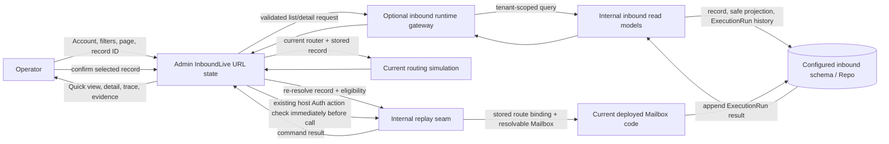

# Phase 170: Inbound Investigation and Recovery - Research

<user_constraints>
## User Constraints (from CONTEXT.md)

### Locked Decisions

#### Account-scoped investigation and return context
- **D-01:** Keep Account, filters, page, selected inbound record, and Quick view/full-detail state in URL navigation. Resolve a requested record by exact ID within the selected Account even when it is outside the current page or filters; explain that it is outside the current results without disclosing foreign-Account existence. Return to the same Account, filter, and page context. Account changes clear selected record and transient replay state while retaining compatible filters.
- **D-02:** Distinguish a successful empty read, no filter matches, out-of-range page, unavailable selection, inbound package unavailable, and failed/unavailable read. Reserve “no records” for a successful empty read. Do not silently convert missing optional support or read failures into an empty result.

#### Routing and execution truth
- **D-03:** Persisted ExecutionRun facts and durable route bindings are the historical record. The routing-clause trace evaluates the currently configured router; label it as a current routing simulation and never imply it proves which rules ran when the message arrived. Historical per-clause snapshots and deployment-version pinning are outside this phase.
- **D-04:** Use the same latest fresh execution disposition for list and detail summaries. Keep earlier fresh and replay runs in chronological history instead of allowing an older matched run to overwrite a later fresh result. Distinguish matched Mailbox, no match, failed execution, and missing execution history. A Mailbox outcome is not evidence of provider delivery or recipient receipt. Keep exact times, source, and IDs available where they support investigation; never infer missing facts.

#### Progressive evidence and privacy
- **D-05:** Lead with masked record identity and useful safe diagnostic facts, then disclose routing, execution history, and stored evidence progressively. Keep raw provider payload/MIME redacted by default behind the existing action-time :reveal_raw capability. Reset revealed state when record or Account selection changes.
- **D-06:** Project an explicit safe set of verification facts. Apply a field-level display policy to route matcher values and actual subject/header values; mask or withhold sensitive values in ordinary trace output. Do not render arbitrary provider facts, raw exception text, or stack traces. Keep payloads out of URLs, logs, and telemetry. Do not add a new reveal capability or raw export surface.

#### Replay eligibility and confirmation
- **D-07:** Determine replay eligibility from the selected record’s stored evidence, durable route binding, execution history, and resolvable Mailbox. Explain distinct no-prior-match, missing-history, and unsafe legacy-binding cases before confirmation where possible. Do not reconstruct an old route by evaluating current route rules or atomizing persisted module text.
- **D-08:** Describe replay as running the recorded Mailbox identity with currently deployed code against the stored inbound message. Keep it distinct from a current-router simulation and from provider delivery/redelivery. At confirmation, re-resolve the exact Account-scoped record and eligibility, then invoke the host’s existing :replay_inbound authorization immediately before execution. Keep tenant scoping at the read and replay seams.
- **D-09:** Keep replay as a single selected-record action. Show local pending/busy feedback and prevent duplicate submission from the same open confirmation. “Busy” describes the in-flight local action unless the runtime supplies a distinct contention fact; do not imply a global lock or add retries. Preserve selected record, Account, and history after denial, failure, or completion.

#### Outcome wording and retained history
- **D-10:** Report a replay run being recorded separately from the Mailbox outcome. Distinguish a recorded failed execution from a replay command that failed before a run was recorded. Show “requested” or “queued” only when an authoritative runtime fact supplies that state; current synchronous replay success is reported from the returned/persisted run.
- **D-11:** Show “no change” only when an explicit inbound command result or persisted fact says so. Do not infer it from :ignore, an unchanged message projection, or an empty/unavailable reread. The current inbound replay path appends an ExecutionRun and exposes Mailbox outcomes; the outbound definition based on newly normalized Event rows does not transfer. The owner resolved the missing source by approving the additive explicit `:no_change` Mailbox outcome in D-16.
- **D-12:** Keep command feedback separate from a later timeline read. Display terminal history only when the scoped read provides it; represent an unavailable refresh as unavailable. If background execution changes a selected record, refresh its lineage from a real completion signal or identify the displayed history as stale.

#### Interaction and dependency posture
- **D-13:** Reuse the existing Admin shell, LiveView/HEEx components, brand, type scale, spacing, themes, and focus patterns from Phase 168. Use native links/buttons and semantic lists/tables as content requires; do not add a partial ARIA grid. Preserve keyboard and touch access, narrow-screen readability, zoom, reduced-motion behavior, and the established 44px target baseline.
- **D-14:** Keep disclosures operable by keyboard with truthful expanded state. Announce action results and waiting states accessibly without moving focus. Keep replay confirmation named, modal behavior truthful, focus contained and returned, and a visible close/cancel action.
- **D-15:** Keep the runtime optional inbound gateway and internal read/replay seams. Preserve tenant predicates plus Tenancy.scope/2, host schema-prefix handling, stable adopter APIs, and the existing Auth adapter. Add only a narrow internal projection or gateway operation if eligibility needs it. Prefer the existing stack and a smaller dependency tree; no new dependency or frontend framework is justified by this phase.
- **D-16:** Add `:no_change` as an explicit, additive outcome of the stable `MailglassInbound.Mailbox.process/1` callback and persist it through the existing append-only ExecutionRun outcome path. Existing callback outcomes and their meanings remain unchanged. A mailbox must explicitly return `:no_change` before Admin can display that result; never infer it from `:ignore`, unchanged projections, or reread results. Keep the change limited to the new outcome and its required internal persistence/read/rendering support; do not add a dependency or change existing execution function signatures. This is the approved exception under D-15 because INUX-04 cannot truthfully expose the state through the current outcome set.
- **D-17:** For scoped inbound reads, render a read as unavailable only for an explicit gateway error value or `DBConnection.ConnectionError` (including queue timeout); do not display raw exception text. Let other exceptions and programming/configuration errors propagate to maintainers. Successful empty results retain their separate empty state. [VERIFIED: current gateway/read models return values directly or raise through Ecto; Admin lock includes db_connection 2.10.2; [CITED: DBConnection.ConnectionError reference](https://db-connection.hexdocs.pm/DBConnection.ConnectionError.html)]
- **D-18:** No suitable per-record execution-completion signal exists in the current Admin inbound flow: the existing PubSub event marks record insertion, while execution telemetry is not subscribed to by the selected-record UI. Keep selected lineage labeled as a snapshot through its last successful read and provide an explicit native refresh control; do not add polling or a new completion PubSub signal in this phase. [VERIFIED: `mailglass_admin/lib/mailglass_admin/inbound_live.ex:80-88,449-467`; `mailglass_inbound/lib/mailglass_inbound/execution.ex:20-47`; `mailglass_inbound/lib/mailglass_inbound/telemetry.ex:17,129-141`]

### the agent's Discretion
- Choose the exact responsive arrangement and order of existing summary, timeline, trace, evidence, and replay controls within the inherited Phase 168 design contract.
- Select the smallest safe allowlist and masking rules for diagnostic facts based on provider schemas and existing product policy; keep the behavior explicit and covered with sensitive fixtures.
- Choose narrow Admin-boundary error/state representations that distinguish unavailable reads from successful empty reads while preserving internal programming/configuration failures for maintainers.

### Deferred Ideas (OUT OF SCOPE)
- Persisted historical route snapshots or deployment-version pinning would add new evidence/retention semantics; current trace is explicitly labeled as a simulation.
- General inbound search, timeline pagination/export, bulk replay, provider redelivery, manual reconciliation, raw evidence export, and new retention policy are separate capabilities.
- New authorization capabilities or policy knobs, public API changes, framework migration, and new frontend dependencies are out of scope unless planning identifies a concrete requirement that cannot be met within existing contracts.
- No pending todos matched Phase 170.
</user_constraints>

<phase_requirements>
## Phase Requirements

| ID | Description | Research Support |
|----|-------------|------------------|
| INUX-01 | An operator can find and inspect an inbound record and return to the same account/filter context, including no records, no filter matches, and unavailable selections. | Existing LiveView URL/filter state and tenant-scoped exact-detail read are reusable; planning must separate list/page/filtered-empty/package/read-error states and test exact selected IDs outside list page/filters. |
| INUX-02 | An operator can follow an inbound record's routing and execution evidence and distinguish a matched mailbox, no match, failed execution, and missing history without invented certainty. | Use durable route binding and append-only ExecutionRun history; align list/detail latest fresh disposition and label route trace as present-router simulation. |
| INUX-03 | An authorized operator can inspect available inbound evidence through readable progressive disclosure while preserving existing redaction and reveal permissions. | Reuse EvidenceCard and :reveal_raw action-time Auth seam; replace arbitrary verification-facts and unmasked trace output with explicit field projection/masking. |
| INUX-04 | An operator can understand replay eligibility and perform a permitted inbound replay with clear confirmation and truthful outcomes, including disabled, denied, busy, no-change, and failure states. | Reuse tenant-scoped replay seam, durable eligibility facts, existing Auth adapter and modal; persist and render `:no_change` only when the Mailbox explicitly returns the new outcome approved in D-16. |
</phase_requirements>

**Researched:** 2026-10-08  
**Domain:** Phoenix LiveView operator investigation, multi-tenant inbound execution lineage, and privacy-safe recovery  
**Confidence:** HIGH for repository architecture and existing contracts; MEDIUM for external accessibility/security guidance.

## Summary

Phase 170 is a bounded refinement of the existing inbound Admin journey and supporting internal read seams. Keep the Admin-to-inbound runtime gateway, tenant-scoped read models, host authorization adapter, LiveView URL navigation, HEEx components, and existing asset pipeline. The current source already supplies the main pieces: paged records, exact detail, a chronological fresh/replay timeline, routing-clause reflection, default-redacted evidence, and synchronous single-record replay. [VERIFIED: `mailglass_admin/lib/mailglass_admin/inbound_live.ex:41-48,731-779`; `mailglass_admin/lib/mailglass_admin/optional_deps/mailglass_inbound.ex:93-171`; `mailglass_inbound/lib/mailglass_inbound/internal/operator/detail.ex:35-53,76-144`; `mailglass_inbound/lib/mailglass_inbound/internal/operator/timeline.ex:23-52`; `mailglass_inbound/lib/mailglass_inbound/internal/replay.ex:27-43`]

The highest-risk planning work is semantic, not a new technology choice: exact record selection currently depends on the current list/filter in Quick view and is discarded by a full-detail filter check; gateway absence and query results currently collapse to empty/zero values; detail can prefer an older matched run while list uses the latest fresh run; provider verification facts and route actuals render without a field-level display policy; and the source code has no no-change outcome yet. D-16 resolves the product contract by adding an explicit callback outcome, which the plan must thread through persistence, read projection and UI wording. [VERIFIED: `mailglass_admin/lib/mailglass_admin/inbound_live.ex:731-779,971-1099,1116-1131`; `mailglass_inbound/lib/mailglass_inbound/internal/operator/detail.ex:97-144`; `mailglass_inbound/lib/mailglass_inbound/internal/operator/records.ex:122-139`; `mailglass_admin/lib/mailglass_admin/inbound/evidence_card.ex:90-100`; `mailglass_admin/lib/mailglass_admin/inbound/routing_trace.ex:156-177`; `mailglass_inbound/lib/mailglass_inbound/execution.ex:334-343`; CONTEXT D-16]

**Primary recommendation:** Plan a small sequence across (1) scoped read/result-state seams and list/detail truth, (2) safe evidence/routing projection and progressive presentation, then (3) exact replay eligibility/confirmation/outcomes and connected acceptance. Do not add packages. Thread the explicitly returned `:no_change` through existing persistence and projection seams; preserve the meaning of existing Mailbox outcomes and never infer no-change from projection differences or read state. [VERIFIED: `mailglass_admin/mix.lock:38`; `mailglass_inbound/docs/api_stability.md:108-149`; `mailglass_inbound/lib/mailglass_inbound/execution.ex:49-72,334-343`; CONTEXT D-11/D-15/D-16]

## Architectural Responsibility Map

| Capability | Primary Tier | Secondary Tier | Rationale |
|------------|-------------|----------------|-----------|
| Account, filters, page and selected-record navigation | Frontend Server (SSR) | Browser / Client | `InboundLive` owns `handle_params`, URL building, validated filter assigns and selection; browser history is the durable navigation representation. [VERIFIED: `mailglass_admin/lib/mailglass_admin/inbound_live.ex:154-205,210-285,1296-1474`; [CITED: Phoenix LiveView live navigation](https://phoenix-live-view.hexdocs.pm/1.2.12/live-navigation.html)] |
| Exact Account-scoped record/detail/history reads | API / Backend | Database / Storage | Internal inbound read models own predicates, `Tenancy.scope/2`, Repo/schema-prefix handling and projections; LiveView should not own SQL. [VERIFIED: `mailglass_inbound/lib/mailglass_inbound/internal/operator/detail.ex:76-144`; `mailglass_inbound/lib/mailglass_inbound/internal/operator/records.ex:81-139`; `mailglass_inbound/lib/mailglass_inbound/internal/operator/timeline.ex:27-49`] |
| Routing/execution explanation | API / Backend | Frontend Server (SSR) | Persisted ExecutionRun and evidence binding are historical facts; route matcher reflection is a separate, current-config simulation rendered by Admin. [VERIFIED: `mailglass_inbound/lib/mailglass_inbound/inbound_records/execution_run.ex:1-7,38-46`; `mailglass_admin/lib/mailglass_admin/optional_deps/mailglass_inbound.ex:121-159`; CONTEXT D-03/D-04] |
| Raw evidence reveal and safe diagnostic display | Frontend Server (SSR) | Browser / Client | Admin applies field policy and checks existing host authorization at reveal time; raw provider data remains in the inbound storage projection and must not enter URL/log/telemetry. [VERIFIED: `mailglass_admin/lib/mailglass_admin/inbound_live.ex:359-385,1237-1277`; `mailglass_admin/lib/mailglass_admin/inbound/evidence_card.ex:39-63,90-150`; CONTEXT D-05/D-06] |
| Replay eligibility, authorization and execution | API / Backend | Frontend Server (SSR) | The inbound replay seam resolves stored route binding and exact scoped record/evidence; Admin revalidates selection and calls host `:replay_inbound` immediately before execution. [VERIFIED: `mailglass_inbound/lib/mailglass_inbound/internal/replay.ex:27-43,237-279`; `mailglass_admin/lib/mailglass_admin/inbound_live.ex:387-445`; `mailglass_admin/lib/mailglass_admin/inbound/destructive_action.ex:1-39`; CONTEXT D-07/D-08] |

## Project Constraints (from AGENTS.md)

- No `AGENTS.md` was found in the repository. No project-local `.agents/skills/` or `.codex/skills/` `SKILL.md` files were found during discovery. [VERIFIED: repository inventory]
- Preserve the optional package boundary: Admin calls inbound through the conditionally compiled runtime gateway; do not add a compile-time `mailglass_inbound` reference to Admin LiveView or promote internal seams into stable adopter APIs. [VERIFIED: `mailglass_admin/lib/mailglass_admin/optional_deps/mailglass_inbound.ex:1-46`; `mailglass_admin/docs/api_stability.md:20-52,145-168`; `mailglass_inbound/docs/api_stability.md:108-149`]
- Keep Account isolation at both read and replay seams using explicit tenant predicates plus `Tenancy.scope/2`; use `MailglassInbound.Repo` and preserve configured schema prefix. [VERIFIED: `mailglass_inbound/lib/mailglass_inbound/internal/operator/detail.ex:76-95`; `mailglass_inbound/lib/mailglass_inbound/internal/operator/timeline.ex:27-49`; `mailglass_inbound/lib/mailglass_inbound/internal/replay.ex:237-267`; `mailglass_inbound/docs/api_stability.md:414-435`]
- Preserve the stable router/Auth/session semantics and the existing host-owned `:operator_access` and `:destructive_action` moments; no new authorization capability or public API is justified by current evidence. [VERIFIED: `mailglass_admin/docs/operator-trust.md:14-58`; CONTEXT D-08/D-15]
- Reuse the current Phoenix LiveView/HEEx UI, shared component tokens, theme/focus conventions, and prebuilt CSS. The shared design guide forbids adding a parallel CSS system and requires rebuilt committed Admin assets when source/class use changes. [VERIFIED: `mailglass_admin/docs/design-system.md:1-37`; Phase 168 UI-SPEC `168-UI-SPEC.md:1-42`; CONTEXT D-13/D-15]
- Keep raw provider payload and MIME out of URL, application logs and telemetry. Continue to gate reveal through the existing `:reveal_raw` action-time host Auth call; do not create a raw export surface. [VERIFIED: `mailglass_admin/lib/mailglass_admin/inbound_live.ex:359-385,1237-1277`; CONTEXT D-05/D-06]

## Standard Stack

### Core

| Library / subsystem | Version | Purpose | Why Standard |
|---------------------|---------|---------|--------------|
| Elixir / OTP | Repository pin: Elixir `1.18.4`, Erlang `27.3.4.13`; these pins are not installed in the observed environment. | Admin LiveView and inbound read/replay implementation | Existing project toolchain and Mix packages. [VERIFIED: `.tool-versions:1-2`; `mailglass_admin/mix.exs:12`; `mailglass_inbound/mix.exs:16`] |
| Phoenix LiveView | Admin/inbound lock: `1.2.12`; root lock: `1.1.33` | URL-patched navigation, server-rendered updates and event handling | Already used by the affected LiveView and HEEx components; do not upgrade as part of this phase. [VERIFIED: `mailglass_admin/mix.lock:38`; `mailglass_inbound/mix.lock:33`; `mix.lock:49`; `mailglass_admin/lib/mailglass_admin/inbound_live.ex:24`] |
| Phoenix | `1.8.14` in package locks | Host router, LiveView and Phoenix.Component/HEEx integration | Existing package stack. [VERIFIED: `mailglass_admin/mix.lock:35`; `mailglass_inbound/mix.lock:31`] |
| Ecto SQL / Repo facade | `ecto_sql 3.14.0` in package locks | Tenant-scoped reads and persisted execution lineage | Existing `Repo`/`Tenancy` seams own DB access; keep query work out of LiveView. [VERIFIED: `mailglass_admin/mix.lock:13`; `mailglass_inbound/mix.lock:8`; `mailglass_inbound/lib/mailglass_inbound/internal/operator/detail.ex:76-95`] |
| PostgreSQL adapter | `postgrex 0.22.4` in package locks | Existing inbound persistence/test DB | Current database adapter, not a new phase dependency. [VERIFIED: `mailglass_admin/mix.lock:44`; `mailglass_inbound/mix.lock:38`] |
| Existing Admin UI and asset pipeline | Phoenix.Component/HEEx, Tailwind v4, vendored daisyUI utilities, prebuilt committed bundle | Native controls, responsive layouts, themes and shared states | The design-system guide names this as the current path; reuse shared components and semantic tokens. [VERIFIED: `mailglass_admin/docs/design-system.md:1-37`; Phase 168 UI-SPEC `168-UI-SPEC.md:1-42`] |

### Supporting

| Library / subsystem | Version | Purpose | When to Use |
|---------------------|---------|---------|-------------|
| Existing Auth adapter | Stable adopter-owned seam | Mount/access and action-time replay/reveal checks | Use at existing action time; do not replace it with a UI-only permission flag. [VERIFIED: `mailglass_admin/docs/operator-trust.md:14-58`; `mailglass_admin/lib/mailglass_admin/inbound/destructive_action.ex:1-39`] |
| Existing inbound Repo/Tenancy | In-repo internal seams | Tenant predicates, configured schema and account-safe reads | All list/detail/history/eligibility/replay access. [VERIFIED: `mailglass_inbound/lib/mailglass_inbound/internal/operator/records.ex:112-120`; `mailglass_inbound/lib/mailglass_inbound/internal/operator/timeline.ex:27-49`; `mailglass_inbound/lib/mailglass_inbound/internal/replay.ex:237-267`] |
| Playwright Test | Locked project package `1.59.1` | Connected browser acceptance for the integrated operator journey | Use after Elixir/OTP and test harness prerequisites are installed; browser binary/runtime was not launched or verified. [VERIFIED: `mailglass_admin/package.json:4-10`; `mailglass_admin/playwright.config.cjs:1-40`] |

### Alternatives Considered

| Instead of | Could Use | Tradeoff |
|------------|-----------|----------|
| Existing LiveView/HEEx/native disclosure and controls | A new frontend framework or ARIA grid | No evidence demonstrates a missing capability in the current stack; new framework would violate D-13/D-15 and add an unnecessary dependency. [VERIFIED: Phase 168 UI-SPEC `168-UI-SPEC.md:1-42`; CONTEXT D-13/D-15] |

**Installation:** None. This phase installs no external package. Preserve the no-new-dependency decision; package legitimacy audit is not applicable. [VERIFIED: CONTEXT D-15; project lock/source inspection]

**Version verification:** Versions above are the repository's currently locked versions, read from package `mix.lock` files on 2026-10-08. No registry query is needed because no external package is recommended or installed. [VERIFIED: `mailglass_admin/mix.lock`; `mailglass_inbound/mix.lock`; `mix.lock`]

## Architecture Patterns

### System Architecture Diagram



Data ownership and flow are derived from the existing gateway, read models, replay path and locked D-03/D-08 distinctions. The current route simulation is a separate branch from replay, which resolves the persisted binding. [VERIFIED: `mailglass_admin/lib/mailglass_admin/optional_deps/mailglass_inbound.ex:121-171`; `mailglass_inbound/lib/mailglass_inbound/internal/replay.ex:27-43,269-339`; CONTEXT D-03/D-08]

### Recommended Project Structure

```text
mailglass_admin/lib/mailglass_admin/
├── inbound_live.ex                  # URL state, typed read states, action orchestration
├── optional_deps/mailglass_inbound.ex # Optional runtime gateway; narrow wrappers only
└── inbound/
    ├── records_list.ex               # Semantic list/table and empty/unavailable states
    ├── quick_view.ex                 # Exact selection and list return
    ├── detail_header.ex              # Masked identity, current disposition, eligibility
    ├── routing_trace.ex              # Explicitly labeled current simulation
    ├── timeline.ex                   # Chronological persisted fresh/replay runs
    ├── evidence_card.ex              # Safe verification facts and gated raw evidence
    └── replay_modal.ex               # Single-record consequence and pending state

mailglass_inbound/lib/mailglass_inbound/internal/
├── operator/
│   ├── records.ex                    # Account-scoped list and outcome projection
│   ├── detail.ex                     # Exact Account-scoped detail and latest fresh outcome
│   └── timeline.ex                   # Account-scoped chronological lineage
└── replay.ex                         # Eligibility re-resolution and execution
```

These existing paths are verified as current implementations; the planner should add only the smallest internal projection/result seam when a requirement cannot be satisfied from current results. [VERIFIED: files listed above; CONTEXT D-15]

### Pattern 1: URL Is the Investigation State

**What:** Keep Account, filters, page, exact selection and Quick view/full-detail mode in the query URL; normalize/validate params in `handle_params` and use `push_patch` when changing state within this LiveView. [VERIFIED: `mailglass_admin/lib/mailglass_admin/inbound_live.ex:154-205,210-285,1296-1474`; [CITED: Phoenix LiveView 1.2.12 live navigation](https://phoenix-live-view.hexdocs.pm/1.2.12/live-navigation.html)]

**When to use:** Any list selection, filter, page change, Quick view/full-detail toggle, or return action that must survive refresh and browser history. [VERIFIED: CONTEXT D-01; `mailglass_admin/lib/mailglass_admin/inbound_live.ex:154-205,260-285`]

**Example:**

```elixir
def handle_params(params, _uri, socket) do
  selection = validate_selection(params)
  {:noreply, load_scoped_view(socket, params, selection)}
end

def handle_event("open_record", %{"id" => id}, socket) do
  {:noreply, push_patch(socket, to: record_path(socket, id))}
end
```

This illustrates the documented LiveView patch/parameter-validation pattern; `validate_selection/1`, `load_scoped_view/3`, and `record_path/2` are explanatory placeholders, not existing functions. [CITED: Phoenix LiveView 1.2.12 live navigation](https://phoenix-live-view.hexdocs.pm/1.2.12/live-navigation.html)

### Pattern 2: Exact Read Identity Is Separate from the Current List Slice

**What:** Read a requested ID using selected `tenant_id` plus exact record ID, independently of current list page/filter; keep the ID through an unavailable or outside-current-results state. Do not resolve foreign Account existence to distinguish it from a missing record. [VERIFIED: `mailglass_inbound/lib/mailglass_inbound/internal/operator/detail.ex:35-53,76-95`; CONTEXT D-01/D-02]

**When to use:** Deep links, browser Back/Forward, selected records moved outside the current page/window, and after replay refresh. [VERIFIED: CONTEXT D-01/D-12]

**Current boundary:** `Detail.fetch/2` is already an internal exact detail read with an explicit tenant predicate and `Tenancy.scope/2`; `Records.list_records_page/2` is the paged/filter read. Keep these responsibilities separate. [VERIFIED: `mailglass_inbound/lib/mailglass_inbound/internal/operator/detail.ex:35-95`; `mailglass_inbound/lib/mailglass_inbound/internal/operator/records.ex:81-119`]

### Pattern 3: Keep Historical Facts and Current Simulation Distinct

**What:** Present persisted ExecutionRun source/outcome/time/ID as historical lineage. Label trace output as a simulation against the currently declared router. Use the same latest-fresh selection rule in the list projection and detail summary; show all stored runs chronologically in the timeline. [VERIFIED: `mailglass_inbound/lib/mailglass_inbound/internal/operator/records.ex:122-139`; `mailglass_inbound/lib/mailglass_inbound/internal/operator/detail.ex:97-144`; `mailglass_inbound/lib/mailglass_inbound/internal/operator/timeline.ex:27-49`; `mailglass_admin/lib/mailglass_admin/optional_deps/mailglass_inbound.ex:121-159`; CONTEXT D-03/D-04]

**Closed persisted values, quoted verbatim:** `@sources [:fresh, :replay]`; `@outcomes [:no_match, :accept, :ignore, :reject, :bounce, :failed]`; `@type source :: :fresh | :replay`; `@type outcome :: :no_match | :accept | :ignore | :reject | :bounce | :failed`. [VERIFIED: `mailglass_inbound/lib/mailglass_inbound/inbound_records/execution_run.ex:16-20`]

### Pattern 4: Safe Facts Are Projected Before Rendering

**What:** Make an explicit server-side allowlist of safe verification facts and display/masking policy per key/value; apply the same policy to expected route matcher values and actual subject/header values. Leave arbitrary provider facts, exception details and stack traces out of ordinary UI. Keep raw source behind existing action-time reveal authorization. [VERIFIED: `mailglass_admin/lib/mailglass_admin/inbound/evidence_card.ex:90-100,104-150`; `mailglass_admin/lib/mailglass_admin/inbound/routing_trace.ex:156-177`; `mailglass_admin/lib/mailglass_admin/inbound_live.ex:359-385,1237-1277`; CONTEXT D-05/D-06]

**Why:** The current evidence component iterates every verification-fact entry, while the trace currently uses raw matcher/subject/header content for expected, actual and reason strings; email subject, address and header values may include sensitive or adversarial content. OWASP advises minimizing or masking sensitive personal data in logs, and the same data-minimization principle supports a narrow operator projection. [VERIFIED: `mailglass_admin/lib/mailglass_admin/inbound/evidence_card.ex:90-100`; `mailglass_admin/lib/mailglass_admin/inbound/routing_trace.ex:156-177`; [CITED: OWASP Logging Cheat Sheet](https://cheatsheetseries.owasp.org/cheatsheets/Logging_Cheat_Sheet.html)]

### Pattern 5: Eligibility Recheck, Then Authorize, Then Execute

**What:** On confirmation, re-resolve the exact selected record and current eligibility through Account-scoped internal reads, invoke the existing host `:replay_inbound` authorization immediately before the replay call, then report the returned command result separately from the later timeline refresh. [VERIFIED: `mailglass_admin/lib/mailglass_admin/inbound_live.ex:387-445`; `mailglass_admin/lib/mailglass_admin/inbound/destructive_action.ex:1-39`; `mailglass_inbound/lib/mailglass_inbound/internal/replay.ex:27-43`; CONTEXT D-08/D-10/D-12]

**When to use:** Every replay confirm, including a record that was eligible when the modal opened but whose Account, stored evidence, route binding, history or Mailbox changed before the click. [VERIFIED: CONTEXT D-08/D-09; [CITED: OWASP Authorization Cheat Sheet](https://cheatsheetseries.owasp.org/cheatsheets/Authorization_Cheat_Sheet.html)]

### Anti-Patterns to Avoid

- **Treat an empty list/zero aggregate as successful empty evidence:** optional package absence and gateway/read failures need distinct states; only a successful scoped read may produce “No records.” [VERIFIED: `mailglass_admin/lib/mailglass_admin/inbound_live.ex:971-981,1032-1072`; CONTEXT D-02]
- **Treat current router clauses as historical proof:** `explain_routes` reflects routes loaded from the current router and evaluates the stored record against them. Label this a current simulation. [VERIFIED: `mailglass_admin/lib/mailglass_admin/optional_deps/mailglass_inbound.ex:121-159`; CONTEXT D-03]
- **Resolve a legacy route from saved module text or by rematching current routes:** the replay seam intentionally uses durable route binding and refuses unsafe older rows; do not reintroduce dynamic module resolution or silently route historical content differently. [VERIFIED: `mailglass_inbound/lib/mailglass_inbound/internal/replay.ex:269-299`; `mailglass_inbound/docs/inbound-operator.md:168-188`; CONTEXT D-07]
- **Infer “no change” from `:ignore`, a same-looking projection, or an empty reread:** expose it only if an explicit result/persisted fact exists. [VERIFIED: `mailglass_inbound/lib/mailglass_inbound/execution.ex:334-343`; CONTEXT D-11]
- **Use client disabled state as the only replay guard:** retain pending feedback but re-resolve selection/eligibility and guard duplicate handling on the LiveView server path. [VERIFIED: `mailglass_admin/lib/mailglass_admin/inbound/replay_modal.ex:68-88`; CONTEXT D-08/D-09]

## Don't Hand-Roll

| Problem | Don't Build | Use Instead | Why |
|---------|-------------|-------------|-----|
| Routing clause semantics | A second matcher in the LiveView or UI module | `MailglassInbound.Router.Matcher.explain/2` through the existing optional gateway | A duplicate matcher can disagree with actual route evaluation; keep presentation separate from the route engine. [VERIFIED: `mailglass_admin/lib/mailglass_admin/optional_deps/mailglass_inbound.ex:114-159`] |
| Account query scope | Admin-side SQL, or selection-option membership as authorization | Existing internal operator read models, explicit tenant predicates, `Tenancy.scope/2`, `MailglassInbound.Repo` | These own the row and schema boundary; read and replay both need independent tenant scope. [VERIFIED: `mailglass_inbound/lib/mailglass_inbound/internal/operator/detail.ex:76-95`; `mailglass_inbound/lib/mailglass_inbound/internal/operator/timeline.ex:27-49`; `mailglass_inbound/lib/mailglass_inbound/internal/replay.ex:249-267`] |
| Host authorization | New package-specific auth rules or UI-only button checks | Existing `MailglassAdmin.Auth` adapter and the `:replay_inbound` / `:reveal_raw` action calls | The host owns policy, recent authentication and action-time decisions. [VERIFIED: `mailglass_admin/docs/operator-trust.md:45-58`; `mailglass_admin/lib/mailglass_admin/inbound/destructive_action.ex:23-39`; `mailglass_admin/lib/mailglass_admin/inbound_live.ex:1237-1277`] |
| Disclosure and status semantics | Partial ARIA grid or custom client framework | Native links/buttons, semantic table/list, existing modal/focus hooks and W3C disclosure/status guidance | Existing stack supports this workflow; W3C specifies Enter/Space and accurate `aria-expanded` for disclosures, and WCAG status messages need programmatically exposed results/wait states. [VERIFIED: CONTEXT D-13/D-14; [CITED: W3C ARIA APG Disclosure](https://www.w3.org/WAI/ARIA/apg/patterns/disclosure/); [CITED: WCAG 2.2 Status Messages](https://www.w3.org/WAI/WCAG22/Understanding/status-messages.html)] |
| Evidence privacy policy | Render all provider maps or invent a reveal/export pathway | A narrow allowlist/projection plus existing `:reveal_raw` action | Arbitrary provider metadata can contain addresses, subjects, tokens or hostile strings; raw payload remains restricted. [VERIFIED: `mailglass_admin/lib/mailglass_admin/inbound/evidence_card.ex:90-100`; CONTEXT D-05/D-06; [CITED: OWASP Logging Cheat Sheet](https://cheatsheetseries.owasp.org/cheatsheets/Logging_Cheat_Sheet.html)] |

**Key insight:** The safest implementation reuses the durable inbound evidence and current boundaries, then makes uncertainty visible at the Admin boundary. A new dependency cannot answer whether a historical run happened, whether a selected Account owns a record, or whether an inbound command explicitly reported no change. [VERIFIED: `mailglass_inbound/lib/mailglass_inbound/internal/replay.ex:27-43,269-339`; CONTEXT D-01/D-03/D-08/D-11/D-15]

## Common Pitfalls

### Pitfall 1: Confusing a page result with an exact selection

**What goes wrong:** A valid record ID outside the current page/filter is displayed as unavailable or its URL selection is dropped. [VERIFIED: `mailglass_admin/lib/mailglass_admin/inbound_live.ex:745-779,1102-1123`]

**Why it happens:** Quick view searches only the current `records` page; full detail does call exact detail, but then `filter_selected_detail/3` discards the loaded detail when current filters do not match. [VERIFIED: `mailglass_admin/lib/mailglass_admin/inbound_live.ex:745-752,766-779,1102-1123`]

**How to avoid:** Keep requested ID separately, resolve it by exact Account-scoped detail lookup, retain it when it falls outside the visible query, and use non-disclosing unavailable copy for missing/foreign IDs. Test list return retains Account/filter/page. [VERIFIED: CONTEXT D-01/D-02; `mailglass_inbound/lib/mailglass_inbound/internal/operator/detail.ex:35-95`]

**Warning signs:** Selection works only if record is first on page; Quick view reports “outside active filters” without telling the operator it is outside the result set; selecting Back changes page or reopens Quick view. [VERIFIED: `mailglass_admin/lib/mailglass_admin/inbound/quick_view.ex:8-12,78-90`; CONTEXT D-01]

### Pitfall 2: Hiding read failures as empty data

**What goes wrong:** A missing optional inbound package, unavailable query, failed read, truly empty Account and no filter matches all look like a successful empty list/zero. [VERIFIED: `mailglass_admin/lib/mailglass_admin/inbound_live.ex:971-981,1032-1072`; `mailglass_admin/lib/mailglass_admin/inbound/records_list.ex:61-104`]

**Why it happens:** The current gateway absence branch returns `empty_page_meta()`/`@zero_summary`; read-model APIs also use empty collections for blank tenant or zero rows. [VERIFIED: `mailglass_admin/lib/mailglass_admin/inbound_live.ex:1032-1072`; `mailglass_inbound/lib/mailglass_inbound/internal/operator/records.ex:81-109`; `mailglass_inbound/lib/mailglass_inbound/internal/operator/summary.ex:30-52`]

**How to avoid:** Introduce narrow Admin-boundary states/results for successful empty, filtered empty, page out of range, package unavailable, and known read unavailable. Do not broad-rescue application errors; keep unknown programming/configuration failures visible to maintainers. [VERIFIED: CONTEXT D-02 and discretion item 3; `mailglass_admin/lib/mailglass_admin/inbound_live.ex:1032-1072`]

**Warning signs:** “No records” on the optional-dependency build, a zero summary after DB failure, or “No execution runs” when timeline read is unavailable. [VERIFIED: `mailglass_admin/lib/mailglass_admin/inbound_live.ex:1032-1099`; `mailglass_admin/lib/mailglass_admin/inbound/timeline.ex:30-34`]

### Pitfall 3: List and detail disagree on the latest fresh disposition

**What goes wrong:** List shows a later `:failed`/`:no_match` fresh result, while detail reuses an earlier matched Mailbox. [VERIFIED: `mailglass_inbound/lib/mailglass_inbound/internal/operator/records.ex:122-139`; `mailglass_inbound/lib/mailglass_inbound/internal/operator/detail.ex:97-144`]

**Why it happens:** List reads the latest fresh run by `inserted_at`; Detail first looks for the latest matched fresh run and only falls back to latest fresh if none matched. [VERIFIED: `mailglass_inbound/lib/mailglass_inbound/internal/operator/detail.ex:97-144`; `mailglass_inbound/lib/mailglass_inbound/internal/operator/records.ex:157-187`]

**How to avoid:** Share or align latest-fresh selection semantics; retain every fresh and replay run in chronological timeline and keep replay results separate from current fresh disposition. [VERIFIED: CONTEXT D-04; `mailglass_inbound/lib/mailglass_inbound/internal/operator/timeline.ex:27-49`]

**Warning signs:** Detail header mailbox/outcome differs from selected list row after a fresh failure or retry; a replay run overwrites the fresh summary. [VERIFIED: the query functions cited above; `mailglass_inbound/lib/mailglass_inbound/internal/operator/timeline.ex:29-47`]

### Pitfall 4: Exposing sensitive provider fields in ordinary diagnostics

**What goes wrong:** Verification facts, route matchers, subjects or header values show raw PII/secrets or untrusted text before the operator is authorized to reveal raw evidence. [VERIFIED: `mailglass_admin/lib/mailglass_admin/inbound/evidence_card.ex:90-100`; `mailglass_admin/lib/mailglass_admin/inbound/routing_trace.ex:156-177`]

**Why it happens:** EvidenceCard enumerates the provider's entire `verification_facts` map; RoutingTrace renders expected matcher and actual values directly in its normal trace. [VERIFIED: files/lines above]

**How to avoid:** Project an explicit provider-aware allowlist, mask values by field, render safe text through HEEx escaping, and put adversarial PII/secrets in sensitive fixtures. Keep raw payload/MIME redacted by default and gated through the current Auth seam. [VERIFIED: CONTEXT D-05/D-06; `mailglass_admin/lib/mailglass_admin/inbound_live.ex:359-385,1237-1277`; [CITED: OWASP Logging Cheat Sheet](https://cheatsheetseries.owasp.org/cheatsheets/Logging_Cheat_Sheet.html)]

**Warning signs:** UI loops over the map without a policy, “expected” values reveal addresses, header actuals reveal sensitive headers, raw error/reason text is visible, or payload values appear in URL/telemetry. [VERIFIED: `mailglass_admin/lib/mailglass_admin/inbound/evidence_card.ex:90-100`; `mailglass_admin/lib/mailglass_admin/inbound/routing_trace.ex:156-177`; CONTEXT D-06]

### Pitfall 5: Treating replay command success as the Mailbox result or a provider delivery

**What goes wrong:** A recorded failed ExecutionRun is described as pre-run command failure; local replay completion is described as a new provider receipt/delivery; “requested” is shown without queued/request fact. [VERIFIED: `mailglass_inbound/lib/mailglass_inbound/internal/replay.ex:27-43`; `mailglass_inbound/lib/mailglass_inbound/execution.ex:49-72`; CONTEXT D-08/D-10]

**Why it happens:** The current LiveView discards `_result` and uses one generic success flash; a `:failed` run is a persisted result, whereas an error before insertion returns an error tuple. [VERIFIED: `mailglass_admin/lib/mailglass_admin/inbound_live.ex:399-416`; `mailglass_inbound/lib/mailglass_inbound/execution.ex:49-72,334-343`]

**How to avoid:** Match structured result values; say the run was recorded separately from its `outcome`; distinguish command errors before run persistence; refresh from scoped timeline only when it succeeds and mark unavailable refresh separately. Never imply provider redelivery or recipient receipt. [VERIFIED: CONTEXT D-08/D-10/D-12; `mailglass_inbound/docs/inbound-operator.md:88-160`]

**Warning signs:** One “Replay recorded” line for all outcomes, no source/outcome in detail, latest timeline read used to overwrite command feedback, or provider language in Mailbox result copy. [VERIFIED: `mailglass_admin/lib/mailglass_admin/inbound_live.ex:408-416`; `mailglass_admin/lib/mailglass_admin/inbound/timeline.ex:25-60`; CONTEXT D-10/D-12]

### Pitfall 6: Inventing inbound no-change semantics

**What goes wrong:** A result is called “no change” because Mailbox returned `:ignore`, record display looks the same, or a reread is empty/unavailable. [VERIFIED: CONTEXT D-11; `mailglass_inbound/lib/mailglass_inbound/execution.ex:334-343`]

**Why it happens:** The current replay command synchronously executes and normalizes only outcome, outcome reason, and failure into the return map; its durable record is an ExecutionRun, not outbound Event-row counts. [VERIFIED: `mailglass_inbound/lib/mailglass_inbound/execution.ex:49-72,334-343`; `mailglass_inbound/lib/mailglass_inbound/inbound_records/execution_run.ex:38-46`]

**How to avoid:** Require the Mailbox to explicitly return the approved `:no_change` outcome, persist it as the ExecutionRun outcome, and preserve it through read projection and Admin result rendering. Keep `:ignore` distinct; never infer the outcome from a projection diff or reread. [VERIFIED: CONTEXT D-11/D-16; `mailglass_inbound/lib/mailglass_inbound/execution.ex:334-343`; `mailglass_inbound/lib/mailglass_inbound/inbound_records/execution_run.ex:38-46`]

**Warning signs:** Branching on `:ignore`, comparing record structs, or interpreting timeline refresh failure as a no-change. [VERIFIED: CONTEXT D-11]

### Pitfall 7: A disabled control or modal button is the only replay guard

**What goes wrong:** Duplicate confirmation or stale eligibility can execute more than once; “busy” is incorrectly presented as a global lock; selected context is cleared on an error. [VERIFIED: CONTEXT D-08/D-09]

**Why it happens:** Current modal uses `phx-disable-with`, but `confirm_replay` has no consumed/open-review assign guard and accepts an event whenever a selected replayable record loads. [VERIFIED: `mailglass_admin/lib/mailglass_admin/inbound/replay_modal.ex:68-88`; `mailglass_admin/lib/mailglass_admin/inbound_live.ex:399-447`]

**How to avoid:** Preserve modal focus behavior and current local pending feedback; add a server-side single-open-confirm guard, revalidate exact selected Account/record/eligibility at confirmation, and preserve selection after denial/failure/completion. Do not add retries or a distributed lock. [VERIFIED: CONTEXT D-08/D-09/D-14]

**Warning signs:** Two ExecutionRun rows from rapid double-submit, confirmation after Account switch, or busy copy implying other operators cannot replay. [VERIFIED: CONTEXT D-09]

## Code Examples

### URL patch with validated parameters

```elixir
def handle_params(params, _uri, socket) do
  filter =
    case params["sort_by"] do
      value when value in ~w(name company) -> value
      _ -> "name"
    end

  {:noreply, assign(socket, :sort_by, filter)}
end
```

This follows the official LiveView example: `handle_params/3` receives user-controlled URL params after a patch; validate them before assigning or querying. For Phase 170, adapt this to the existing Account/filter/page/record URL state and current project API, not this illustrative `sort_by` parameter. [CITED: Phoenix LiveView 1.2.12 live navigation](https://phoenix-live-view.hexdocs.pm/1.2.12/live-navigation.html)

### Native accessible disclosure

Use a native `<button type="button">` to toggle the actual content and set `aria-expanded` to match visibility; Enter and Space must operate the disclosure. Prefer this over custom tree/grid semantics for routing, evidence and timeline sections. [CITED: W3C ARIA APG Disclosure](https://www.w3.org/WAI/ARIA/apg/patterns/disclosure/)

### Accessible action feedback

Keep an always-present polite status region for success/result/waiting feedback, and use an error/alert treatment only for important errors that do not otherwise change context. Do not move focus just to announce a normal result. WCAG explains that status messages cover results, waiting/progress and errors when no context change occurs. [CITED: WCAG 2.2 Understanding 4.1.3](https://www.w3.org/WAI/WCAG22/Understanding/status-messages.html)

## State of the Art

| Old Approach | Current Approach | When Changed | Impact |
|--------------|------------------|--------------|--------|
| Reconstruct historic replay target by converting persisted module names or re-running routing rules | Resolve mailbox only from durable route binding written with inbound evidence | Durable route binding introduced in inbound `2.2.0`; current operator docs prohibit unsafe legacy rematching | Explain unsafe legacy history as unavailable; never silently change old target. [VERIFIED: `mailglass_inbound/docs/inbound-operator.md:168-188`; `mailglass_inbound/lib/mailglass_inbound/internal/replay.ex:269-299`] |
| Treat route trace as if it were historical routing evidence | Clearly label it as a simulation against the current router | Locked in Phase 170 CONTEXT D-03 | Persisted run/binding remain historical truth; current clause output answers a different question. [VERIFIED: CONTEXT D-03; `mailglass_admin/lib/mailglass_admin/optional_deps/mailglass_inbound.ex:121-159`] |
| Reuse outbound “new normalized Event rows means no change” logic | Require the Mailbox to explicitly return the additive `:no_change` outcome; persist it through the existing ExecutionRun outcome path | Locked in Phase 170 CONTEXT D-11/D-16 | Do not map `:ignore`, result diffs, or reread state to `:no_change`. [VERIFIED: CONTEXT D-16; `mailglass_inbound/lib/mailglass_inbound/execution.ex:334-343`] |

**Deprecated/outdated:** No external packages, frameworks, or provider APIs are recommended for this phase. Do not add a dependency or replace the current API/UI stack without a newly demonstrated inability to meet a locked requirement. [VERIFIED: CONTEXT D-15]

## Assumptions Log

| # | Claim | Section | Risk if Wrong |
|---|-------|---------|---------------|
| A1 | A narrow internal `eligibility` or result projection can provide the UI's per-record pre-confirm eligibility and unavailable-read distinctions without changing stable adopter APIs. | Architecture / replay | If the right owner is not inbound internal operator/replay, maintainers must settle the boundary before plan lock. [ASSUMED] |
| A2 | The existing Playwright browser installation can launch the required browser after Elixir/OTP and harness prerequisites are installed; only the package CLI/version was observed, not an actual browser launch. | Environment | Connected rendered proof may need a separate browser binary/bootstrap step. [ASSUMED] |

## Questions Resolved During Planning

1. **How should the Admin boundary represent known operational read failure? (RESOLVED: D-17)**
   - What we know: current internal list/detail/timeline read contracts return collections/maps/nil for their regular cases; absent gateway in LiveView currently becomes empty page/zero summary. [VERIFIED: `mailglass_inbound/lib/mailglass_inbound/internal/operator/records.ex:81-109`; `mailglass_inbound/lib/mailglass_inbound/internal/operator/detail.ex:35-54`; `mailglass_inbound/lib/mailglass_inbound/internal/operator/timeline.ex:23-52`; `mailglass_admin/lib/mailglass_admin/inbound_live.ex:1032-1099`]
   - Resolution: Convert only an explicit gateway error value or `DBConnection.ConnectionError` (including queue timeout) into a sanitized unavailable read. Do not catch arbitrary exceptions, adapter SQL errors, or programming/configuration faults; let them reach maintainers. Keep successful empty results separate. [VERIFIED: CONTEXT D-02/D-17; `mailglass_inbound/lib/mailglass_inbound/internal/operator/records.ex:81-109`; `mailglass_inbound/lib/mailglass_inbound/internal/operator/detail.ex:35-54`; [CITED: DBConnection.ConnectionError reference](https://db-connection.hexdocs.pm/DBConnection.ConnectionError.html)]
2. **What completion signal updates an already-selected timeline after background execution? (RESOLVED: D-18)**
   - What we know: inbound insert PubSub carries an ID and the current handler prepends the tenant-scoped inserted record; execution can also be dispatched asynchronously. [VERIFIED: `mailglass_admin/lib/mailglass_admin/inbound_live.ex:80-88,449-467`; `mailglass_inbound/lib/mailglass_inbound/execution.ex:20-47`]
   - Resolution: The inbound insert PubSub carries an inserted record ID, not execution completion for the selected record; execution telemetry is not consumed by this LiveView. Label selected lineage as a timestamped snapshot, add an explicit native refresh control, and add no polling or new PubSub signal. [VERIFIED: CONTEXT D-12/D-18; `mailglass_admin/lib/mailglass_admin/inbound_live.ex:80-88,449-467`; `mailglass_inbound/lib/mailglass_inbound/execution.ex:20-47`; `mailglass_inbound/lib/mailglass_inbound/telemetry.ex:17,129-141`]

## Environment Availability

| Dependency | Required By | Available | Version / observation | Fallback |
|------------|-------------|-----------|------------------------|----------|
| Elixir and Erlang | Mix tests/builds for Admin and inbound code | ✗ | `.tool-versions` pins `erlang 27.3.4.13` and `elixir 1.18.4`; `asdf current` reported both pinned versions not installed. | Install/use project-pinned versions before phase validation; no observed fallback runtime. [VERIFIED: `.tool-versions:1-2`; `asdf current` output 2026-10-08] |
| Node.js / npm | Admin browser harness | ✓ | Node `v26.10.0`; npm `11.19.1`. | None required for current package script. [VERIFIED: local version probes 2026-10-08] |
| PostgreSQL | Existing core/Admin ExUnit and browser harness DB setup | ✓ | `pg_isready`: `/tmp:5432 - accepting connections` at research time. No app or browser server started. | Existing test DB setup. [VERIFIED: local probe 2026-10-08] |
| Playwright CLI/package | Connected browser acceptance | ✓ | package CLI `1.59.1`; `mailglass_admin/node_modules/.bin/playwright` present. Browser engine was not launched/probed. | Focused ExUnit can check semantics; rendered acceptance still requires working browser. [VERIFIED: `mailglass_admin/package.json:4-10`; local binary/version probe 2026-10-08] |
| Admin/inbound build artifacts | Existing test packages | ✓ | `mailglass_admin/_build` and `mailglass_inbound/_build` directories exist. | Let the normal package test/build command report staleness; no test run during research. [VERIFIED: local directory probe 2026-10-08] |

**Missing dependencies with no fallback:** Repository-pinned Elixir/Erlang are not installed in this environment; execution/verification will need those pins installed or an explicitly accepted compatible runtime. The user directed that this research pass not run tests or boot the app. [VERIFIED: `.tool-versions:1-2`; `asdf current` output 2026-10-08]

**Missing dependencies with fallback:** None identified. Browser engine availability remains unverified rather than observed missing. [VERIFIED: local probes 2026-10-08]

## Validation Architecture

`workflow.nyquist_validation` is `true`; keep the Validation Architecture in the plan. No tests or app/browser server were run during this planning-stage research. [VERIFIED: `.planning/config.json:20`; research task scope]

### Test Framework

| Property | Value |
|----------|-------|
| Framework | ExUnit in package Mix projects; Playwright Test for connected browser acceptance. [VERIFIED: `mailglass_admin/test/mailglass_admin/inbound_live_test.exs:1-2`; `mailglass_inbound/test/mailglass_inbound/internal/operator/records_test.exs`; `mailglass_admin/package.json:4-10`] |
| Config file | Mix package configs; `mailglass_admin/playwright.config.cjs`. [VERIFIED: `mailglass_admin/playwright.config.cjs:1-40`] |
| Admin quick run command | From `mailglass_admin`: `mix test test/mailglass_admin/inbound_live_test.exs test/mailglass_admin/inbound/components_test.exs test/mailglass_admin/inbound/evidence_card_test.exs test/mailglass_admin/inbound/replay_modal_test.exs`. [VERIFIED: existing test paths] |
| Inbound quick run command | From `mailglass_inbound`: `mix test test/mailglass_inbound/internal/operator/records_test.exs test/mailglass_inbound/replay_test.exs test/mailglass_inbound/async_execution_test.exs`. [VERIFIED: existing test paths] |
| Connected acceptance command | From `mailglass_admin`: `npm run test:operator-browser`; this command builds assets and Playwright config starts its isolated operator server. It is a future acceptance command, not run in research. [VERIFIED: `mailglass_admin/package.json:4-10`; `mailglass_admin/playwright.config.cjs:1-40`] |
| Full package suites | From Admin: `mix test`; from inbound: `mix test`. Run after focused semantic checks and connected acceptance. [VERIFIED: package layout; no test execution claimed] |

### Phase Requirements → Test Map

| Req ID | Behavior | Test Type | Automated Command | File Exists? |
|---|---|---|---|---|
| INUX-01 | Exact Account-scoped selection across page/filter, list return, empty/no-match/out-of-range/unavailable/package/read-error states | Inbound unit + Admin LiveView + connected browser | Admin quick command; inbound `records_test.exs`; `npm run test:operator-browser` | Yes; extend focused cases for exact off-page/filter selection and distinct unavailable states. [VERIFIED: current test files exist; CONTEXT D-01/D-02] |
| INUX-02 | Latest fresh disposition agrees in list/detail; run history is chronological; no-match/failed/missing states remain distinct; current trace is labeled simulation and masks sensitive fields | Inbound unit + Admin component/LiveView | Inbound quick command; Admin quick command | Yes; add regression cases for older matched followed by later failed/no-match fresh result and unsafe trace fixtures. [VERIFIED: `mailglass_inbound/test/mailglass_inbound/internal/operator/records_test.exs`; `mailglass_admin/test/mailglass_admin/inbound_live_test.exs`; `mailglass_admin/test/mailglass_admin/inbound/components_test.exs`] |
| INUX-03 | Progressive safe evidence; raw remains default redacted and reveal denial/grant/reset behavior follows existing capability | Admin component + LiveView + keyboard/browser | Admin quick command; `npm run test:operator-browser` | Yes; extend with allowlist/masking fixtures for verification facts and route expected/actual values. [VERIFIED: `mailglass_admin/test/mailglass_admin/inbound/evidence_card_test.exs`; `mailglass_admin/test/mailglass_admin/inbound_live_test.exs`] |
| INUX-04 | Replay eligibility, action-time authorization, local busy/duplicate guard, persisted-vs-command failures, explicit `:no_change` evidence, context retained | Inbound replay unit + Admin LiveView/modal + connected browser | Inbound quick command; Admin quick command; `npm run test:operator-browser` | Yes; assert callback-returned `:no_change` persists and renders distinctly while `:ignore` and projection/reread state do not become no-change; also cover stale eligibility, duplicate submission and result-refresh failure. [VERIFIED: `mailglass_inbound/test/mailglass_inbound/replay_test.exs`; `mailglass_admin/test/mailglass_admin/inbound_live_test.exs`; `mailglass_admin/test/mailglass_admin/inbound/replay_modal_test.exs`; CONTEXT D-08–D-12/D-16] |

### Sampling Rate

- **Per core read/replay task:** run only the affected inbound read/replay ExUnit module(s) from the inbound package. [VERIFIED: existing `mailglass_inbound/test/mailglass_inbound/internal/operator/` and `replay_test.exs`]
- **Per LiveView/component task:** run the affected Admin LiveView/component module(s) from `mailglass_admin`. [VERIFIED: existing Admin inbound tests]
- **Per integrated journey slice:** run the focused connected Playwright path after pinned Elixir/Erlang and browser harness prerequisites are available. [VERIFIED: `mailglass_admin/package.json:4-10`; `mailglass_admin/playwright.config.cjs:1-40`]
- **Phase gate:** all scoped read/replay semantics, Admin states, security checks and rendered workflow pass; rebuild committed CSS bundle if source/class changes were made. [VERIFIED: `mailglass_admin/docs/design-system.md:1-37`; `.planning/config.json:20`]

### Wave 0 Gaps

- [ ] Add exact selection cases: a valid same-Account inbound ID outside page/filter remains selected; foreign/missing IDs are non-disclosing; switching Account clears record/replay/reveal state but retains compatible filter/page context. [VERIFIED: CONTEXT D-01; source paths above]
- [ ] Distinguish successful zero rows, no filter matches, out-of-range page, package absent, invalid/unavailable selection, and known read failure; preserve other available panels and propagate unexpected programming/configuration failures. [VERIFIED: CONTEXT D-02; `inbound_live.ex:1032-1099`]
- [ ] Add latest fresh run regression: `:accept` followed by fresh `:failed` or `:no_match` must yield one disposition in both list and detail; replay history remains separately chronological. [VERIFIED: `records.ex:122-139`; `detail.ex:97-144`; `timeline.ex:27-49`]
- [ ] Add safe provider/trace fixtures containing subject, recipient, sensitive header, arbitrary verification key, exception text and hostile markup; assert ordinary UI omits/masks disallowed values while reveal authorization remains action-time and raw remains redacted after selection/Account changes. [VERIFIED: CONTEXT D-05/D-06; `evidence_card.ex:90-150`; `routing_trace.ex:156-177`]
- [ ] Exercise replay eligibility for fresh no-match, missing execution history, unsafe legacy binding, resolvable mailbox, mailbox no longer resolvable, and a record/eligibility change between modal open and confirm; assert no foreign Account existence leak. [VERIFIED: `internal/replay.ex:269-299`; CONTEXT D-07/D-08]
- [ ] Add distinct result fixtures for recorded `:failed` run versus pre-run command error, actual queued/requested fact only where runtime supplies it, denied auth, local busy/double submit, unavailable terminal history refresh, and a callback-returned `:no_change` persisted and displayed distinctly from `:ignore`. [VERIFIED: `execution.ex:49-72,334-343`; CONTEXT D-09–D-12/D-16]
- [ ] Browser acceptance should cover one full Account → list → Quick view → detail → evidence → replay → return task at desktop and narrow/mobile widths, keyboard/touch, zoom, Light/Dark/System, reduced motion, empty/error/denied/busy and long/non-ASCII data. [VERIFIED: CONTEXT D-13/D-14; `.planning/ROADMAP.md:140-153`]
- No new framework/config/fixture package is identified; use the existing ExUnit/Playwright harness. [VERIFIED: existing package/test manifests; CONTEXT D-15]

## Security Domain

Security applies because this phase reads tenant data, accepts URL-supplied record IDs, reveals raw PII, and executes a host-authorized replay. OWASP ASVS project page identifies version 5.0.0 as current (“Bleeding Edge”); ASVS categories below use the current 5.0 taxonomy where referenced, not an assertion of ASVS conformance. [CITED: [OWASP ASVS Project](https://owasp.org/projects/asvs); [OWASP ASVS 5.0 taxonomy](https://cornucopia.owasp.org/taxonomy/asvs-5.0)]

### Applicable ASVS Categories

| ASVS 5.0 category | Applies | Standard control / phase relevance |
|-------------------|---------|------------------------------------|
| V02 Validation and Business Logic | Yes | Validate URL IDs, Account/filter/page parameters and eligible replay state server-side; never rely on disabled controls. [CITED: [ASVS 5.0 Input Validation](https://cornucopia.owasp.org/taxonomy/asvs-5.0/02-validation-and-business-logic/02-input-validation); VERIFIED: `mailglass_admin/lib/mailglass_admin/inbound_live.ex:1296-1474`] |
| V03 Web Frontend Security | Yes | HEEx escape untrusted subject/header/provider values; retain safe semantic disclosure and modal behavior. [CITED: [ASVS 5.0 taxonomy](https://cornucopia.owasp.org/taxonomy/asvs-5.0); VERIFIED: `routing_trace.ex:156-177`; `evidence_card.ex:90-100`] |
| V06 Authentication | Yes, host-owned | Preserve existing Admin mount authorization and host Auth adapter; Mailglass does not add login or policy. [VERIFIED: `mailglass_admin/docs/operator-trust.md:14-58`; [CITED: OWASP ASVS Project](https://owasp.org/projects/asvs)] |
| V07 Session Management | Yes, preserve | Keep explicit operator session whitelist; do not widen copied host session values. [VERIFIED: `mailglass_admin/docs/operator-trust.md:31-43`; `mailglass_admin/docs/api_stability.md:76-91`] |
| V08 Authorization | Yes | Exact reads and replay include selected Account and record; invoke host replay authorization immediately before execution; guessed foreign IDs remain non-disclosing. [VERIFIED: `detail.ex:76-95`; `internal/replay.ex:237-267`; `inbound_live.ex:387-445`; [CITED: OWASP Authorization Cheat Sheet](https://cheatsheetseries.owasp.org/cheatsheets/Authorization_Cheat_Sheet.html)] |
| V11 Cryptography | No new crypto operation | Do not change provider signature verification or expose signed/raw payload. [VERIFIED: CONTEXT D-06/D-15; inbound API stability on signature errors] |
| V14 Data Protection | Yes | Minimize/mask verification facts, route values and PII; raw reveal remains capability-gated; do not emit payload in URL/log/telemetry. [VERIFIED: CONTEXT D-05/D-06; `evidence_card.ex:90-150`; [CITED: OWASP Logging Cheat Sheet](https://cheatsheetseries.owasp.org/cheatsheets/Logging_Cheat_Sheet.html)] |
| V16 Security Logging and Error Handling | Yes | Map only known operational errors to unavailable; do not expose exception/stack text; preserve maintainer visibility for unexpected faults. [CITED: [ASVS 5.0 taxonomy](https://cornucopia.owasp.org/taxonomy/asvs-5.0); VERIFIED: CONTEXT D-02/D-06 and discretion item 3] |

### Known Threat Patterns for Phoenix LiveView / Ecto

| Pattern | STRIDE | Standard Mitigation |
|---------|--------|---------------------|
| User-controlled `inbound_id` crosses Account boundary (IDOR) | Spoofing / Information disclosure | Every exact read includes selected Account and ID; use tenant predicate plus `Tenancy.scope/2`; missing and foreign selection copy is the same. [VERIFIED: `detail.ex:76-95`; `internal/replay.ex:249-267`; [CITED: OWASP Authorization Cheat Sheet](https://cheatsheetseries.owasp.org/cheatsheets/Authorization_Cheat_Sheet.html)] |
| Stale or forged replay eligibility/duplicate confirmation | Tampering / Elevation of privilege | Re-resolve exact Account-scoped record and eligibility, server-side duplicate guard, action-time host Auth, one selected-record command. [VERIFIED: CONTEXT D-08/D-09; `inbound_live.ex:399-445`] |
| Provider-controlled fields or raw evidence leak PII/secrets | Information disclosure | Explicit allowlist, per-field masking, raw source redacted by default, existing action-time `:reveal_raw`; never render raw exception or arbitrary map wholesale. [VERIFIED: CONTEXT D-05/D-06; `evidence_card.ex:90-100`; `routing_trace.ex:156-177`] |
| Broad rescue hides DB/config/programming failures | Denial of service / operational truth | Catch/map only named operational failure classes; retain unexpected errors for maintainers. [VERIFIED: CONTEXT D-02 and discretion item 3] |
| Current router trace described as historical decision | Repudiation / incorrect incident response | Label the trace as a current simulation; present persisted ExecutionRun and durable binding as received-time evidence. [VERIFIED: CONTEXT D-03; `optional_deps/mailglass_inbound.ex:121-159`] |

## Sources

### Primary (HIGH confidence)

- `.planning/phases/170-inbound-investigation-and-recovery/170-CONTEXT.md` — all locked decisions, discretion and deferrals.
- `.planning/ROADMAP.md` Phase 170 and `.planning/REQUIREMENTS.md` INUX-01–INUX-04.
- `mailglass_admin/lib/mailglass_admin/inbound_live.ex`, `mailglass_admin/lib/mailglass_admin/optional_deps/mailglass_inbound.ex`, `mailglass_admin/lib/mailglass_admin/inbound/*.ex` — URL/event state, optional gateway, presentation, reveal and replay.
- `mailglass_inbound/lib/mailglass_inbound/internal/operator/{records,detail,timeline}.ex`, `mailglass_inbound/lib/mailglass_inbound/internal/replay.ex`, `mailglass_inbound/lib/mailglass_inbound/execution.ex`, `mailglass_inbound/lib/mailglass_inbound/inbound_records/execution_run.ex` — read scopes, lineage, route binding and command result.
- `mailglass_admin/docs/operator-trust.md`, `mailglass_admin/docs/api_stability.md`, `mailglass_inbound/docs/api_stability.md`, `mailglass_inbound/docs/inbound-operator.md`, `mailglass_admin/docs/design-system.md` — authorization, stable/internal boundary, replay semantics and UI mechanics.
- Phase 168 context/UI contract/baseline and Phase 169 context/UI contract/research — inherited workspace, accessibility and sibling investigation patterns.
- Existing Admin inbound tests, inbound operator/replay tests, `.planning/config.json`, package lockfiles and browser package/config — focused validation map and current dependency versions.

### Official documentation (MEDIUM confidence)

- [Phoenix LiveView 1.2.12 live navigation](https://phoenix-live-view.hexdocs.pm/1.2.12/live-navigation.html) — `push_patch`, `handle_params`, and URL parameter validation.
- [W3C ARIA APG Disclosure pattern](https://www.w3.org/WAI/ARIA/apg/patterns/disclosure/) — native button, Enter/Space operation and `aria-expanded` state.
- [W3C WCAG 2.2 Understanding 4.1.3: Status Messages](https://www.w3.org/WAI/WCAG22/Understanding/status-messages.html) — result/waiting/progress/error message semantics and avoiding excessive assertive alerts.
- [OWASP Authorization Cheat Sheet](https://cheatsheetseries.owasp.org/cheatsheets/Authorization_Cheat_Sheet.html) — object-level authorization on every access, guessed identifier/IDOR protection and safe auth failure handling.
- [OWASP Logging Cheat Sheet](https://cheatsheetseries.owasp.org/cheatsheets/Logging_Cheat_Sheet.html) — minimize/mask sensitive personal data and credentials in logs.
- [OWASP ASVS project](https://owasp.org/projects/asvs) and [ASVS 5.0 taxonomy](https://cornucopia.owasp.org/taxonomy/asvs-5.0) — current version and applicable categories for this stack.

## Metadata

**Confidence breakdown:**
- Standard stack: HIGH — current lockfiles and project design guide read directly; no new package recommended.
- Architecture: HIGH — the relevant LiveView, optional gateway, inbound read/replay seams and phase decisions are present in source.
- Pitfalls: HIGH — selection/filter behavior, latest fresh query mismatch, privacy iteration and replay result handling are directly visible in source.
- Security/accessibility guidance: MEDIUM — verified against official OWASP, Phoenix, W3C and WCAG documentation; this is a scoped plan, not a certification claim.
- Runtime availability: HIGH for commands/packages probed; pinned Elixir/Erlang are not installed and browser engine remains unverified.

**Research date:** 2026-10-08  
**Valid until:** 2026-11-07 for repository architecture and locked stack; recheck package lockfiles, ASVS version and browser/runtime availability if they change before execution.
