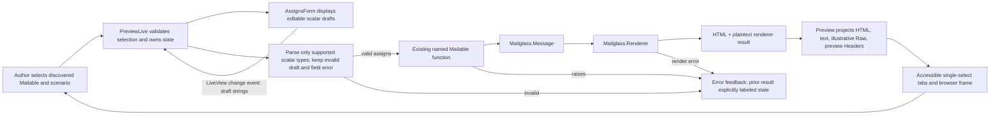

<user_constraints>
## User Constraints (from CONTEXT.md)

### Locked Decisions

#### Scenario discovery and author orientation
- **D-01:** Keep the existing Mailglass.Mailable and optional preview_props/0 contract. Discovery exposes ordered named scenarios with default assigns; the selected scenario invokes the existing Mailable function. Preserve auto-discovery, explicit Mailable lists, custom mount paths, and safe resolution against discovered modules/scenarios. Do not add a separate scenario registry or public API.
- **D-02:** Keep the compact picker and make the selected Mailable and scenario legible at narrow widths. Reuse the current mobile disclosure rather than adding a second sidebar. Preserve two distinct setup states: no Mailables discovered (generator and discovery guidance) and Mailables present but no preview scenarios (how to add a scenario). Use the current brandbook's plain copy and proper code markup. Correct guides/preview.md so its preview_props example matches the supported named-scenario-to-assigns-map shape.
- **D-03:** Use Mailable, preview scenario, and assigns consistently. Keep selection links mount-aware and do not convert module/scenario strings into atoms from untrusted URL or event data.

#### Live editing, input fidelity, and recovery
- **D-04:** Retain live preview updates when scenario inputs change; this matches the existing LiveView behavior and test coverage. Avoid a second always-visible Render preview action that repeats the same event; offer a retry action only in a failure state if it performs a real retry. Use built-in LiveView debounce on free-text fields to avoid unnecessary render work per keystroke while keeping the preview responsive. Do not introduce a separate manual draft/commit workflow without measured need.
- **D-05:** Preserve attempted input separately from the last successful render. On validation or rendering failure, keep the editor and correction path available, show a useful field or render error, and retain useful input. If prior output remains visible, label it clearly as the last successful preview and not current; never style stale output as the result of the failed attempt.
- **D-06:** Make editing truthful for each value type. Parse and validate supported scalar inputs without silently replacing invalid numeric/date values with defaults. Keep the user's draft visible on invalid input. Do not label Elixir inspect output as JSON or imply that arbitrary nested maps/structs are editable when submissions are passed as strings. Present values without a safe, lossless editor contract (including nested structures and timezone-sensitive DateTime values unless their round-trip semantics are explicitly established) as read-only with accurate guidance to edit the Mailable scenario. Do not add a general schema or dynamic struct reconstruction contract.
- **D-07:** Announce state changes once and associate validation feedback with its field. Do not nest duplicate live/status announcements inside an alert. Keep diagnostic render errors useful to the developer preview job, with the documented dev-only mount boundary in force.

#### Rendering semantics and output truth
- **D-08:** Render the selected Mailable through Mailglass.Renderer, the same content-rendering stage used by outbound preflight. Do not call outbound preflight, Outbound.deliver/2, or a provider adapter from Preview. Describe this accurately as using Mailglass's delivery rendering pipeline; do not claim that the preview is exactly what a recipient or provider receives.
- **D-09:** Keep HTML and plaintext as renderer outputs. Keep Raw as the existing best-effort, MIME-shaped preview envelope, not serialized wire bytes. Identify it as illustrative preview output. In Headers, identify preview-generated Message-ID and Date values so they cannot be mistaken for provider-bound facts. Do not add transport serialization or an adapter dependency.
- **D-10:** Correct preview page and guide copy that currently overstates delivery equivalence. Distinguish renderer output from outbound preflight, final adapter encoding, tracking/compliance transformations, and delivery. Keep preview free of a send action. State that this code path does not call Outbound.deliver; do not claim a package boundary structurally makes such a call impossible.
- **D-11:** Correct PreviewLive documentation that says no telemetry is emitted: Preview adds no preview-specific telemetry, while the shared Renderer emits its normal render lifecycle telemetry. Preserve the telemetry contract and do not add recipient/body data to preview-specific metadata. Do not broaden this phase into telemetry redesign absent a reproduced privacy defect.

#### Accessible output inspection and responsive design
- **D-12:** Complete the existing single-select horizontal tab pattern using the W3C APG convention: one tab stop, Left/Right navigation with wrapping, Home/End support, visible focus on the focused tab, and manual activation with Space/Enter or click. Manual activation avoids a LiveView event on every arrow-key focus move. Keep aria-selected, aria-controls, labelled panel IDs, and panel visibility consistent; every control relationship must resolve. Make a panel keyboard-focusable when its content has no focusable descendant so keyboard users can reach and scroll long output.
- **D-13:** Keep long plaintext readable with wrapping and keep raw/header content within its own scroll region. Preserve full non-ASCII and long values; do not clip essential output or make hover the only way to inspect it. Let tabs and preview controls wrap at narrow widths without page-level horizontal scrolling.
- **D-14:** Preserve Phase 168's accepted Mailglass visual/accessibility contract: current semantic tokens and brand, flat surfaces, 16px body and 14px labels, visible focus, reduced-motion behavior, and 44px minimum interaction targets. Keep empty/setup copy, input errors, and output labels plain and specific.

#### Preview framing, host boundary, and evidence limits
- **D-15:** Keep Admin chrome appearance (persisted System/Light/Dark) independent from the preview backdrop and selected CSS-pixel width. Label 375, 768, and 1024 as pixel widths, not physical device types. The backdrop applies only to browser preview surfaces and must not imply the email content supports dark mode.
- **D-16:** State plainly that the iframe and backdrop show browser rendering only; they do not certify Gmail, Outlook, Apple Mail, or other email clients. Capture artifacts establish preview-pipeline confidence only. Do not add a client-emulation matrix or visual judge.
- **D-17:** Preserve the host-owned dev-only mount contract. MailglassAdmin.Router.mailglass_admin_routes/2 does not enforce a dev environment or add preview authorization; adopter configuration must guard the route (as the documented compile-time dev_routes example does). Do not add account scoping, auth policy, or a production preview surface in this phase.
- **D-18:** Keep iframe scripts disabled and do not describe sandboxing as HTML sanitization or a network/privacy boundary. Preserve supported email rendering; do not change same-origin/resource behavior without a demonstrated compatibility need. Use synthetic, non-sensitive preview assigns and treat local screenshot captures as potentially sensitive. Rendered remote image URLs may make browser requests; document this boundary instead of promising that Preview blocks them.

#### Shift-left acceptance and dependency posture
- **D-19:** Convert every machine-observable PRVUX criterion into deterministic coverage. Use existing Admin LiveView/ExUnit coverage for discovery, typed edits, failure recovery, stale-output truth, renderer output, empty/setup states, and framing semantics. Use the existing browser suite for actual tab keyboard/focus behavior and representative narrow/zoom/long-content layout. Reuse current fixtures and capture tooling; do not add a test framework or dependency.
- **D-20:** Run the relevant existing checks and report their merge-gating status accurately. Support Contract Admin is a required leaf behind CI Green; Operator Browser Gate and Preview Capture Advisory are outside the CI Green aggregate and are advisory in the current workflow. Do not present their green result as merge-blocking proof or create/promote a required lane for this phase. Follow D-52: passing automated evidence closes machine-observable acceptance without owner UAT; retain only bounded rendered review for genuinely visual questions.

### the agent's Discretion
- Choose the exact compact picker arrangement, spacing, error placement, and status wording within the Phase 168 UI contract and current brandbook.
- Set the smallest practical built-in LiveView debounce and choose the scalar field types to edit only where parsing preserves their type and semantics.
- Choose representative fixtures that cover valid, invalid, long, non-ASCII, and unsupported structured values without creating an exhaustive viewport/theme cross-product.
- Keep the approved one-batch rendered review bounded to one corrective pass and one confirmation round unless a concrete unresolved blocker appears.

### Deferred Ideas (OUT OF SCOPE)
- Byte-exact RFC/MIME or provider-adapter serialization and provider-specific delivery proof.
- Actual Gmail/Outlook/Apple Mail or dark-mode emulation and any paid visual judge.
- Production-shared preview access, new authorization/account scope, send-to-self, or preview send actions.
- A generalized schema/API for arbitrary nested maps and structs, native authoring editor, or framework migration.
- New dependencies, new required CI lane, or branch-protection changes.
- Broad exception telemetry redesign or remote-resource blocking absent a reproduced, in-scope privacy defect.
</user_constraints>

<phase_requirements>
## Phase Requirements

| ID | Description | Research Support |
|----|-------------|------------------|
| PRVUX-01 | An author can find a Mailable/scenario and retain a clear sense of the selected preview, including narrow layouts and the no-Mailables/setup state. | Existing Discovery/Sidebar/LiveView paths, mount-aware URL selection, mobile disclosure, setup branches, and browser responsive checks. [VERIFIED: `.planning/REQUIREMENTS.md:38`] |
| PRVUX-02 | An author can edit scenario inputs, render through the supported pipeline, and recover from validation/render failures without losing useful input or mistaking stale output for the new result. | Renderer/preflight boundary, supported scalar parser strategy, separate draft and successful result state, LiveView recovery and field feedback, ExUnit failure cases. [VERIFIED: `.planning/REQUIREMENTS.md:39`] |
| PRVUX-03 | An author can inspect HTML, plaintext, raw output, and headers with readable long content and clear tab/selection behavior while preserving the same supported rendering semantics used for delivery. | Existing four representation tabs, truthful labeling, APG keyboard interaction, long-content/browser assertions, renderer contract. [VERIFIED: `.planning/REQUIREMENTS.md:40`] |
| PRVUX-04 | An author can change device framing and preview appearance independently of admin appearance and understand the limits of what those controls demonstrate about actual email clients. | Existing split Admin-theme/backdrop/width state, pixel-width controls, browser-only copy, and capture evidence boundaries. [VERIFIED: `.planning/REQUIREMENTS.md:41`] |
</phase_requirements>

# Phase 171: Developer Preview - Research

**Researched:** 2026-10-09  
**Domain:** Elixir, Phoenix LiveView/HEEx, email content rendering, accessible developer preview  
**Confidence:** HIGH for repository architecture and scope; MEDIUM for guidance checked through current official docs

## Summary

Keep this as an in-place refinement of the current `PreviewLive` and its function components. `preview_props/0` discovery already provides named scenarios and default assigns, and the selected scenario function builds the message that is rendered by `Mailglass.Renderer`. This is the supported shared content-rendering stage. Outbound preflight adds tenancy/tracking/suppression/rate/stream policy and later compliance/tracking preparation, so renderer output, the illustrative raw envelope, generated preview headers, a provider-encoded message, and actual delivery must remain distinct concepts. [VERIFIED: `mailglass_admin/lib/mailglass_admin/preview_live.ex:837-846`] The code says: `msg = apply(mod, scenario, [assigns_map])` and `Mailglass.Renderer.render(msg)`. [VERIFIED: `lib/mailglass/outbound/preflight.ex:7-15,35-42`] Preflight calls `Renderer.render(message)` after policy checks, then `prepare/1` adds delivery metadata and transformations.

Preserve the existing Phoenix/LiveView/HEEx and Admin visual system. The focused implementation work is state fidelity and recovery: retain raw attempted edits apart from successfully parsed assigns; reject malformed values without defaulting; keep the editor visible after errors; and label any preserved prior artifact as the last successful preview. Edit only scalar values with a safe, type-preserving parse. Render nested maps/structs and timezone-sensitive DateTime values read-only unless their round-trip contract becomes demonstrably lossless. Complete the tab widget as W3C APG manual-activation tabs so key navigation can move focus without repeatedly changing a LiveView panel. [CITED: https://www.w3.org/WAI/ARIA/apg/patterns/tabs/]

**Primary recommendation:** Reuse existing modules and fixtures; introduce no new dependency or public contract. Make Preview's input model explicitly hold draft text, parsed scenario assigns, current render status, and last successful output. Keep source and UI copy honest about what is generated and what is not proven. Automate server-observable behavior in Admin LiveView tests and browser focus/layout behavior in the existing Playwright suite; treat browser/capture lanes as advisory under the current CI graph.

## Architectural Responsibility Map

| Capability | Primary Tier | Secondary Tier | Rationale |
|------------|-------------|----------------|-----------|
| Discover Mailables and scenarios | API / Backend | — | `Preview.Discovery` reflects marker modules and scenario defaults; route/event selection must be checked against those discovered values. [VERIFIED: `mailglass_admin/lib/mailglass_admin/preview/discovery.ex:1-35,42-115`] |
| Edit input and handle render errors | Frontend Server (SSR) | Browser / Client | LiveView owns authoritative draft/parsed/render state; browser form events carry string values and preserve focused input while patches arrive. [CITED: https://phoenix-live-view.hexdocs.pm/form-bindings.html] |
| Build email and render output | API / Backend | Frontend Server (SSR) | Mailable builds a `Mailglass.Message`; core `Mailglass.Renderer` creates content outputs, while Preview projects them to a browser. [VERIFIED: `mailglass_admin/lib/mailglass_admin/preview_live.ex:837-846`; `lib/mailglass/renderer.ex:1-24`] |
| Inspect HTML, text, raw, and headers | Browser / Client | Frontend Server (SSR) | Function components expose one selected tab panel; HTML is framed in an iframe and other representations are text/table DOM. [VERIFIED: `mailglass_admin/lib/mailglass_admin/preview/tabs.ex:1-20,30-140`] |
| Frame width and backdrop | Browser / Client | Frontend Server (SSR) | Width and backdrop are presentation state; admin chrome theme remains an independent persisted preference. [VERIFIED: `mailglass_admin/lib/mailglass_admin/preview_live.ex:195-224`] |
| Dev-only route exposure | API / Backend | — | Adopter owns the surrounding dev route guard; the route macro is not itself a production authorization boundary. [VERIFIED: `guides/preview.md:10-30`; `mailglass_admin/lib/mailglass_admin/router.ex:71-79`] |
| Automated interaction evidence | Browser / Client | API / Backend | ExUnit covers server state/render contracts; Playwright is needed to prove browser focus, tab keys, and measured layout. [VERIFIED: `mailglass_admin/test/mailglass_admin/preview_live_test.exs:359-410`; `mailglass_admin/e2e/structural.spec.js:1439-1525`] |

## Standard Stack

### Core

| Library | Version | Purpose | Why Standard |
|---------|---------|---------|--------------|
| Elixir | project target `1.18.4` | LiveView and core rendering runtime | Existing package toolchain. Verbatim toolchain values: `elixir 1.18.4` and `erlang 27.3.4.13`. [VERIFIED: `.tool-versions:1-2`] |
| Phoenix | locked `1.8.14` (published 2026-09-14; latest stable registry release is `1.8.15`, 2026-09-25) | Router and component system | Existing Admin framework. Keep the lock for this feature-only phase; do not roll a dependency upgrade into preview UX work. Verbatim lock value: `"phoenix": {:hex, :phoenix, "1.8.14"`. [VERIFIED: `mailglass_admin/mix.lock:35`; Hex API: https://hex.pm/api/packages/phoenix/releases/1.8.14; https://hex.pm/api/packages/phoenix`] |
| Phoenix LiveView | locked and latest stable `1.2.12` (published 2026-09-16) | Stateful preview events and HEEx view | Existing preview owner; use its built-in form binding/debounce and current version's behavior. Verbatim lock value: `"phoenix_live_view": {:hex, :phoenix_live_view, "1.2.12"`. [VERIFIED: `mailglass_admin/mix.lock:38`; Hex API: https://hex.pm/api/packages/phoenix_live_view/releases/1.2.12; https://hex.pm/api/packages/phoenix_live_view`] |
| Phoenix.Component / HEEx | Phoenix `1.8.14` | Reusable function components and escaped HTML output | Existing markup boundary. The exact dependency declaration is `{:phoenix, "~> 1.8"}` and the locked Phoenix version is `1.8.14`. [VERIFIED: `mailglass_admin/mix.exs:111-117`; `mailglass_admin/mix.lock:35`] |
| Mailglass.Renderer | in-repo | HTML rendering, plaintext derivation, CSS inlining, attribute stripping | The shared content render used by outbound preflight. [VERIFIED: `lib/mailglass/renderer.ex:1-24,63-84`] |
| ExUnit + Phoenix.LiveViewTest | existing test stack | Server-side LiveView and output contract tests | Existing required Admin suite includes preview tests. [VERIFIED: `mailglass_admin/test/mailglass_admin/preview_live_test.exs:13-29`] |
| Playwright Test | existing `@playwright/test` lock | Real-browser behavior and layout evidence | Existing Admin browser lane exercises the preview; extend current suite. [VERIFIED: `mailglass_admin/package.json:1-11`; `.github/workflows/ci.yml:942-1020`] |

**Version note:** The task's source list points to the Phoenix LiveView `1.1.33` documentation, but the inspected package lock currently resolves LiveView `1.2.12`; use versioned docs matching the lock when planning implementation. The dependency declaration is `{:phoenix_live_view, "~> 1.1"}`. [VERIFIED: `mailglass_admin/mix.exs:111-114`; `mailglass_admin/mix.lock:38`] Official LiveView documentation was checked on 2026-10-09 at the current v1.2.12 documentation URL, plus the core LiveView API docs. [CITED: https://phoenix-live-view.hexdocs.pm/form-bindings.html; https://phoenix-live-view.hexdocs.pm/security-model.html; https://hexdocs.pm/phoenix_live_view/1.1.33/Phoenix.LiveView.html]

### Supporting

| Library / System | Version | Purpose | When to Use |
|------------------|---------|---------|-------------|
| Phoenix HTML | locked and latest stable `4.3.0` (published 2025-09-28) | HTML helpers integrated by Phoenix | Existing dependency; no need for changes in this phase. Verbatim lock value: `"phoenix_html": {:hex, :phoenix_html, "4.3.0"`. [VERIFIED: `mailglass_admin/mix.lock:36`; Hex API: https://hex.pm/api/packages/phoenix_html/releases/4.3.0; https://hex.pm/api/packages/phoenix_html`] |
| Tailwind standalone Hex binary + vendored daisyUI | existing | Admin styles and semantic tokens | Continue existing HEEx utility classes; rebuild and commit `priv/static/app.css` when class scanning changes. [VERIFIED: `mailglass_admin/docs/design-system.md:15-29`] |
| Playwright Chromium | existing | Browser keyboard, responsive layout, zoom, and screenshots | Use focused cases through existing `npm run test:operator-browser`; do not equate Chromium output with email-client output. [VERIFIED: `mailglass_admin/package.json:4-10`; `mailglass_admin/dev/mix/tasks/mailglass_admin.preview.capture.ex:1-25`] |
| W3C APG and WCAG 2.2 | current guidance | Tab keyboard pattern and responsive/interaction acceptance | Use APG tabs as interaction guidance and WCAG success criteria for reflow, keyboard access, and status messaging. [CITED: https://www.w3.org/WAI/ARIA/apg/patterns/tabs/; https://www.w3.org/WAI/WCAG22/quickref/] |

### Alternatives Considered

| Instead of | Could Use | Tradeoff |
|------------|-----------|----------|
| Existing PreviewLive state and components | A second preview class, React app, or schema-driven editor | Adds a new public/runtime contract and dependency surface without solving a requirement the current LiveView cannot address. Retain current stack. [VERIFIED: `mailglass_admin/lib/mailglass_admin/preview_live.ex:1-30`; `.planning/phases/171-developer-preview/171-CONTEXT.md:4-9`] |
| Manual-activation tabs | Automatic activation on arrow focus | The panel update is a LiveView event; manual activation lets arrow key travel remain local and avoids event churn. [CITED: https://www.w3.org/WAI/ARIA/apg/patterns/tabs/] |
| Existing Chromium captures | Email-client emulation / paid screenshot judge | Out of scope and would claim a different evidence surface; current capture contract already calls artifacts preview-pipeline confidence only. [VERIFIED: `mailglass_admin/dev/mix/tasks/mailglass_admin.preview.capture.ex:1-16`] |

**Installation:** None. No external package is required for this phase. Preserve dependency restraint. [VERIFIED: `.planning/phases/171-developer-preview/171-CONTEXT.md:46-48,153-160`]

## Package Legitimacy Audit

Not applicable: Phase 171 adds no package. Existing dependencies are reused; no package legitimacy check or registry install is part of the recommendation. [VERIFIED: `.planning/phases/171-developer-preview/171-CONTEXT.md:46-48,153-160`]

## Architecture Patterns

### System Architecture Diagram



The diagram deliberately ends at the local browser preview. Outbound preflight later performs policy checks and preparation; adapter encoding and delivery are downstream. [VERIFIED: `lib/mailglass/outbound/preflight.ex:7-15,35-42`]

### Recommended Project Structure

Keep existing boundaries and add no new module unless plan-level source review finds an unavoidable ownership gap:

```text
mailglass_admin/lib/mailglass_admin/
├── preview_live.ex              # event/state/render orchestration
└── preview/
    ├── discovery.ex             # existing safe scenario discovery
    ├── sidebar.ex               # existing picker and setup selection
    ├── assigns_form.ex          # typed scalar controls and field feedback
    ├── tabs.ex                  # APG tab controls and output panes
    └── device_frame.ex          # pixel width controls
mailglass_admin/test/mailglass_admin/preview_live_test.exs
mailglass_admin/e2e/structural.spec.js
guides/preview.md
```

These paths are already in use. [VERIFIED: `mailglass_admin/lib/mailglass_admin/preview_live.ex:1-12`; `mailglass_admin/lib/mailglass_admin/preview/assigns_form.ex:1-6`; `mailglass_admin/lib/mailglass_admin/preview/tabs.ex:1-6`; `mailglass_admin/test/mailglass_admin/preview_live_test.exs:1-18`; `mailglass_admin/e2e/structural.spec.js:1439-1525`]

### Pattern 1: Discovered scenario selection only

**What:** Resolve route selection against the discovered module/scenario set and invoke the existing function with the selected assign map. Keep module and scenario names as strings until checked against discovered values; submitted values must not create atoms. Preserve explicit discovery lists and mount-aware links. [VERIFIED: `mailglass_admin/lib/mailglass_admin/preview_live.ex:97-126,549-570`; `mailglass_admin/lib/mailglass_admin/preview/discovery.ex:42-115`]

The source of truth declares `@optional_callbacks preview_props: 0` and `@callback preview_props() :: [{atom(), map()}]`. [VERIFIED: `lib/mailglass/mailable.ex:73-75`]

### Pattern 2: Draft input distinct from successful rendering

**What:** Keep form strings as attempted input; separately parse into typed assigns. A successful parse invokes the scenario and renderer; a parse or render error preserves the attempted values, editor and correction path. Keep last successful artifacts separately and render them only with explicit stale labeling (or hide them). Clear stale state after a successful render. [VERIFIED: current `rerender/1` retains artifacts on error but stores only `render_error` at `mailglass_admin/lib/mailglass_admin/preview_live.ex:806-834`; form values currently derive from `scenario_assigns` at `mailglass_admin/lib/mailglass_admin/preview/assigns_form.ex:31-48`]

Use LiveView's built-in `phx-debounce` on free text and a stable form `id`. Phoenix documents form-level `phx-change`, client ownership of focused input values, and automatic form recovery after reconnect for forms with IDs. [CITED: https://phoenix-live-view.hexdocs.pm/form-bindings.html]

### Pattern 3: Scalar editing with exact parse results

**What:** Recommend editable types only when a valid user representation maps back to the same value type without loss: text, integer, float, boolean, and date only if strict date parsing is implemented. Treat parse failure as an error, never coerce it to the old default. For numbers, require a complete parse with no trailing suffix; for date values, require exact calendar-valid input. Keep timezone-sensitive DateTime, nested structures, structs, maps, and atoms read-only under this contract. [VERIFIED: the current form renders numbers, booleans, Date/DateTime, structs, maps, and atoms at `mailglass_admin/lib/mailglass_admin/preview/assigns_form.ex:15-20,68-211`; the current coercion fallback returns the prior default on integer/float parse error at `mailglass_admin/lib/mailglass_admin/preview_live.ex:778-802`]

The browser may submit strings regardless of input type. Do not tell users a textarea is JSON if its content is Elixir `inspect` syntax, and do not pass nested input strings to a function that expects maps/structs. [VERIFIED: `mailglass_admin/lib/mailglass_admin/preview/assigns_form.ex:163-210,254-265`; `mailglass_admin/lib/mailglass_admin/preview_live.ex:761-802`]

### Pattern 4: Manual-activation single-select tabs

**What:** Use one tab stop at the selected tab; arrow keys move focus with wrapping, Home/End move to first/last, Enter/Space/click activate. Set `aria-selected`, `tabindex`, `aria-controls`, `aria-labelledby`, and hidden state so exactly the active panel is exposed and all references resolve. Give the tabpanel `tabindex="0"` when no meaningful focusable child exists. Use a small client-side key handler for focus movement and keep activation through the existing LiveView event; do not send a LiveView event for each arrow movement. [CITED: https://www.w3.org/WAI/ARIA/apg/patterns/tabs/; https://www.w3.org/WAI/ARIA/apg/patterns/tabs/examples/tabs-manual/]

The existing `Tabs` component currently renders all four tabs but only one selected panel. [VERIFIED: `mailglass_admin/lib/mailglass_admin/preview/tabs.ex:30-140`]

### Pattern 5: Separate rendering output from evidence framing

**What:** Preserve the browser surface that renders `srcdoc`, but give it an accurate description. Keep HTML and plaintext renderer outputs, and keep Raw as an illustrative hand-built envelope. Call generated Message-ID and Date values preview-generated. Keep `375`, `768`, and `1024` labeled as CSS-pixel widths; do not attach device names. Keep Admin chrome theme, backdrop, and width as independent state. [VERIFIED: `mailglass_admin/lib/mailglass_admin/preview_live.ex:195-224,852-875,895-933`; `mailglass_admin/lib/mailglass_admin/preview/device_frame.ex:1-12`]

### Anti-Patterns to Avoid

- **Conflating renderer output with delivery:** Preview calls `Mailglass.Renderer`; preflight adds other checks and preparation later. Do not say exactly as recipient receives or imply a send occurred. [VERIFIED: `lib/mailglass/renderer.ex:40-50`; `lib/mailglass/outbound/preflight.ex:7-15,35-42`]
- **Falling back to previous defaults on invalid input:** That hides user intent and can make the preview appear successful with the wrong value. Preserve the input and show the parse issue. [VERIFIED: `mailglass_admin/lib/mailglass_admin/preview_live.ex:778-802`]
- **Showing an editor only in the success branch:** Current render-error branch omits the assigns form, making correction less direct. Keep correction controls present after failed attempts. [VERIFIED: `mailglass_admin/lib/mailglass_admin/preview_live.ex:324-431`]
- **Using `inspect` as if it were JSON:** Elixir structs/maps are not a JSON editing protocol; without safe parsing and type reconstruction, render them read-only. [VERIFIED: `mailglass_admin/lib/mailglass_admin/preview/assigns_form.ex:163-210`]
- **Tabs with broken targets or only mouse activation:** Ensure one exposed panel and APG keyboard support; automated HTML assertions alone cannot prove actual focus behavior. [VERIFIED: `mailglass_admin/lib/mailglass_admin/preview/tabs.ex:35-105`; [CITED: https://www.w3.org/WAI/ARIA/apg/patterns/tabs/]]
- **Calling iframe sandbox sanitization:** Keep scripts disabled, but be precise that `srcdoc` still contains rendered HTML and can load remote resources. MDN says `srcdoc` is arbitrary HTML and sandbox origin flags have specific behavior. [CITED: https://developer.mozilla.org/en-US/docs/Web/API/HTMLIFrameElement/srcdoc; https://developer.mozilla.org/en-US/docs/Web/HTML/Reference/Elements/iframe]
- **Using color-only state or non-wrapping long output:** Keep text status, focus styling, field associations, and a separately scrollable code/output region. The shared system requires 44px controls; W3C WCAG 2.2 minimum target size is 24 CSS px at AA, with 44 CSS px at enhanced AAA. [CITED: https://www.w3.org/WAI/WCAG22/quickref/]

## Don't Hand-Roll

| Problem | Don't Build | Use Instead | Why |
|---------|-------------|-------------|-----|
| HTML/plaintext message rendering | A second template render or stub representation | Existing `Mailglass.Renderer.render/1` | It already derives text from logical HTML before CSS inlining and returns renderer HTML/text. [VERIFIED: `lib/mailglass/renderer.ex:1-24,63-84`] |
| Message delivery preparation | A Preview call into provider/adaptor or another delivery flow | The preview's existing renderer call only | Preflight owns policy and preparation beyond rendering. [VERIFIED: `lib/mailglass/outbound/preflight.ex:7-15,35-42`] |
| Arbitrary map/struct editing | A new generic JSON/schema/struct reconstruction facility | Read-only `inspect` display with clear edit-in-scenario guidance | No lossless type contract currently exists; user's requirement explicitly excludes a generalized contract. [VERIFIED: `mailglass_admin/lib/mailglass_admin/preview/assigns_form.ex:163-210`; `.planning/phases/171-developer-preview/171-CONTEXT.md:28-33`] |
| Accessible tab behavior | Ad hoc one-off keyboard semantics | W3C APG manual tab pattern using the current component | It standardizes focus, activation, and relationships while avoiding event chatter. [CITED: https://www.w3.org/WAI/ARIA/apg/patterns/tabs/] |
| Screenshot matrix and manifest | New capture harness | Existing `mix mailglass_admin.preview.capture` | Already uses discovery, widths/themes, and a manifest; add only the small representative cases needed. [VERIFIED: `mailglass_admin/dev/mix/tasks/mailglass_admin.preview.capture.ex:1-25,83-120`] |

**Key insight:** The risky complexity is correctness at boundaries: string drafts into typed scenario inputs, render failure versus prior output, and browser preview versus delivery proof. A second framework or generalized editor would add new contracts without reducing those boundary risks.

## Common Pitfalls

### Pitfall 1: Wrong output appears current after failure

**What goes wrong:** A failed attempt leaves previous HTML/text/raw/header values in state; users may infer they belong to the new input.  
**Why it happens:** Current `rerender/1` changes `render_error` on failure but does not replace/clear successful output. [VERIFIED: `mailglass_admin/lib/mailglass_admin/preview_live.ex:806-834`]  
**How to avoid:** Keep `attempted_inputs` and `last_successful_output` distinct. Render the output only with an explicit “Last successful preview” label after a failure; keep editor, field errors, and a real retry/correction path visible.  
**Warning signs:** Updating a field to invalid input leaves an unlabeled prior message beneath an error, or the error branch removes the editor.

### Pitfall 2: Invalid numbers silently revert or partially parse

**What goes wrong:** A nonnumeric draft is replaced by an old/default value; suffixes can be accepted if the parser tail is ignored.  
**Why it happens:** `coerce/2` currently takes the number from `Integer.parse/1` / `Float.parse/1` and falls back to default only for `:error`; it does not preserve raw attempted input as validation state. [VERIFIED: `mailglass_admin/lib/mailglass_admin/preview_live.ex:778-802`]  
**How to avoid:** Parse into `{:ok, typed}` / `{:error, message}`; require full-string consumption; retain original draft on failure. Add one valid numeric, malformed numeric, and trailing-data fixture check.  
**Warning signs:** The input visibly changes back, or the output updates with a value different from what the author typed.

### Pitfall 3: Date and DateTime round trips lose meaning

**What goes wrong:** An HTML `datetime-local` value has no timezone/offset but `%DateTime{}` may. Re-rendering from the submitted string can change type or timezone.  
**Why it happens:** HTML form events deliver strings. LiveView's client/server binding docs explicitly describe event payload values as parameter strings. [CITED: https://phoenix-live-view.hexdocs.pm/form-bindings.html]  
**How to avoid:** Make DateTime read-only unless the existing type's zone/offset semantics can be preserved exactly. Editable `Date` needs strict ISO date parsing and invalid date field feedback.  
**Warning signs:** DateTime assign becomes a string, timestamps shift, or invalid dates fall back silently.

### Pitfall 4: Nested values masquerade as JSON

**What goes wrong:** `inspect/2` output is shown in a textarea and help text says JSON, but submitted content is a string and no safe JSON decoding/type reconstruction exists.  
**Why it happens:** Presentation currently dispatches maps/structs to a textarea but the event reducer treats all incoming values as strings. [VERIFIED: `mailglass_admin/lib/mailglass_admin/preview/assigns_form.ex:163-210`; `mailglass_admin/lib/mailglass_admin/preview_live.ex:761-802`]  
**How to avoid:** Make these displays read-only, accurately label them as Elixir inspection output, and direct authors to edit scenario defaults/code.  
**Warning signs:** Render exceptions after editing a map/struct field or output docs calling the textarea JSON without decoding semantics.

### Pitfall 5: Broken tab relationships and invisible keyboard state

**What goes wrong:** Inactive tabs reference panel IDs that are not present because only the active panel is rendered; keyboard users must tab through every tab, or arrow focus triggers a server event for every key.  
**Why it happens:** Current component emits all `aria-controls` values but mounts only one panel and has only click activation. [VERIFIED: `mailglass_admin/lib/mailglass_admin/preview/tabs.ex:35-105`]  
**How to avoid:** Implement APG manual behavior and ensure each tab's referenced panel exists or adjust the relationships/hidden panels so ID references are valid. Assert actual focus, wrapping, Home/End, activation and selected panel in Playwright. [CITED: https://www.w3.org/WAI/ARIA/apg/patterns/tabs/; https://www.w3.org/WAI/ARIA/apg/patterns/tabs/examples/tabs-manual/]  
**Warning signs:** Axe/DOM checks pass but arrow navigation or Enter/Space fails with a real keyboard.

### Pitfall 6: Preview claims exceed the execution boundary

**What goes wrong:** Descriptions imply MIME bytes, provider-specific behavior, final tracking/compliance rewrites, or delivery.  
**Why it happens:** Raw looks MIME-like; Headers adds synthetic Message-ID/Date; the shared renderer is reused by delivery but is only one preflight stage. [VERIFIED: `mailglass_admin/lib/mailglass_admin/preview_live.ex:848-933`; `lib/mailglass/outbound/preflight.ex:7-15,35-42`]  
**How to avoid:** Label Raw illustrative, label synthetic headers as preview-generated, and say “Mailglass delivery rendering pipeline” rather than “exactly what a recipient receives.” Add no send action.  
**Warning signs:** Preview guide calls Raw a wire serialization or says rendered browser markup is what Gmail/Outlook will display.

### Pitfall 7: Sandbox described as sanitization or privacy isolation

**What goes wrong:** Trusting the iframe sandbox claim as proof of sanitized HTML or no network requests.  
**Why it happens:** `srcdoc` consumes HTML and is commonly described as isolated; the current frame permits same-origin but not scripts.  
**How to avoid:** Keep script execution disabled; do not alter same-origin or resources absent demonstrated rendering need. State that remote images may make network requests, use synthetic non-sensitive assigns, and treat capture artifacts as potentially sensitive. MDN documents the security properties and limitations of `srcdoc`/sandbox. [CITED: https://developer.mozilla.org/en-US/docs/Web/API/HTMLIFrameElement/srcdoc; https://developer.mozilla.org/en-US/docs/Web/HTML/Reference/Elements/iframe]  
**Warning signs:** Copy promises “sanitized,” “private,” or “no network,” or test fixtures include real recipient data.

## Code Examples

### Existing supported scenario shape

The source contract is `@callback preview_props() :: [{atom(), map()}]`. [VERIFIED: `lib/mailglass/mailable.ex:73-75`] Example from the existing adopter fixture, copied verbatim:

```elixir
def preview_props do
  [
    welcome_default: %{user_name: "Ada", plan: :free, admin?: false},
    welcome_enterprise: %{user_name: "Babbage", plan: :enterprise, admin?: true}
  ]
end
```

Verbatim source quote: `welcome_default: %{user_name: "Ada", plan: :free, admin?: false}, welcome_enterprise: %{user_name: "Babbage", plan: :enterprise, admin?: true}`. Source: `mailglass_admin/test/support/fixtures/mailables.ex:11-16`. This shape should also replace the outdated single-map `preview_props/0` sample in `guides/preview.md:39-45`. [VERIFIED: `guides/preview.md:39-45`; `mailglass_admin/test/support/fixtures/mailables.ex:11-16`]

### LiveView form bindings

Use the existing form-level change pattern and built-in debounce; keep it a lightweight interaction. Example syntax is documented by Phoenix LiveView; no new JS package is required for debounce itself. [CITED: https://phoenix-live-view.hexdocs.pm/form-bindings.html]

```heex
<form id="preview-assigns" phx-change="assigns_changed">
  <input name="assigns[user_name]" phx-debounce="150" />
</form>
```

This is a schematic snippet; field names should be generated from scenario defaults using current code patterns, and must not become dynamic atoms from client input. The debounce interval is agent-discretion, tune to the smallest practical value that avoids per-keystroke render churn.

### Parse scalar drafts without replacing them

The reducer should distinguish draft strings from accepted assigns and parse errors. This is a planning pattern, not an existing function or frozen API:

```elixir
case parse_supported_value(default, draft) do
  {:ok, typed_value} ->
    # merge typed_value into allowed scenario assigns, then render
  {:error, message} ->
    # retain draft and field error; keep prior output explicitly stale
end
```

All names and values in this schematic are illustrative, not prescribed in-repo enums. Do not include arbitrary submitted keys in the assign map; the source already restricts merged keys to existing defaults. [VERIFIED: `mailglass_admin/lib/mailglass_admin/preview_live.ex:761-776`]

### Component-owned semantics

Keep HEEx components responsible for rendering controls/output while `PreviewLive` owns selection, parsed inputs, and render results. The current structure has existing functions for `AssignsForm.assigns_form/1`, `Tabs.tabs/1`, and `DeviceFrame.device_frame/1`. [VERIFIED: `mailglass_admin/lib/mailglass_admin/preview/assigns_form.ex:28-48`; `mailglass_admin/lib/mailglass_admin/preview/tabs.ex:30-110`; `mailglass_admin/lib/mailglass_admin/preview/device_frame.ex:24-68`]

## Validation Architecture

The project config contains the exact setting `"nyquist_validation": true`, so this section is required. [VERIFIED: `.planning/config.json:20`]

### Test Framework

| Property | Value |
|----------|-------|
| Framework | ExUnit + Phoenix.LiveViewTest in `mailglass_admin`; Playwright Test for connected browser acceptance. [VERIFIED: `mailglass_admin/test/mailglass_admin/preview_live_test.exs:13-15`; `mailglass_admin/package.json:1-11`] |
| Config file | `mailglass_admin/test/test_helper.exs`; `mailglass_admin/playwright.config.cjs`. The browser config sets `testDir: "./e2e"` and launches the existing deterministic operator server. [VERIFIED: `mailglass_admin/test/test_helper.exs:1-5`; `mailglass_admin/playwright.config.cjs:18-32`] |
| Quick run command | `cd mailglass_admin && mix test test/mailglass_admin/preview_live_test.exs --warnings-as-errors` |
| Required Admin contract command | `cd mailglass_admin && mix verify.support_contract.admin` [VERIFIED: `mailglass_admin/mix.exs:204-212`; `.github/workflows/ci.yml:874-939`] |
| Browser command | `cd mailglass_admin && npm run test:operator-browser` [VERIFIED: `mailglass_admin/package.json:4-8`] |
| Full Admin test command | `cd mailglass_admin && mix test --warnings-as-errors --exclude flaky` (the existing `verify.preview` alias adds compile, asset build, and bundle-diff checks). [VERIFIED: `mailglass_admin/mix.exs:195-212`] |

### Phase Requirements → Test Map

| Req ID | Behavior | Test Type | Automated Command | File Exists? |
|--------|----------|-----------|-------------------|-------------|
| PRVUX-01 | Discovered Mailable/scenario and active selection remain understandable at narrow width; zero-Mailables and no-scenario states are distinct. | LiveView + browser | `mix test test/mailglass_admin/preview_live_test.exs --warnings-as-errors`; browser focused scenario in `npm run test:operator-browser` | ✅ base tests and fixtures exist; add assertions for scenario-empty state, visible selection, and no page overflow |
| PRVUX-02 | Supported scalar edits parse to their original types; invalid drafts remain; validation/render failure keeps correction path; prior output is clearly stale. | LiveView | `mix test test/mailglass_admin/preview_live_test.exs --warnings-as-errors` | ✅ base test file and happy/broken fixtures exist; add valid, invalid, render-failure recovery, stale-output truth, reset/retry and read-only structured values |
| PRVUX-03 | Correct HTML/text/raw/header artifact, accurate labels, tab relation integrity, APG keyboard/focus behavior, readable long/non-ASCII output. | LiveView + browser | LiveView focused test plus `npm run test:operator-browser` | ✅ tests assert four artifacts; add accessible relationships and Playwright keys/focus/scroll/layout assertions |
| PRVUX-04 | Width and backdrop stay distinct from Admin theme; controls use labeled CSS-pixel choices; limitations copy says browser preview only. | LiveView + browser/capture | LiveView focused test; `npm run test:operator-browser`; `mix mailglass_admin.preview.capture --dry-run` for manifest contract | ✅ current width/theme tests and capture tooling exist; extend separation/label assertions |

Use focused deterministic fixtures for valid, invalid, long, non-ASCII and unsupported nested values. Do not multiply every scenario by every viewport and every appearance state. Test the important separations and one representative long content path.

### Sampling Rate

- **Per task commit:** focused `preview_live_test.exs` tests.
- **Per browser interaction task:** focused Playwright case via the existing browser command; no LiveView component test stands in for focus/keyboard proof.
- **Before phase verification:** Admin support contract, browser suite, and capture/diff checks where changed files affect those contracts. Follow source version / changed-surface risk; no new required lane.

### Wave 0 Gaps

- Add focused cases to existing test modules for strict number/date parse and retained invalid draft, stale-output label and failure editor visibility, structured read-only value, all tab-to-panel references, and manual tab key behavior. [VERIFIED: `mailglass_admin/test/mailglass_admin/preview_live_test.exs:359-410`; `mailglass_admin/e2e/structural.spec.js:1439-1525`]
- Add browser assertions for horizontal arrow wrapping, Home/End, activation by Enter/Space, focus ring, panel reachability/scroll, narrow layout and page-level overflow at 320/390 CSS px, browser zoom, and independent chrome/backdrop/width state. The 320px reflow requirement is WCAG 2.2; the 390px specimen already exists in browser tests. [CITED: https://www.w3.org/WAI/WCAG22/quickref/] [VERIFIED: `mailglass_admin/e2e/structural.spec.js:1474-1525`]
- No framework install or new configuration is needed. The project uses an existing LiveView/HEEx stack and existing Playwright package. [VERIFIED: `mailglass_admin/mix.exs:111-117`; `mailglass_admin/package.json:1-11`]

### CI Evidence Boundary

`Support Contract Admin` is a required leaf consumed by `CI Green`; `Operator Browser Gate` and `Preview Capture Advisory` are separately named jobs and are not in the `ci_green.needs` list. Therefore browser and capture results are valuable direct evidence but advisory and not merge-blocking checks under current workflow. [VERIFIED: `.github/workflows/ci.yml:874-939,942-1020,1056-1110,1412-1435`; `.planning/phases/170-inbound-investigation-and-recovery/170-VALIDATION.md:20-29`]

## Security Domain

The security domain is included under the phase research protocol's default-on rule. Route exposure must preserve the adopter-owned dev-only guard. The router source states `mailglass_admin_routes/2` “does NOT enforce `:dev`” and calls the guard the adopter's job. [VERIFIED: `mailglass_admin/lib/mailglass_admin/router.ex:71-79`; `guides/preview.md:10-30`; `.planning/phases/171-developer-preview/171-CONTEXT.md:40-44`]

### Applicable ASVS Categories

| ASVS Category | Applies | Standard Control |
|---------------|---------|-----------------|
| V2 Authentication | Yes, as a boundary check | Preserve existing host router/auth configuration; no new preview auth flow in scope. |
| V3 Session Management | Limited | No new session/auth semantics; preserve persisted Admin theme only and avoid putting message content in URLs/session. |
| V4 Access Control | Yes | Keep preview mounted only under adopter's documented dev-only condition; no new shared production surface or authorization claim. |
| V5 Input Validation | Yes | Route/event strings are untrusted; constrain Mailable/scenario to discovery and assign keys to current defaults; parse each editable scalar strictly. Phoenix describes route params as public/user-controlled and event payload as a map. [CITED: https://hexdocs.pm/phoenix_live_view/1.1.33/Phoenix.LiveView.html; https://phoenix-live-view.hexdocs.pm/security-model.html] |
| V6 Cryptography | No new cryptography | Do not hand-roll signing/encryption; the phase has no cryptographic requirement. |

### Known Threat Patterns for Phoenix/LiveView preview

| Pattern | STRIDE | Standard Mitigation |
|---------|--------|---------------------|
| Arbitrary module/scenario resolution or atom creation from URL/event input | Elevation of Privilege / Denial of Service | Resolve only discovered modules/scenarios and use the closed supported tab set; do not convert untrusted strings to atoms. Existing implementation has safe existing-atom functions and discovery lookup. [VERIFIED: `mailglass_admin/lib/mailglass_admin/preview_live.ex:97-126,549-570`] |
| Forged assigns keys or map-shaped event payload | Tampering | Ignore unknown assign keys; reject malformed nested payload shapes and parse only keys/types present in scenario defaults. [VERIFIED: `mailglass_admin/lib/mailglass_admin/preview_live.ex:761-776`] |
| Unsafe HTML in `srcdoc` / remote asset request | Tampering / Information Disclosure | Keep renderer-owned content path and script-disabled iframe sandbox; do not promise sanitization or network isolation. Remote image requests are a documented trust boundary. [CITED: https://developer.mozilla.org/en-US/docs/Web/API/HTMLIFrameElement/srcdoc; https://developer.mozilla.org/en-US/docs/Web/HTML/Reference/Elements/iframe] |
| Public host accidentally exposing development preview | Elevation of Privilege / Information Disclosure | Adopter must retain compile-time dev route guard; code/docs state this route macro does not enforce environment/auth. [VERIFIED: `guides/preview.md:10-30`; `mailglass_admin/lib/mailglass_admin/router.ex:71-79`] |
| Message data in local capture artifacts | Information Disclosure | Use synthetic preview data; store captures under existing tmp outputs and treat artifacts as sensitive. [VERIFIED: `mailglass_admin/dev/mix/tasks/mailglass_admin.preview.capture.ex:1-25`; `.planning/phases/171-developer-preview/171-CONTEXT.md:130-147`] |

## Environment Availability

This phase depends on existing runtime/test/browser tools. Probes did not boot the app or run tests.

| Dependency | Required By | Available | Version | Fallback |
|------------|------------|-----------|---------|----------|
| Elixir / Mix | Admin LiveView tests, compile, capture task | ✗ for the selected project version in this shell | `.tool-versions` contains `elixir 1.18.4`; `asdf current` reports it is not installed. The shell's `mix --version` and `elixir --version` stop at the shim with “No version is set for command”. [VERIFIED: `.tool-versions:1-2`; shell probe 2026-10-09] | Install/select the version already named by project toolchain when executing; do not change project toolchain. |
| Erlang/OTP | Elixir runtime | ✓ | `asdf current`: `27.3.4.13` installed. [VERIFIED: `.tool-versions:1-2`; shell probe 2026-10-09] | — |
| Node.js / npm | Existing Playwright browser suite | ✓ | Node `v22.14.0`; npm `11.1.0`. [VERIFIED: shell probes 2026-10-09] | — |
| Chromium | Playwright and preview screenshot capture | ✓ | `/opt/homebrew/bin/chromium` exists; `chromium --version` did not return a version string in this probe. [VERIFIED: shell probe 2026-10-09] | Existing CI installs Playwright Chromium; local executable is present but confirm the Playwright launch path during execution. [VERIFIED: `.github/workflows/ci.yml:1123-1134`] |
| GSD Context7 CLI | Framework docs lookup | ✗ | `ctx7` command not found; MCP Context7 tool not available in this subagent context. [VERIFIED: shell/tool inventory probe 2026-10-09] | Used official Phoenix hexdocs pages through the available web fetch tool. |

**Missing dependencies with no fallback:** none identified for eventual execution; Elixir 1.18.4 must be installed/selected for exact local phase commands, while CI supplies pinned BEAM setup.  
**Missing dependencies with fallback:** Context7 lookup unavailable; official docs pages were used directly. Chromium version output unavailable; the CI/browser lane pins and installs its browser environment.

## State of the Art

| Old Approach | Current Approach | When Changed | Impact |
|--------------|------------------|--------------|--------|
| Use automatic activation whenever a tab gets focus | Use manual activation when selecting a tab incurs network/server latency; keep focus movement local | APG guidance says auto activation is recommended when panels display without noticeable latency; manual activation is appropriate otherwise | In this LiveView tab panel, arrow navigation should not trigger a server event per key. [CITED: https://www.w3.org/WAI/ARIA/apg/patterns/tabs/] |
| Describe a browser iframe as email-client proof | Label it as browser preview-pipeline evidence | This phase's locked D-16 | No Gmail/Outlook/Apple Mail/dark-mode claim follows from Chromium rendering. [VERIFIED: `.planning/phases/171-developer-preview/171-CONTEXT.md:40-44`] |
| Treat MIME-like text as final serialized output | Keep Raw as a best-effort illustrative envelope, Headers as preview-generated values | Existing implementation and locked D-09 | Avoids introducing false wire/provider equivalence. [VERIFIED: `mailglass_admin/lib/mailglass_admin/preview_live.ex:848-875,895-933`] |

**Deprecated/outdated:** the example in `guides/preview.md` currently shows `preview_props/0` returning one flat keyword map, while `Mailglass.Mailable` declares named scenario tuples whose values are maps. Correct the guide to the current callback shape as already locked. [VERIFIED: `guides/preview.md:39-45`; `lib/mailglass/mailable.ex:73-75`]

## Assumptions Log

| # | Claim | Section | Risk if Wrong |
|---|-------|---------|---------------|
| A1 | `150ms` in the illustrative `phx-debounce` snippet is a starting point, not a measured latency target. | Code Examples | If too small it may still render on rapid typing; if too large the preview feels delayed. |

## Open Questions (RESOLVED)

1. **Which scalar types should be editable?**
   - **RESOLVED:** Plan 171-02 Task 1 selects text, integer, float, true/false boolean and calendar-valid Date as editable, with complete parsing and synthetic valid/invalid fixture coverage. DateTime, nested maps, structs and atoms are read-only with edit-in-scenario guidance.
   - Evidence and rationale: `mailglass_admin/lib/mailglass_admin/preview/assigns_form.ex` already presents the scalar controls, while `preview_live.ex` currently accepts partial numbers and falls back to prior values on parse failure. The plan's `<behavior>` and `<action>` require strict parsing against scenario-default types, retained invalid drafts, false checkbox submission, and Date fixture cases; they do not establish a timezone-safe DateTime round trip.
   - Recommendation retained: expose only values with a lossless scalar editor contract; do not add a general nested-value schema.

2. **Exact debounce interval?**
   - **RESOLVED:** No millisecond constant is locked at planning time. D-04 explicitly leaves the smallest practical built-in LiveView debounce to implementation discretion; Plan 171-02 Task 1 requires it on free-text fields, and Plan 171-04 Task 2 requires connected-browser evidence for the pending interval.
   - Evidence and rationale: No render-latency measurement was collected for current fixtures. The illustrative `150ms` in the code example is a starting point, not an acceptance target; choosing a number without measurement would create unsupported precision.
   - Recommendation retained: choose a short built-in interval during implementation and verify the resulting interaction rather than treating the example value as a contract.

3. **Manual tabs key handling implementation?**
   - **RESOLVED:** Plan 171-03 Task 2 uses a tablist-scoped `phx-hook` in `mailglass_admin/lib/mailglass_admin/controllers/assets.ex`: Left/Right/Home/End move DOM focus locally, while Enter/Space/click activate through the existing LiveView `set_tab` event. The hook removes its listeners on destruction and is proved in the existing browser suite.
   - Evidence and rationale: `controllers/assets.ex` embeds the current `Hooks` registry and `LiveSocket` bootstrap; `171-PATTERNS.md` identifies it as the closest project-native analog. There is no tracked `mailglass_admin/assets/js/app.js` in this repository, so the earlier path suggestion was stale. APG manual activation avoids a server event on every arrow focus move.
   - Recommendation retained: use the existing client bootstrap and four-tab component, with no new framework, package or general widget abstraction.

## Sources

### Primary (HIGH confidence)

- Repository source reviewed: Phase 171 context/UI contract, Mailable, Discovery, PreviewLive, AssignsForm, Tabs, DeviceFrame, Renderer, Outbound.Preflight, tests, capture task, guides, theme/design system and CI workflow.
- W3C APG Tabs and manual activation example — tab navigation, activation and panel focus behavior: https://www.w3.org/WAI/ARIA/apg/patterns/tabs/ and https://www.w3.org/WAI/ARIA/apg/patterns/tabs/examples/tabs-manual/
- W3C WCAG 2.2 Quick Reference — 1.4.10 reflow, 2.1 keyboard, 4.1.3 status messages, 2.5.8 target size minimum: https://www.w3.org/WAI/WCAG22/quickref/
- Phoenix LiveView core API, v1.1.33 documentation linked from task: https://hexdocs.pm/phoenix_live_view/1.1.33/Phoenix.LiveView.html

### Secondary (MEDIUM confidence)

- Phoenix LiveView form bindings and security model (current official docs served as v1.2.12 during research): https://phoenix-live-view.hexdocs.pm/form-bindings.html and https://phoenix-live-view.hexdocs.pm/security-model.html
- MDN iframe and srcdoc reference — HTML platform details for the existing sandbox boundary: https://developer.mozilla.org/en-US/docs/Web/HTML/Reference/Elements/iframe and https://developer.mozilla.org/en-US/docs/Web/API/HTMLIFrameElement/srcdoc
- Swoosh.Email reference — message body/header representation as an application email struct, not wire encoding: https://swoosh.hexdocs.pm/Swoosh.Email.html
- Rails Action Mailer preview guide — precedent for named preview examples only; it does not change Mailglass's scope or contracts: https://guides.rubyonrails.org/action_mailer_basics.html#previewing-emails

### Lookup notes

- Context7 MCP was unavailable and `ctx7` was not installed. As prescribed by documentation lookup instructions, current official documentation URLs were fetched directly; no docs CLI was downloaded.
- Existing Phoenix family versions and release dates were checked against the official Hex package/release API on 2026-10-09. The current Phoenix lock is one patch behind the latest stable registry release; no upgrade is recommended within this phase. [VERIFIED: Hex API URLs in the Standard Stack table]
- No app boot, test execution, screenshot capture, rendered review, or CI run was performed in this research task.
- The official docs page inspected for current LiveView forms/security reported v1.2.12. The project lock also contains LiveView `1.2.12`, whereas task-specific source notes still mention v1.1.33. Versioned docs matching the lock should guide the implementation.

## Metadata

**Confidence breakdown:**
- Standard stack: HIGH — existing framework/package versions read from project config and lock; no new package proposed.
- Architecture: HIGH — current source and phase contracts directly define the rendering, state, route, and component boundaries.
- Accessibility: MEDIUM — primary W3C pattern and WCAG guidance checked; actual browser behavior still needs implementation proof.
- Pitfalls: HIGH — reproduced from the open current implementation and requirements; no runtime execution was performed.

**Research date:** 2026-10-09  
**Valid until:** 2026-11-08 for stable architecture and accessibility patterns; recheck dependency docs if project lock changes.
