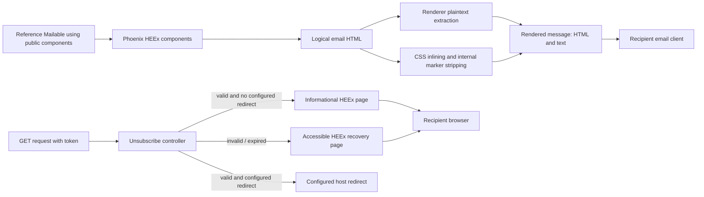

# Phase 172: Recipient Output and Built-in Pages - Research

**Researched:** 2026-10-09
**Domain:** Phoenix HEEx transactional email rendering, plaintext extraction, and unsubscribe browser pages
**Confidence:** HIGH for repository contracts and official guidance; MEDIUM for cross-client risk characterization

<user_constraints>
## User Constraints (from CONTEXT.md)

### Locked Decisions

### Public component output and email-client constraints
- **D-01:** Improve heading, body, action, link, image fallback, narrow-width, and long-content behavior within the existing `Mailglass.Components` API and adopter theme contract. Keep important copy as ordinary live HTML text; keep descriptive link text and meaningful image alternatives. Make layouts fluid with email-safe table/width fallbacks and inline styles, and avoid fixed-height treatments around variable content.
- **D-02:** Preserve HEEx escaping, existing inline style and CSS-inliner behavior, presentation-table semantics, and the existing surgical MSO/VML paths and HTML fallbacks. Do not add a dependency or replace the current component/rendering architecture. Treat successful component rendering and markup preservation as evidence about Mailglass output, not a certification of Gmail, Outlook, or other recipient-client behavior.

### Representative examples and sender identity
- **D-03:** Keep AtlasDesk's bespoke HTML renderer explicit and intact. Add a named, inspectable reference-demo scenario that uses the public `Mailglass.Components` path, with the same sender identity and visual language as representative AtlasDesk scenarios. The examples must make their authoring path clear; do not convert every existing scenario or make the public-component example merely a static guide snippet.
- **D-04:** Update the relevant guides/example copy to show supported Mailable and component usage accurately. Use the existing brandbook's calm, exact voice and current brand tokens; the current `brandbook/brand-book.md` supersedes older prompt drafts.

### Plaintext meaning and links
- **D-05:** Keep `Mailglass.Renderer`'s generated-plaintext pipeline as the current supported behavior. Fix extraction so meaningful anchor URLs survive when links are nested inside text content or appear as ordinary unmarked anchors, while button/link components retain their existing useful label-and-URL meaning without duplicate URLs. Preserve readable order, paragraphs, headings, non-ASCII content, and essential action context.
- **D-06:** Do not silently change whether caller-supplied `text_body` is replaced by generated plaintext in this phase; the current renderer documentation and implementation define generated plaintext as the renderer output. If a public explicit-text contract is found during planning, treat it as a compatibility question to resolve before implementation rather than changing it incidentally.

### Built-in unsubscribe GET and recovery pages
- **D-07:** Valid GET remains informational and does not mutate subscription state or claim completion. Do not add a browser submission form or preference UI. Give recipients a clear next step within the supported product boundary: use their mail app's unsubscribe control when available, or contact the sender through the contact details in the message.
- **D-08:** Keep invalid and expired GET states distinguishable with their existing 404 and 410 responses. Replace the minimal, raw failure bodies with accessible, escaped HTML and concise recovery guidance that does not expose recipient data. Keep configured redirect behavior and POST response, event, and idempotency semantics unchanged.
- **D-09:** Use the existing lightweight HEEx/Phoenix rendering path and Mailglass brand voice/tokens for the built-in pages. Use semantic document structure, readable narrow layouts, sufficient contrast, and explicit state text; add no frontend framework or extra dependency.

### Shift-left acceptance and evidence boundaries
- **D-10:** Automate machine-observable component structure, escaping, plaintext links/content, example-path distinction, unsubscribe copy/status/redirect behavior, and preservation of POST semantics using existing ExUnit and browser/capture tooling. Run the existing focused regression gate and relevant checks; do not add a test framework or promote an advisory lane to required CI. Passing automation closes machine-observable acceptance without owner UAT.
- **D-11:** Keep evidence claims bounded. Automated HTML and browser renders can establish renderer/page behavior and responsive structure; they do not prove delivered-message rendering in Gmail/Outlook or image-enabled/disabled behavior across clients. Do not require manual inbox-client review or claim it occurred as part of this phase.

### the agent's Discretion
- Choose exact component spacing, type scale, inline styles, and short page copy within the current brandbook, semantic theme, and existing component contracts.
- Choose a representative public-component Mailable and fixture values that demonstrate narrow, long, non-ASCII, image-alt, and meaningful-link behavior while keeping AtlasDesk's separate renderer visible.
- Choose the smallest sufficient test additions and browser captures in existing lanes; keep responsive cases representative rather than multiplying a full theme/client/viewport matrix.

### Deferred Ideas (OUT OF SCOPE)
- Delivered inbox verification across Gmail, Outlook, Apple Mail, image-loading states, and dark-mode variants; this requires separate client-specific evidence and is not covered by generated HTML or browser previews.
- Interactive browser unsubscribe confirmation, a preference center, or any additional unsubscribe state transition.
- Provider/MIME serialization, send-to-self, or broader outbound pipeline changes.
- New email-rendering libraries, frontend frameworks, test frameworks, or additional required CI lanes.
</user_constraints>

<phase_requirements>
## Phase Requirements

| ID | Description | Research Support |
|----|-------------|------------------|
| MAILUX-01 | An author using the public email components can produce readable transactional messages with coherent heading/body/action hierarchy and usable long-content, narrow-width, link, and image-fallback behavior while preserving email-specific markup support. | Existing component structure and email client compatibility evidence below identify the rendering path, constraints, and assertions. |
| MAILUX-02 | An evaluator can review representative existing transactional scenarios with consistent sender branding and explicit coverage of both the public components and AtlasDesk's separate renderer; examples accurately demonstrate supported authoring paths. | Existing Mailglass demo Mailable registry and AtlasDesk HTML helper establish the two separate paths to represent. |
| MAILUX-03 | A recipient can understand the message and its essential action from plaintext output as well as HTML, with meaningful links and content preserved through the renderer. | Current renderer pipeline and strategy tests define generated text behavior; nested and unmarked links are a focused gap. |
| MAILUX-04 | A recipient visiting the built-in unsubscribe GET page or an invalid/expired link sees readable, accessible, truthful state and next-step copy; configured host redirects and the existing protocol POST contract remain intact, with no unsupported confirmation or completion claim. | Controller GET branches, embedded HEEx template, and existing controller tests define status, redirect, and POST regression boundaries. |
</phase_requirements>

## Summary

Build this phase on the current Phoenix HEEx component library and `Mailglass.Renderer`. The public email components already provide presentation tables, inline styles, theme resolution, text/image/link/heading primitives, and targeted MSO/VML fallbacks. Preserve those behaviors and make improvements within the existing contracts. The main concrete output defect to plan around is plaintext extraction: existing component-specific links already render label plus destination, while ordinary anchors and anchors nested in a text component can lose their URL. [VERIFIED: `lib/mailglass/components.ex:34-40,78-99,113-127,139-168,181-219,233-265,276-307,310-379,405-430,433-468`; `lib/mailglass/renderer.ex:1-6,41-63,122-152,174-220`; `test/mailglass/renderer_test.exs:61-77,182-200`]

Keep the bespoke AtlasDesk HTML helper and its scenarios intact. Add one named Mailable/scenario that demonstrably uses `Mailglass.Components` while sharing AtlasDesk's sender identity and visual language. Make the rendered output and authoring source inspectable so an evaluator can distinguish the paths. For unsubscribe pages, retain valid GET as informational, preserve the existing redirect and POST contracts, and render invalid/expired states through escaped, accessible HEEx with actionable recovery copy and no recipient/token disclosure. [VERIFIED: `reference/demo_app/lib/mailglass_demo_web/mailers/atlas_desk_email.ex:1-45`; `reference/demo_app/lib/mailglass_demo_web/mailers/account_mailer.ex:1-47`; `reference/demo_app/lib/mailglass_demo_web/router.ex:77-92`; `lib/mailglass/compliance/unsubscribe_controller.ex:24-68`; `lib/mailglass/compliance/unsubscribe_html/confirm.html.heex:1-19`; `test/mailglass/compliance/unsubscribe_controller_test.exs:124-185`]

**Primary recommendation:** Implement a focused vertical slice across the existing public components, generated-plaintext extraction, reference-demo Mailable/scenario, unsubscribe HEEx pages, affected guides, and the existing ExUnit/browser evidence surfaces. Use the focused regression gate; do not add a dependency, public rendering API, client-certification claim, or required CI lane.

## Architectural Responsibility Map

| Capability | Primary Tier | Secondary Tier | Rationale |
|------------|-------------|----------------|-----------|
| Email component rendering and theme styling | API / Backend | Recipient email client | HEEx components and `Mailglass.Renderer` produce the HTML/plaintext output; the receiving email client interprets it. |
| Plaintext link and content extraction | API / Backend | Recipient email client | The renderer transforms component HTML into the `text_body` output consumed by mail delivery. |
| Public-component demo scenario | API / Backend | Browser / Client | A reference Mailable constructs the message; the developer preview/demo renders it for inspection. |
| Unsubscribe GET and invalid/expired pages | API / Backend | Browser / Client | Controller verifies and routes the state, while HEEx emits the recipient-facing page. |

## Standard Stack

### Core

| Library / surface | Version | Purpose | Why Standard |
|-------------------|---------|---------|--------------|
| Phoenix.Component / HEEx | Existing locked project version | Server-rendered public email components and built-in page templates | The repository already uses HEEx for public components and embeds unsubscribe templates; official Phoenix docs describe HEEx as HTML-aware and component-oriented. [CITED: https://hexdocs.pm/phoenix_live_view/Phoenix.Component.html] |
| `Mailglass.Renderer` | In-repository | Generate plaintext, inline CSS, strip internal markers, and return rendered message | It is the existing supported delivery rendering pipeline and is the required site for plaintext link fixes. [VERIFIED: `lib/mailglass/renderer.ex:1-6,41-63,122-152,174-220`] |
| ExUnit | Existing project test stack | Component, renderer, controller, and contract regression tests | Current renderer/controller test suites already own the directly affected contracts. [VERIFIED: `test/mailglass/renderer_test.exs:1-13`; `test/mailglass/compliance/unsubscribe_controller_test.exs:1-4,124-188`] |

### Supporting

| Surface | Version | Purpose | When to Use |
|---------|---------|---------|-------------|
| Existing HEEx embedded unsubscribe templates | In-repository | Escaped response page markup | Use for valid, invalid, and expired page bodies with one shared semantic and visual shell. |
| Existing demo Mailable and preview registry | In-repository | Make authoring paths reviewable as named scenarios | Add a public-component example beside the currently registered AtlasDesk-rendered examples. |
| Existing demo browser/capture tooling | In-repository | Browser rendering and responsive structure evidence | Capture a representative public-component scenario and built-in GET page using current supported local viewport/browser evidence. The CI preview-capture job is explicitly advisory. [VERIFIED: `.github/workflows/ci.yml:1055-1064,1153-1179`] |

### Alternatives Considered

| Instead of | Could Use | Tradeoff |
|------------|-----------|----------|
| Current HEEx/component + renderer path | New email rendering package or client-specific markup layer | Out of scope and unsupported by a demonstrated gap; adds a dependency or parallel authoring surface while the existing components already provide email-specific fallbacks. [VERIFIED: `lib/mailglass/components.ex:78-99,139-219,310-379`] |
| Existing ExUnit/browser surfaces | New testing framework or required CI lane | The phase context explicitly locks existing tooling and forbids lane promotion; deterministic contract tests are sufficient for machine-observable behavior. |

No package installation is recommended. Package registry/legitimacy audit is not applicable because this phase adds no external package.

## Architecture Patterns

### System Architecture Diagram



### Recommended Project Structure

Keep changes in existing ownership seams:

- `lib/mailglass/components.ex` for public component output and markup contracts.
- `lib/mailglass/renderer.ex` for generated plaintext extraction.
- `reference/demo_app/lib/mailglass_demo_web/mailers/` and the demo Mailable registry for the named example.
- `lib/mailglass/compliance/unsubscribe_html/` and the existing controller rendering path for state-specific page copy.
- `guides/components.md`, `guides/authoring-mailables.md`, and `guides/unsubscribe.md` for accurate adopter instructions.
- Existing focused component, renderer, controller, reference-demo and browser/capture tests for automated acceptance.

### Pattern 1: Preserve the email-safe rendering pipeline

**What:** Keep HEEx interpolation and escaping for dynamic copy, existing component attributes and adopter theme resolution, presentation semantics on layout tables, inline base styling, CSS inlining, and the existing narrowly applied Outlook branches. The renderer's documented stages are HEEx render, plaintext extraction before CSS inlining, CSS inlining, then removal of `data-mg-*` markers. [VERIFIED: `lib/mailglass/renderer.ex:1-6,41-63,122-152,222-237`; `lib/mailglass/components.ex:78-99,113-127,139-219`]

**When to use:** For all public component and built-in page changes. Do not alter CSS inliner order or the plain-text stage's access to the pre-VML logical HTML.

**Example:** The official Phoenix component docs show HTML-aware interpolation inside element content (`<p>Hello {@name}</p>`). Apply that pattern to dynamic page/example content and do not turn untrusted values into raw HTML. [CITED: https://hexdocs.pm/phoenix_live_view/Phoenix.Component.html]

### Pattern 2: Preserve actionable links in generated plaintext

**What:** For an anchor without a Mailglass strategy marker, recursively retain its readable child text and append its meaningful destination exactly once; for marked button/link anchors, keep the existing label-plus-destination format and suppress duplicate extraction by nested traversal. Include anchors nested in text components and plain HTML-string templates in tests. [VERIFIED: `lib/mailglass/renderer.ex:174-216`; `test/mailglass/renderer_test.exs:61-77,182-200`]

**When to use:** When a recipient may need to act from a text-only email. Keep paragraph/heading order and existing whitespace normalization. Ensure non-ASCII content and image alternatives stay intact.

### Pattern 3: Keep email layout fluid at the base layer

**What:** Keep important content as live text and use a fluid full-width outer table with a max-width inner container, inline baseline styles, natural height, and ordinary word wrapping where supported. Do not rely on media queries alone for the basic single-column content/action experience. Keep any two-column row as an enhancement with the existing stacked HTML fallback. [VERIFIED: `lib/mailglass/components.ex:78-99,139-219`; [CITED: Gmail CSS support](https://developers.google.com/workspace/gmail/design/css); [CITED: Microsoft email rendering guidance](https://learn.microsoft.com/en-us/troubleshoot/dynamics-365/customer-insights/journeys/email/email-troubleshoot-rendering)]

**When to use:** For narrow-width and long-content scenarios, including long link destinations, long names, and dynamic text. Microsoft documents Classic Outlook's Word-based processor, table-cell padding as a spacing mitigation, long-word overflow risk, and VML background height failures with dynamic text. Avoid fixed-height VML backgrounds around variable content; preserve the existing VML button and row/column fallbacks, which have different purposes. [CITED: https://learn.microsoft.com/en-us/troubleshoot/dynamics-365/customer-insights/journeys/email/email-troubleshoot-rendering]

### Pattern 4: Render state-specific unsubscribe pages with a shared accessible shell

**What:** Keep status selection in the controller and render short state-specific text in HEEx: valid GET says the visit did not change subscription state and offers only the allowed next steps; invalid/expired pages explain recovery without token or recipient values. Keep the configured redirect path separate. Use semantic document structure, one page heading, readable width, explicit state in text, and escaped dynamic values when any are rendered. [VERIFIED: `lib/mailglass/compliance/unsubscribe_controller.ex:24-68`; `lib/mailglass/compliance/unsubscribe_html/confirm.html.heex:1-19`]

**When to use:** Default built-in GET rendering when no configured redirect applies; invalid and expired token recovery. Do not add form controls or new state transitions.

### Accessibility and email semantics

- Keep `role="presentation"` on tables used solely for layout. W3C APG explains that presentation role suppresses the table semantics for assistive technology while descendants remain available where applicable. [CITED: https://www.w3.org/WAI/ARIA/apg/practices/hiding-semantics/]
- CTA text must describe the action/destination rather than use repeated generic link text. W3C H30 describes link text that conveys link purpose. [CITED: https://www.w3.org/WAI/WCAG21/Techniques/html/H30.html]
- Keep required `alt` present on images; use concise purpose-based alternative text for informative/functional images, and an empty alternative for decorative images. Existing component docs explicitly require `alt` and explain `alt=""` for decorative images. [VERIFIED: `lib/mailglass/components.ex:405-429`; [CITED: W3C Images Tutorial](https://www.w3.org/WAI/tutorials/images/)]
- A browser render and a valid HTML tree can establish Mailglass's markup and responsive structure, but cannot demonstrate how Gmail or Outlook will render a delivered message. Gmail's docs say unsupported CSS may be ignored; Microsoft lists client-specific behaviors and caveats. [CITED: https://developers.google.com/workspace/gmail/design/css; https://learn.microsoft.com/en-us/troubleshoot/dynamics-365/customer-insights/journeys/email/email-troubleshoot-rendering]

### Anti-Patterns to Avoid

- **Media-query-only responsiveness:** the fluid/stacked base rendering must remain understandable when CSS media-query support is absent or ignored. Gmail supports some media queries but says unsupported CSS can be ignored; Microsoft documents clients with limited/no media-query behavior. [CITED: https://developers.google.com/workspace/gmail/design/css; https://learn.microsoft.com/en-us/troubleshoot/dynamics-365/customer-insights/journeys/email/email-troubleshoot-rendering]
- **Fixed-height VML background around dynamic copy:** content expansion can exceed the precomputed VML height in Classic Outlook. [CITED: https://learn.microsoft.com/en-us/troubleshoot/dynamics-365/customer-insights/journeys/email/email-troubleshoot-rendering]
- **Raw HTML error response interpolation:** failure bodies currently concatenate the status message into a minimal HTML string; replace the response rendering seam with HEEx and escaped content rather than embedding raw HTML. [VERIFIED: `lib/mailglass/compliance/unsubscribe_controller.ex:64-68`]
- **GET completion language or mutation:** valid GET is presently read-only; keep this a statement of actual state and next step. [VERIFIED: `lib/mailglass/compliance/unsubscribe_controller.ex:24-35,52-61`]
- **Converting AtlasDesk examples to components:** AtlasDesk scenarios are intentionally authored through its own HTML helper; preserve this path and add one distinct public component scenario. [VERIFIED: `reference/demo_app/lib/mailglass_demo_web/mailers/atlas_desk_email.ex:1-45`; `reference/demo_app/lib/mailglass_demo_web/mailers/account_mailer.ex:25-46`; `reference/demo_app/lib/mailglass_demo_web/router.ex:77-92`]

## Don't Hand-Roll

| Problem | Don't Build | Use Instead | Why |
|---------|-------------|-------------|-----|
| HEEx and HTML escaping | Custom interpolation/escaping or raw dynamic HTML | Phoenix HEEx interpolation and the existing component/page templates | HEEx is HTML-aware; keeping dynamic output in the existing template path preserves context-sensitive escaping. [CITED: https://hexdocs.pm/phoenix_live_view/Phoenix.Component.html] |
| Email CSS compatibility | New renderer, media-query framework, or client-specific “certification” abstraction | Existing inline component styling, CSS inliner, and existing MSO/VML fallbacks | Project already owns the rendering path, and recipient-client variability cannot be represented by one generic guarantee. [VERIFIED: `lib/mailglass/renderer.ex:1-6,122-152,222-237`; `lib/mailglass/components.ex:139-219,310-379`; [CITED: Microsoft](https://learn.microsoft.com/en-us/troubleshoot/dynamics-365/customer-insights/journeys/email/email-troubleshoot-rendering)] |
| Unsubscribe page rendering | Hand-built status HTML strings | Embedded HEEx unsubscribe templates | Removes raw interpolated HTML and lets one accessible shell render the known states. [VERIFIED: `lib/mailglass/compliance/unsubscribe_controller.ex:52-68`; `lib/mailglass/compliance/unsubscribe_html.ex:1-6`] |
| Test infrastructure | New framework or mandatory preview CI lane | Existing ExUnit suites and current browser/capture lane | The current focused regression gate already runs renderer tests, and capture is available as advisory evidence. [VERIFIED: `scripts/gsd-regression-gate.sh:100-125`; `.github/workflows/ci.yml:1055-1064,1153-1179`] |

**Key insight:** The complicated part is maintaining the boundary among component semantics, HTML serialization, generated plaintext, and client-specific rendering. Keep one renderer and verify transformations where they happen; do not let browser screenshots become claims about actual recipient clients.

## Common Pitfalls

### Pitfall 1: Plaintext contains link labels but loses destinations

**What goes wrong:** An actionable anchor becomes only visible label text in `text_body`, or its URL appears twice when an ordinary-anchor extraction strategy intersects with a `link_pair` marker.

**Why it happens:** The current walker handles `link_pair` specially, but the default recursion visits child text without extracting the ancestor anchor's `href`. A text component extracts flattened text and does not recurse into its anchor children. [VERIFIED: `lib/mailglass/renderer.ex:174-216`]

**How to avoid:** Add tests for marked CTA, marked link, plain unmarked anchor, anchor nested inside component text, non-action link with no href, and repeated/nested links. Assert label+URL exactly once, order, paragraphs, heading content, non-ASCII, and image alt behavior.

**Warning signs:** `text_body` has a descriptive label but no corresponding link target, repeated URLs, flattened paragraphs, or lost Unicode/image-alt copy.

### Pitfall 2: Component page tests pass but email clients diverge

**What goes wrong:** A browser screenshot looks fluid, but a recipient client drops media-query styling, changes spacing, mishandles long words, or truncates dynamic content against fixed VML dimensions.

**Why it happens:** Gmail support is selective and Classic Outlook uses a Word-based rendering engine with different CSS/VML behavior. Microsoft also cautions that client customizations and forwarding can change output. [CITED: https://developers.google.com/workspace/gmail/design/css; https://learn.microsoft.com/en-us/troubleshoot/dynamics-365/customer-insights/journeys/email/email-troubleshoot-rendering]

**How to avoid:** Treat inline/width/table fallbacks as the base behavior; use representative long and narrow cases; keep live text and natural heights; describe browser evidence as Mailglass output evidence only. Do not run or claim a full client matrix in this phase.

**Warning signs:** Essential layout exists only in `@media`, long links expand a container, or dynamic copy sits inside fixed-height VML.

### Pitfall 3: Unsubscribe page states overpromise or erase protocol distinctions

**What goes wrong:** Valid GET copy sounds like unsubscribe completion, failure pages reveal token/recipient data, or response edits accidentally change the configured redirect, 404/410 distinction, or POST protocol behavior.

**Why it happens:** The valid page currently says “about to unsubscribe”; failure is raw HTML; tests already cover redirect and GET statuses alongside separate POST success/idempotency cases. [VERIFIED: `lib/mailglass/compliance/unsubscribe_html/confirm.html.heex:13-16`; `lib/mailglass/compliance/unsubscribe_controller.ex:24-68`; `test/mailglass/compliance/unsubscribe_controller_test.exs:124-185,187-257`]

**How to avoid:** Use truthful informational copy for valid GET; retain separate invalid and expired states and existing status codes; test configured redirect unchanged; assert no form/no event on GET and preserve all POST contract tests as a regression check.

**Warning signs:** GET reports completion, invalid/expired pages echo path token or recipient, configured redirect is replaced by rendered HTML, or POST response/event count changes.

### Pitfall 4: Demo example makes the authoring path ambiguous

**What goes wrong:** Evaluators see similar output but cannot determine if it was authored with `Mailglass.Components` or AtlasDesk's helper, or the added public-components example is only a static documentation snippet.

**Why it happens:** Existing demo scenarios call the bespoke HTML builder directly, and the demo registry discovers only registered Mailable modules. [VERIFIED: `reference/demo_app/lib/mailglass_demo_web/mailers/account_mailer.ex:25-46`; `reference/demo_app/lib/mailglass_demo_web/router.ex:77-92`]

**How to avoid:** Add one registered named scenario Mailable with a real `Mailglass.Components` HEEx body, reuse AtlasDesk sender identity/brand voice, and assert both authoring-source path and output in tests. Keep existing AtlasDesk scenario render paths unchanged.

**Warning signs:** New example uses `AtlasDeskEmail.html/1`, isn't registered in the preview route, or has no long/non-ASCII/link/alt text fixture coverage.

## Code Examples

Verified pattern from official Phoenix documentation:

```elixir
~H"""
<p>Hello {@name}</p>
"""
```

This is the documented HEEx interpolation form; keep dynamic values in HEEx text/attribute contexts and avoid raw insertion. [CITED: https://hexdocs.pm/phoenix_live_view/Phoenix.Component.html]

Existing local assertions to extend: button and link plaintext are expected as `Label (url)` and the rendered message has both HTML and generated text. [VERIFIED: `test/mailglass/renderer_test.exs:16-24,61-77`]

## State of the Art

| Previous/default tendency | Recommended current treatment | Evidence boundary |
|---------------------------|-------------------------------|-------------------|
| Make narrow output depend on media queries | Keep single-column content, table widths, and inline base styles understandable first; let supported media queries enhance | Gmail supports specified media queries but may ignore unsupported CSS; Microsoft docs record clients without media-query support. [CITED: Gmail; Microsoft] |
| Place dynamic copy over a VML background with fixed calculated height | Avoid fixed-height VML around variable text | Microsoft documents clipping/misalignment when dynamic text exceeds the precomputed background height. [CITED: Microsoft] |
| Treat a browser-rendered email template as client proof | Describe browser captures as structure/renderer evidence; reserve actual-client claims for client-specific delivered-message tests | Client rendering and forwarding behavior vary. [CITED: Microsoft] |

**Deprecated/outdated:** No code dependency or renderer replacement is needed. VML itself is not deprecated within this phase; retain the current surgical use and HTML alternatives.

## Validation Architecture

### Test Framework

| Property | Value |
|----------|-------|
| Framework | Existing ExUnit suites (version follows locked Elixir project configuration) |
| Config file | Existing root `mix.exs` / test configuration |
| Quick run command | `asdf exec mix test test/mailglass/renderer_test.exs test/mailglass/compliance/unsubscribe_controller_test.exs --warnings-as-errors --seed 1` |
| Focused regression gate | `bash scripts/gsd-regression-gate.sh` |
| Browser evidence | Existing reference-demo browser/capture scripts; use existing lane configuration |

The focused gate currently runs the renderer suite and the connected operator/preview browser suite, plus admin and inbound suites. The separate `preview_capture_advisory` CI job is explicitly advisory; do not claim it is a blocking required check or promote it. [VERIFIED: `scripts/gsd-regression-gate.sh:100-125`; `.github/workflows/ci.yml:1055-1064,1153-1179`]

### Phase Requirements → Test Map

| Req ID | Behavior | Test Type | Automated Command | File Exists? |
|--------|----------|------------|-------------------|--------------|
| MAILUX-01 | Public component structure, heading/body/action hierarchy, escaping, presentation tables, inline styles, image alt, responsive width fallback, and VML preservation | unit/component | `asdf exec mix test test/mailglass/components test/mailglass/renderer_test.exs --warnings-as-errors` | ✅ Existing component and renderer suites; add assertions to current tests |
| MAILUX-02 | Named preview scenario uses public components and coexists with unconverted AtlasDesk HTML scenarios | integration/browser + source contract | `bash scripts/run_demo_browser_evidence.sh` plus focused reference-demo test command | ✅ Demo app/browser evidence exists; add scenario and path assertion |
| MAILUX-03 | Generated text preserves nested/unmarked anchor destinations exactly once, order, meaningful labels, headings, paragraphs, Unicode and image alt; generated text replacement remains unchanged | unit | `asdf exec mix test test/mailglass/renderer_test.exs --warnings-as-errors --seed 1` | ✅ Existing renderer tests; add nested/plain-anchor edge cases |
| MAILUX-04 | Valid GET informs without mutation/form; invalid/expired are accessible/escaped and retain distinct status, redirect and POST behavior | integration/controller | `asdf exec mix test test/mailglass/compliance/unsubscribe_controller_test.exs --warnings-as-errors --seed 1` | ✅ Existing controller tests; add accessibility/copy/no-mutation/no-disclosure assertions |

### Sampling Rate

- **Per task:** run the narrow affected ExUnit file(s), then inspect the generated HTML/plaintext or page output.
- **Per phase gate:** run `bash scripts/gsd-regression-gate.sh` and the relevant existing demo browser/capture check.
- **CI evidence:** report whether each run is blocking or advisory; browser capture remains advisory where configured.

### Wave 0 Gaps

- None — the affected production and acceptance test seams exist. Add cases in the current suites; do not add a framework.

## Security Domain

Security enforcement is included under the research protocol because the phase config does not explicitly set it to false.

### Applicable ASVS Categories

| ASVS Category | Applies | Standard Control |
|---------------|---------|------------------|
| V2 Authentication | no | This page change does not add account authentication; preserve token verification behavior. |
| V3 Session Management | no | Do not introduce a browser session flow. |
| V4 Access Control | yes, boundary-preservation | Valid GET is informational and does not mutate state; POST remains the only mutation route under the current contract. |
| V5 Input Validation, Sanitization and Encoding | yes | Render status copy through HEEx and ensure malformed/invalid tokens and dynamic recipient copy never enter raw HTML. OWASP ASVS names V5 as validation, sanitization and encoding. [CITED: https://devguide.owasp.org/en/06-verification/01-guides/03-asvs/] |
| V6 Cryptography | no changes | Do not modify token generation/verification or introduce cryptography work in this phase. |

### Known Threat Patterns for Phoenix HEEx and unsubscribe pages

| Pattern | STRIDE | Standard Mitigation |
|---------|--------|---------------------|
| Dynamic recipient or status string interpolated into raw HTML | Tampering / XSS | Use HEEx interpolation/escaping; tests should inject HTML-sensitive content and assert it is text, not markup. |
| Invalid or expired token echoed into browser page | Information disclosure | Use generic recovery text and never echo token or recipient values in invalid/expired responses. |
| GET accidentally performs unsubscribe mutation | Tampering | Preserve informational GET / mutation POST split; test no event/state change after valid GET. |
| Changing failure response breaks status distinction or hides host redirect | Tampering | Assert invalid remains 404, expired remains 410, and configured redirect remains as-is. The verbatim existing controller branches are `{:error, :expired} -> failure(conn, 410, "unsubscribe token expired")`, `{:error, :invalid} -> failure(conn, 404, "unsubscribe token invalid")`, and `nil -> failure(conn, 404, "unsubscribe token invalid")`. [VERIFIED: `lib/mailglass/compliance/unsubscribe_controller.ex:25-33`] `DATA_q7Mx3Lpa_START`Source excerpt: `{:error, :expired} -> failure(conn, 410, "unsubscribe token expired")`; `{:error, :invalid} -> failure(conn, 404, "unsubscribe token invalid")`; `nil -> failure(conn, 404, "unsubscribe token invalid")`. `DATA_q7Mx3Lpa_END` |

## Environment Availability

| Dependency | Required By | Available | Version | Fallback |
|------------|------------|-----------|---------|----------|
| `asdf` / Elixir toolchain | ExUnit and Mix checks | ✓ / partial | `asdf` present; installed Elixir versions include 1.18.4-otp-27, but no Mix version was resolved by `asdf exec mix --version` in this shell | Use the repo's `.tool-versions` setup or the existing CI runtime |
| Node.js / npm | Existing browser capture tooling | ✓ | Node v22.14.0; npm 11.1.0 | — |
| PostgreSQL client | Controller integration suite setup | ✓ | `psql` 14.17 client; service availability not probed | Existing local test DB or CI PostgreSQL service |
| Chromium / Playwright | Existing browser/capture lane | Not probed | — | Use the existing configured demo browser/capture lane; no new browser install is required for the ExUnit assertions |

The local toolchain observation is environment-specific; it does not change the recommended required CI command or project runtime. No external service integration or newly installed dependency is needed by the implementation itself.

## Assumptions Log

| # | Claim | Section | Risk if Wrong |
|---|-------|---------|---------------|
| A1 | The locked root ExUnit and reference-demo test commands remain runnable after using the repository's documented `.tool-versions` toolchain. | Validation Architecture | Planner may need to adjust the exact local command to the actual asdf setup; CI still has its strict version-file setup. |
| A2 | The public-components example can be registered in the existing demo `mailables` list without changing preview API or registry semantics. | Architecture Patterns | If registration requires unsupported public API changes, scope must be revisited before implementation. |

## Open Questions

1. **Which named scenario should exercise the public components?**
   - What we know: context allows discretion and the existing AtlasDesk mailers cover account, billing, and operations transactional scenarios.
   - What's unclear: which message type best demonstrates the needed long, narrow, Unicode, link, and image-alt content with minimal new fixture surface.
   - Recommendation: choose one existing demo domain and make a single named component-backed scenario alongside the unchanged AtlasDesk example; no user checkpoint is needed for this implementation detail.

2. **What is the exact local Mix command?**
   - What we know: the project declares `.tool-versions` and the regression gate uses `asdf exec mix`; this session's asdf invocation returned no Mix version.
   - What's unclear: whether the local Elixir/Mix plugin selection is temporarily incomplete.
   - Recommendation: plan around the existing regression script and CI toolchain; resolve local setup only if execution is blocked.

## Sources

### Primary (HIGH confidence)

- Repository source of truth: `Mailglass.Components`, `Mailglass.Renderer`, unsubscribe controller/template, named reference-demo mailers/router, current ExUnit suites, CI workflow, and focused regression script. Direct line citations appear beside claims.
- [Phoenix.Component / HEEx documentation](https://hexdocs.pm/phoenix_live_view/Phoenix.Component.html) — HTML-aware interpolation and component template syntax. [CITED]
- [Gmail CSS support](https://developers.google.com/workspace/gmail/design/css) — CSS selector/property/media-query support and unsupported-CSS caveat. [CITED]
- [Microsoft email rendering troubleshooting guidance](https://learn.microsoft.com/en-us/troubleshoot/dynamics-365/customer-insights/journeys/email/email-troubleshoot-rendering) — Classic Outlook Word-based rendering, table spacing, dynamic VML height caveat, long-word and client-specific issues. [CITED]
- [W3C ARIA APG: presentation role](https://www.w3.org/WAI/ARIA/apg/practices/hiding-semantics/) — presentation semantics.
- [W3C WCAG Technique H30](https://www.w3.org/WAI/WCAG21/Techniques/html/H30.html) — meaningful anchor link text.
- [W3C Images Tutorial](https://www.w3.org/WAI/tutorials/images/) — informative, decorative, and functional image alternatives.
- [OWASP Developer Guide: ASVS](https://devguide.owasp.org/en/06-verification/01-guides/03-asvs/) — category scope for validation/sanitization/encoding.

### Secondary (MEDIUM confidence)

- No third-party email-client support matrix was used to make a support claim. Official client guidance above is used for bounded risks; generated/browser evidence remains distinct from actual recipient-client behavior.

## Metadata

**Confidence breakdown:**
- Standard stack: HIGH — follows current in-repo render and test surfaces; framework guidance checked against official docs.
- Architecture: HIGH — existing pipeline/controller/demo boundaries read directly from source files.
- Pitfalls: HIGH for repository gaps and controller semantics; MEDIUM for the generalizability of client-specific email risks.

**Research date:** 2026-10-09
**Valid until:** 2026-11-08 for stable repository architecture; recheck official email-client guidance before making any client-specific compatibility claim.
