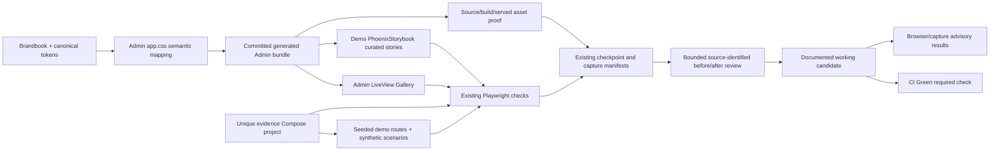

# Phase 173: Consistency and Delivery Evidence - Research

**Researched:** 2026-10-09
**Domain:** Phoenix LiveView UI consistency, Playwright evidence, generated assets, and candidate delivery
**Confidence:** HIGH

<user_constraints>
## User Constraints (from CONTEXT.md)

### Locked Decisions

### Shared patterns, token ownership, and review surfaces
- **D-01:** Treat `brandbook/brand-book.md` as the identity and voice master and `brandbook/tokens.css` as the canonical brand-value source. Keep `mailglass_admin/docs/design-system.md` focused on current implementation mechanics and map its examples to the values actually shipped by `mailglass_admin/assets/css/app.css`; remove contradictions, stale sizes/colors, and historical visual-score instructions that could be mistaken for current acceptance.
- **D-02:** Keep `MailglassAdmin.GalleryLive` as the comprehensive, interactive inventory of shared components and relevant states. Keep PhoenixStorybook in the demo app as a curated primitive/story explorer, consistent for overlapping patterns and themes, without duplicating every Gallery state. Explain each surface's purpose and route maintainers from the guidance to both.
- **D-03:** Reuse existing CSS, HEEx, Gallery and Storybook mechanisms. Do not add a shared specimen framework, mirror a second stylesheet, move Gallery coverage into the demo package, or add a dependency unless implementation proves an existing maintenance problem that cannot be solved with a focused documentation/parity check.

### Repeatable checks and rendered evidence
- **D-04:** Extend the current Playwright/browser path and existing manifests rather than adding visual-test infrastructure. Pair a small representative before/after capture set for changed primary flows and adverse states with focused DOM, accessibility, interaction, and layout assertions. Prefer semantic and geometry assertions for behavior; use screenshots for human-readable rendered comparison, not as a substitute for interaction or accessibility checks.
- **D-05:** Make each evidence record identify the candidate source/revision (and dirty-tree state when applicable), route, synthetic scenario/fixture, theme, viewport, interaction/adverse state, browser, before/after relationship, capture path/hash, and the relevant source/build/served asset identity. Reuse existing asset-byte proof where it already establishes source-to-built-to-served parity. Capture the baseline before changing the evidence target and identify its source; historical screenshots and scores remain historical evidence, not current acceptance.
- **D-06:** Keep browser-rendered email preview evidence distinct from delivered email-client evidence. Do not claim Gmail, Outlook, Apple Mail, image-loading, or dark-mode client compatibility without direct client evidence. Use synthetic fixtures and do not capture real recipient/message data in retained artifacts.

### Candidate preview, CI, and operational cleanup
- **D-07:** Use the existing demo as the working feedback preview and document how to open it, which checkout/source it serves, and which generated assets are loaded. Preserve the owner's retained feedback preview and unrelated services while collecting evidence; isolate Compose project/service names and cleanup to the evidence run rather than stopping the default project.
- **D-08:** Keep required CI status distinct from existing advisory browser/capture jobs. Require the already-defined required CI aggregation to pass for the candidate; run focused existing browser/evidence jobs and the generated-asset drift check where applicable, accurately labeling advisory results. Reuse current lanes first; do not promote a lane or change branch protection as part of this phase.
- **D-09:** Treat temporary services and artifacts as owned resources: evidence commands must clean up only what they create, and the final walkthrough must say which evidence is retained and where. Commit only phase-owned changes through the established GSD process; preserve unrelated pre-existing workspace changes and never claim a candidate is committed or CI-green without matching evidence.

### Shift-left acceptance and decision posture
- **D-10:** Convert all machine-observable Phase 173 acceptance into deterministic checks in the existing stack before any owner checkpoint. Per D-52, passing automation closes the corresponding acceptance row; only irreducible visual judgment or external delivery proof may remain human-needed, and it must be narrowly named. A rendered review can be automated for collection/provenance and still be presented for human visual judgment only if the criterion itself is subjective.
- **D-11:** Use a single coherent implementation plan, bounded to Phase 173's success criteria. Do not churn through alternatives already resolved by repo architecture and source evidence. Escalate only if a decision changes a public or trust contract, retention semantics, branch-protection/release posture, or major maintainer burden.

### Agent's Discretion
- Select representative changed flows, adverse states, viewport/theme combinations, and the smallest truthful capture matrix after inventorying current phase artifacts and current source.
- Choose manifest fields and validation at the least complex existing boundary that prevents stale or misattributed evidence.
- Select the smallest guide, story, evidence-script, and CI-documentation edits that make the delivered state discoverable and repeatable.
- Reconcile baseline and candidate identities using the actual available checkout/preview setup; disclose limitations instead of inferring identity from a URL or historical screenshot.

### Folded Todos
None. The Phase 173 todo matcher returned zero relevant items.

### Deferred Ideas (OUT OF SCOPE)
- A generalized shared Storybook/Gallery catalog, moving one review surface into the other, or expanding the demo dependency boundary.
- Committed pixel-baseline enforcement or a new/promoted required visual CI lane.
- Paid visual judging, cross-browser matrix expansion without a concrete gap, or exhaustive viewport/theme/client combinations.
- Gmail/Outlook/Apple Mail certification and claims about delivered-message rendering.
- Automatic merge, branch-protection changes, package release/publication, or broad CI redesign.
- Changes to unrelated product flows or package contracts.
</user_constraints>

<phase_requirements>
## Phase Requirements

| ID | Description | Research Support |
|----|-------------|------------------|
| UIQ-01 | A maintainer can find the delivered shared patterns and applicable states in the existing gallery/Storybook and current design-system documentation, with clear ownership of tokens and no obsolete implementation left competing with the new patterns. | Map the guide to shipped Admin CSS and brandbook ownership; verify Gallery inventory and curated Storybook overlap; add focused docs/parity checks. |
| UIQ-02 | A maintainer can reproduce focused automated checks and inspect source-identified before/after renders covering the changed primary flows and relevant adverse states, with email-client and other evidence limits stated explicitly. | Extend existing Playwright/checkpoint and Admin capture manifests with candidate and per-capture provenance; pair semantic/geometry checks with bounded images; distinguish browser preview from client delivery. |
| UIQ-03 | The owner can review the completed milestone in a documented working preview, with required CI passing on the delivery candidate, task-owned changes committed, generated assets current, and temporary artifacts/services disposed of or explicitly retained for feedback. | Document demo checkout/assets/start command; require current asset drift check and exact candidate CI Green; isolate evidence Compose project and state retained artifacts. |
</phase_requirements>

## Summary

GSD state marks Phase 173 as the current phase, ready to plan, with the five preceding v2.9 phases complete. [VERIFIED: `.planning/STATE.md:1-38` — quote: `current_phase: 173`, `status: planning`, `completed_phases: 5`]

Phase 173 is a maintainer-facing consolidation and delivery proof task. The repo already has the right surfaces: the brandbook and token CSS, Admin's semantic CSS mapping, a broad LiveView Gallery, a demo-only curated PhoenixStorybook, Playwright browser checks, Admin preview capture manifests, generated-asset parity, and separate required/advisory CI jobs. Keep those boundaries and make their ownership discoverable. [VERIFIED: `.planning/phases/173-consistency-and-delivery-evidence/173-CONTEXT.md` (read this session); `mailglass_admin/lib/mailglass_admin/gallery_live.ex:1-16`; `reference/demo_app/dev/mailglass_demo_web/storybook.ex:1-41`; `.github/workflows/ci.yml:1029-1058`]

The material gaps are truthful documentation and provenance/lifecycle: the Admin design guide's token/type table differs from the built CSS, current manifests do not bind every capture to a candidate and served asset identity, and the browser evidence wrapper currently tears down the default Compose project. Extend existing contracts and tests. Keep screenshots as inspectable evidence; use current DOM/accessibility/interaction/geometry checks for observable acceptance. [VERIFIED: `mailglass_admin/docs/design-system.md:41-72`; `mailglass_admin/assets/css/app.css:31-39,107-126`; `mailglass_admin/dev/mailglass_admin/preview/capture_manifest.ex:59-92`; `scripts/run_demo_browser_evidence.sh:4-23`; [CITED: Playwright assertions](https://playwright.dev/docs/test-assertions)]

**Primary recommendation:** Reconcile Admin guidance with the shipped token mapping, preserve Gallery/Storybook as complementary review surfaces, extend existing evidence records and browser checks with exact candidate/source/build/served identity, then document and verify the retained demo preview after required `CI Green` and `mix verify.preview` pass on the same committed candidate. Run evidence Compose under a unique project name and clean up only that run. [VERIFIED: `mailglass_admin/mix.exs:207-212`; `.github/workflows/ci.yml:1411-1468`; `scripts/run_demo_browser_evidence.sh:10-23`; [CITED: Docker Compose project name](https://docs.docker.com/reference/cli/docker/compose/)]

## Architectural Responsibility Map

| Capability | Primary Tier | Secondary Tier | Rationale |
|------------|-------------|----------------|-----------|
| Brand/token ownership and UI implementation guidance | Maintainer documentation | CDN / Static | Brandbook owns identity/values; Admin CSS maps semantic UI roles and is compiled into served assets. |
| Shared component/state inventory | Browser / Client | API / Backend (LiveView render) | Gallery renders the Admin HEEx components and states; server-rendered LiveView supplies the HTML and updates. |
| Curated primitive/story exploration | Browser / Client | API / Backend (LiveView render) | Demo app mounts PhoenixStorybook and its demo-only story content while consuming the Admin stylesheet. |
| Rendered evidence and assertions | Browser / Client | API / Backend | Playwright drives real routes and DOM; server endpoints and generated/served CSS are part of the evidence chain. |
| Candidate provenance and retained evidence | Maintainer tooling / CI | CDN / Static | Checkpoints bind captures to checkout/build/served asset identity; CI status is evaluated for an exact commit. |
| Preview/evidence service lifecycle | Local orchestration | Database / Storage | Compose project identity scopes temporary services; evidence reset uses seeded synthetic data. |

## Project Constraints (from AGENTS.md)

No root `AGENTS.md` is present, and no project `.agents/skills/` or `.codex/skills/` files were found. There are no additional repository-specific agent directives to carry into planning. [VERIFIED: filesystem inspection this session]

## Standard Stack

Use existing locked dependencies and tasks; this phase installs no packages. Phoenix LiveView and HEEx remain the render/component surface. PhoenixStorybook is already restricted to the demo app's dev environment. [VERIFIED: `reference/demo_app/mix.exs:36-54` — quote: `{:phoenix_storybook, "~> 1.2", only: :dev}`; [CITED: Phoenix LiveView rendering lifecycle](https://phoenix-live-view.hexdocs.pm/Phoenix.LiveView.html#render/1)]

| Existing tool | Version in repo | Purpose | Why use it |
|---|---:|---|---|
| PhoenixStorybook | `1.2.0` | Curated demo primitive/story explorer | Already mounted in demo, reads committed stories, and supports variation groups/templates. Keep its scope curated. [VERIFIED: `reference/demo_app/mix.lock:41` — quote: `"phoenix_storybook": {:hex, :phoenix_storybook, "1.2.0"`; [CITED: component stories and variations](https://github.com/phenixdigital/phoenix_storybook/blob/main/guides/components.md)] |
| Playwright Test | `1.60.0` locked | Browser interaction, semantic assertions, viewport/geometry checks, and rendered capture | Already drives Admin/demo browser proof and produces JSON reports. Await auto-retrying web assertions. [VERIFIED: `reference/demo_app/assets/package-lock.json:12-19` — quote: `"@playwright/test": "^1.59.1"`, `"version": "1.60.0"`; [CITED: Playwright assertions](https://playwright.dev/docs/test-assertions)] |
| ExUnit / LiveViewTest | From project Mix lock | Component, LiveView, manifest, and source-to-built asset contracts | Existing tests cover tokens, capture manifests, Gallery, and mounted assets. [VERIFIED: `mailglass_admin/mix.exs:111-138`; `mailglass_admin/test/mailglass_admin/token_parity_test.exs`; `mailglass_admin/test/mailglass_admin/preview/capture_manifest_test.exs`] |
| Tailwind CLI | Existing locked Mix dependency | Admin CSS build and committed generated bundle | `mix verify.preview` compiles and rejects generated `priv/static/` drift. [VERIFIED: `mailglass_admin/mix.exs:207-212` — quote: `"mailglass_admin.assets.build"`, `"cmd git diff --exit-code priv/static/"`] |
| Docker Compose | Existing CLI/config | Demo preview and isolated evidence services | Reuse Compose config with an explicit run-unique project identity; cleanup only that project's resources. [VERIFIED: `compose.demo.yml:1-5`; [CITED: Compose project-name precedence](https://docs.docker.com/reference/cli/docker/compose/)] |

**Installation:** None. Do not introduce a visual-testing library, new shared catalog, or new required CI lane; those choices are locked out of scope. [VERIFIED: `173-CONTEXT.md` D-03/D-08 and Deferred Ideas]

## Architecture Patterns

### System Architecture Diagram



### Recommended Project Structure

```text
brandbook/                           # identity and canonical values
mailglass_admin/docs/design-system.md # current shipped implementation guidance
mailglass_admin/lib/mailglass_admin/gallery_live.ex # broad shared state inventory
reference/demo_app/dev/.../storybook.ex # curated Storybook config + committed stories
mailglass_admin/dev/.../capture_manifest.ex # Admin capture contract
reference/demo_app/assets/scripts/check-demo-browser-evidence.cjs # demo checkpoint contract
scripts/run_demo_browser_evidence.sh # isolated temporary evidence lifecycle
.planning/phases/173-consistency-and-delivery-evidence/ # current candidate walkthrough/evidence
```

These are existing source locations, not new files or a proposed structure expansion. [VERIFIED: `mailglass_admin/lib/mailglass_admin/gallery_live.ex`; `reference/demo_app/dev/mailglass_demo_web/storybook.ex`; `mailglass_admin/dev/mailglass_admin/preview/capture_manifest.ex`; `reference/demo_app/assets/scripts/check-demo-browser-evidence.cjs`; `scripts/run_demo_browser_evidence.sh`]

### Alternatives Considered

| Instead of | Could Use | Tradeoff |
|------------|-----------|----------|
| Existing broad Gallery plus curated Storybook | One shared catalog or move the Gallery into demo | Rejected by locked D-02/D-03: expands package/dependency boundary and creates duplicate maintenance without a demonstrated gap. [VERIFIED: `173-CONTEXT.md` D-02/D-03] |
| Existing Playwright and manifest path | New visual-test framework or required visual lane | Rejected by D-04/D-08: adds maintenance/CI policy beyond the scoped need; use images for review and deterministic assertions for observable behavior. [VERIFIED: `173-CONTEXT.md` D-04/D-08] |

No external packages are introduced, so the package-legitimacy audit is not applicable. [VERIFIED: `173-CONTEXT.md` D-03/D-08 and Deferred Ideas]

### Pattern 1: Complementary component review surfaces

**What:** Keep the Admin Gallery exhaustive for shared pattern states and themes; Storybook is a small curated explorer for overlapping primitives/stories and theme behavior. Link each from the current guide and explain the audience/use. The existing Storybook config points at the versioned Admin served CSS URL rather than a second CSS build. [VERIFIED: `mailglass_admin/lib/mailglass_admin/gallery_live.ex:3-15`; `reference/demo_app/dev/mailglass_demo_web/storybook.ex:11-40` — quote: `css_path: "/dev/mail/css-" <> MailglassAdmin.Controllers.Assets.css_hash()`; [CITED: PhoenixStorybook setup](https://github.com/phenixdigital/phoenix_storybook/blob/main/guides/setup.md)]

**When to use:** Any change to guide navigation, representative stories, or cross-surface parity. Do not convert the curated explorer into a duplicate of all Gallery states. PhoenixStorybook provides variation groups/templates for multiple situations within a story, while the repo's static Gallery remains the full state audit. [CITED: PhoenixStorybook component variations](https://github.com/phenixdigital/phoenix_storybook/blob/main/guides/components.md); [VERIFIED: `173-CONTEXT.md` D-02]

### Pattern 2: Evidence record at the existing manifest boundary

**What:** Extend the Admin capture manifest and demo checkpoint in place. Give every retained capture enough provenance to reject an empty or stale candidate: commit/revision and dirty state, route, synthetic scenario/fixture, theme, viewport, interaction/adverse state, browser/version, before/after source relation, screenshot file path and byte hash, and relevant source/build/served asset identity. Keep the candidate-level summary in the existing checkpoint and the capture-level facts with each image record; don't create a parallel catalog. [VERIFIED: `mailglass_admin/dev/mailglass_admin/preview/capture_manifest.ex:59-92`; `reference/demo_app/assets/scripts/check-demo-browser-evidence.cjs:52-71`; `173-CONTEXT.md` D-05]

Current Admin entries include `mailable`, `scenario`, `width`, `theme`, `path`, and `sha256`, but not candidate revision, route, browser, before/after relationship, or CSS identity. [VERIFIED: `mailglass_admin/dev/mailglass_admin/preview/capture_manifest.ex:85-92` — quote: `"mailable"`, `"scenario"`, `"width"`, `"theme"`, `"path"`, `"sha256"`]

**Important hash distinction:** In `CaptureManifest`, `:files` hashes the actual PNG bytes, while `:identity` hashes capture identity fields. For final renders, use/verify a file-byte hash and separately record source/build/served CSS identity; a deterministic identity hash does not prove screenshot bytes or rendered correctness. [VERIFIED: `mailglass_admin/dev/mailglass_admin/preview/capture_manifest.ex:95-118` — quote: `Base.encode16(:crypto.hash(:sha256, contents), case: :lower)` and `defp sha256_for(_path, state, relative_path, :identity)`]

### Pattern 3: Required versus advisory proof

**What:** On one committed candidate SHA, require `CI Green` and current generated asset parity; report browser and capture lanes with their actual status labels. The `CI Green` job aggregates required leaf jobs; demo browser evidence and preview capture are separate jobs and are not in its `needs` list. `scripts/setup_branch_protection.sh` lists `CI Green` as a required status context. GitHub treats checks as merge blockers only when the repo configures them as required. [VERIFIED: `.github/workflows/ci.yml:1029-1058,1411-1468`; `scripts/setup_branch_protection.sh:17-20` — quote: `"CI Green"`; [CITED: protected-branch status checks](https://docs.github.com/en/repositories/configuring-branches-and-merges-in-your-repository/managing-protected-branches/about-protected-branches)]

**When to use:** Final candidate walkthrough and phase closeout. Treat a successful dispatch, green advisory job, stale CI run, or different SHA as insufficient proof that the delivery candidate meets UIQ-03. [VERIFIED: `173-CONTEXT.md` D-08/D-09; `.github/workflows/ci.yml:1411-1468`]

### Pattern 4: Isolated Compose run ownership

**What:** Pass a unique Compose project name consistently to `up`, logs, and cleanup. Compose `-p` overrides the project name; `down` removes containers and networks for that project, while `--remove-orphans` can additionally remove containers attached to that project but absent from the current file. The current script uses the default project identity and runs `down --remove-orphans` before and after evidence. A unique project must be created by the run and its cleanup must use the same identity; do not call `down` for the retained feedback preview project. [VERIFIED: `scripts/run_demo_browser_evidence.sh:4-23` — quote: `docker compose -f "$ROOT_DIR/compose.demo.yml" down --remove-orphans`; `compose.demo.yml:1-5` — quote: `name: mailglass-demo`; [CITED: Compose project name](https://docs.docker.com/reference/cli/docker/compose/); [CITED: Compose down scope](https://docs.docker.com/reference/cli/docker/compose/down/)]

**When to use:** Local/CI evidence that starts Docker services. Keep DB reset/token use synthetic and scoped to the evidence run; never reset the owner’s feedback preview database. The existing reset route requires a configured token, and demo browser tests deliberately reset seeded fixtures. [VERIFIED: `reference/demo_app/test/mailglass_demo_web/page_controller_security_test.exs:31-34`; `reference/demo_app/assets/e2e/demo.spec.js:29-37`; `compose.demo.yml:42-50`]

### Anti-Patterns to Avoid

- Treating Storybook parity as an excuse to mirror `app.css`: PhoenixStorybook setup says its configured CSS is its own loaded bundle and may require mirroring plugins/themes/fonts, but this repo already serves the hash-addressed Admin bundle to stories. Keep that existing connection. [CITED: PhoenixStorybook setup](https://github.com/phenixdigital/phoenix_storybook/blob/main/guides/setup.md); [VERIFIED: `reference/demo_app/dev/mailglass_demo_web/storybook.ex:13-23,34-40`]
- Calling screenshot existence a test of interaction/accessibility: use awaited Playwright semantic assertions and geometry checks for behavior, screenshots for visual inspection. Playwright's web matchers auto-retry until timeout; pixel comparisons are sensitive to host OS, browser, and rendering environment. [CITED: Playwright assertions](https://playwright.dev/docs/test-assertions); [CITED: Playwright visual comparisons](https://playwright.dev/docs/test-snapshots)
- Calling browser email preview evidence client compatibility evidence: browser captures do not exercise Gmail, Outlook, or Apple Mail. Keep any such proof explicitly absent unless captured directly from those clients. [VERIFIED: `mailglass_admin/dev/mailglass_admin/preview/capture_manifest.ex:8-17` — quote: `"preview-pipeline confidence only; not cross-client parity"`; `173-CONTEXT.md` D-06]

## Don't Hand-Roll

| Problem | Don't Build | Use Instead | Why |
|---------|-------------|-------------|-----|
| Component catalog/state matrix | A shared cross-app specimen framework or another Gallery | `GalleryLive` plus curated demo stories | Both surfaces exist and have separate intended scopes; duplicate state data creates another parity burden. [VERIFIED: `173-CONTEXT.md` D-02/D-03] |
| CSS source-to-served identity | A second stylesheet or bespoke asset mirror | Existing versioned CSS endpoint, `css_hash/0`, asset-byte checks, and `mix verify.preview` | Existing pipeline binds source, generated bundle, and served CSS. [VERIFIED: `reference/demo_app/dev/mailglass_demo_web/storybook.ex:13-23`; `mailglass_admin/mix.exs:207-212`] |
| Screenshot testing framework | New visual regression dependency or mandatory golden-image CI | Existing Playwright and capture manifests plus bounded image review | DOM, accessibility, and geometry checks express observable behavior with less environmental noise; screenshots remain human-readable render evidence. [CITED: Playwright visual comparisons](https://playwright.dev/docs/test-snapshots); [VERIFIED: `173-CONTEXT.md` D-04] |
| Evidence integrity | A custom hash or a hash treated as proof of correctness | Existing SHA-256 file hash for image bytes, plus source/build/served identity fields | Hashes prove identity only for the bytes hashed; they don't prove correct rendering or client compatibility. [VERIFIED: `capture_manifest.ex:95-118`; `173-CONTEXT.md` D-05/D-06] |
| Service ownership | Global `docker compose down`, orphan cleanup against the feedback project, or broad Docker pruning | A unique `-p` project and project-scoped `down` from the evidence wrapper | Compose teardown is project-scoped, and `down` can remove that project's resources. [CITED: Docker Compose down](https://docs.docker.com/reference/cli/docker/compose/down/)] |

**Key insight:** The highest-value work is aligning names and evidence across existing boundaries. The owner must be able to trace one preview from source checkout to committed Admin CSS to served URL to capture metadata and exact required CI result without any inference from filenames or URL alone. [VERIFIED: `173-CONTEXT.md` D-05/D-07/D-09; `reference/demo_app/dev/mailglass_demo_web/storybook.ex:13-23`; `.github/workflows/ci.yml:1411-1468`]

## Common Pitfalls

### Pitfall 1: Guidance becomes another source of design truth

**What goes wrong:** The current Admin guide repeats or contradicts current token names, values, typography sizes, or historical score rituals. Its table says `base-200` maps to Mist `#EAF6FB`, `base-300` to Ice `#A6EAF2`, and label text is 12px; current `app.css` maps `base-200` to surface-raised White, `base-300` to the border token, and label size to `0.875rem` (14px at the shipped root). [VERIFIED: `mailglass_admin/docs/design-system.md:43-45,62-63` — quote: `| \`base-200\` | Mist \`#EAF6FB\``; `| \`base-300\` | Ice \`#A6EAF2\``; `--text-label/body/heading/display (12/14/20/28)`; `mailglass_admin/assets/css/app.css:31-34,107-125`]
**Why it happens:** Brandbook values, Admin semantic role mappings, and implementation scale values have distinct owners but older guide content treats them as one layer. [VERIFIED: `mailglass_admin/assets/css/app.css:28-40,97-126`; `brandbook/tokens.css:14-40`]
**How to avoid:** Update guide examples from the shipped CSS and tests; state that the brandbook owns identity/value tokens and app.css owns semantic mapping/mechanics. Remove historical visual-score instructions as active acceptance criteria. Add a focused conformance/doc drift check only where existing test idioms can robustly compare these sources. [VERIFIED: `173-CONTEXT.md` D-01; `mailglass_admin/test/mailglass_admin/token_parity_test.exs`]
**Warning signs:** A guide test freezes incorrect old values; Gallery and Storybook both claim to be complete; examples refer to an unshipped size or color.

### Pitfall 2: Candidate evidence is complete-looking but unbound

**What goes wrong:** Screenshots and `passed` status have no checkout revision, dirty-tree disclosure, route/fixture/theme/viewport/state/browser, or exact asset identity. A screenshot hash may be a synthetic identity digest rather than a hash of the PNG bytes. [VERIFIED: `mailglass_admin/dev/mailglass_admin/preview/capture_manifest.ex:81-118`; `reference/demo_app/assets/scripts/check-demo-browser-evidence.cjs:52-71`]
**Why it happens:** Current Admin entry records are scenario-oriented and current demo checkpoint records summarize routes/tests but do not link each capture to its file/source relation. [VERIFIED: `capture_manifest.ex:85-92`; `check-demo-browser-evidence.cjs:52-71`]
**How to avoid:** Fail validation when any required provenance field is missing; test both a valid record and intentionally incomplete/empty candidate records. Record Git revision and dirty state at capture time; bind generated/served CSS to the established hash/byte proof. Set a deliberate baseline from before edits and preserve its source identity. [VERIFIED: `173-CONTEXT.md` D-05; `mailglass_admin/test/mailglass_admin/preview/capture_manifest_test.exs`; `reference/demo_app/assets/e2e/demo.spec.js:5-27`]
**Warning signs:** A historical image is labeled current; a manifest passes with zero captures; screenshot path exists but capture hash/path is not validated; CSS bundle hash is inferred from a URL string.

### Pitfall 3: Evidence cleanup stops the feedback preview

**What goes wrong:** The evidence wrapper invokes default-project `down --remove-orphans` before capture and in EXIT cleanup. The same Compose file's declared project name is the retained demo project, so the wrapper can remove or interrupt it. [VERIFIED: `scripts/run_demo_browser_evidence.sh:10-23`; `compose.demo.yml:1-5`]
**Why it happens:** All commands share the Compose file but omit an explicit per-run `-p` value. [VERIFIED: `scripts/run_demo_browser_evidence.sh:13-23`]
**How to avoid:** Allocate one unique evidence project name, pass it to every Compose command, verify the target project before cleanup, and clean only project-owned resources. Do not use volume removal or Docker-wide prune. Use an EXIT trap for the isolated run only. [CITED: Docker Compose project names and `down`](https://docs.docker.com/reference/cli/docker/compose/); [VERIFIED: `173-CONTEXT.md` D-07/D-09]
**Warning signs:** The command runs `down` without `-p`; a failure path logs or tears down the default demo; feedback-preview service health changes during artifact capture.

### Pitfall 4: Advisory success is reported as required candidate proof

**What goes wrong:** A passing demo screenshot job or prior `CI Green` result is reported as proof for a changed, dirty, or different candidate revision. [VERIFIED: `.github/workflows/ci.yml:1029-1058,1411-1468`; `173-CONTEXT.md` D-08/D-09]
**Why it happens:** CI workflow contains similarly named jobs with different branch-protection roles. GitHub requires only the checks configured as required by branch policy. [CITED: GitHub protected branches](https://docs.github.com/en/repositories/configuring-branches-and-merges-in-your-repository/managing-protected-branches/about-protected-branches)]
**How to avoid:** Capture the commit SHA after task-owned changes are committed; confirm `CI Green` for that exact candidate; list advisory jobs separately and link their artifacts. Keep `mix verify.preview` and relevant focused browser checks current for the same source. [VERIFIED: `.github/workflows/ci.yml:1411-1468`; `mailglass_admin/mix.exs:207-212`]
**Warning signs:** CI status is from the base branch or earlier SHA; an advisory capture artifact is the only cited status; admin bundle changed after the verified job.

### Pitfall 5: Artifacts expose demo content or disappear before review

**What goes wrong:** Retained image/report files include real recipient/message data, or CI artifact retention expires before the owner reviews them. [VERIFIED: `173-CONTEXT.md` D-06/D-09; [CITED: artifact retention configuration](https://docs.github.com/en/actions/tutorials/store-and-share-data)]
**Why it happens:** Browser captures can contain full page content and GitHub artifact retention is configurable but bounded by repository/org/enterprise policy. [CITED: Playwright screenshot output](https://playwright.dev/docs/test-snapshots); [CITED: GitHub artifact retention](https://docs.github.com/en/actions/tutorials/store-and-share-data)]
**How to avoid:** Capture synthetic fixtures only. In the walkthrough, name durable phase artifacts versus temporary CI artifacts and their current retention setting; use current phase evidence rather than older historical galleries. [VERIFIED: `173-CONTEXT.md` D-06/D-09; `.github/workflows/ci.yml:1043-1053,1170-1178` — quote: `retention-days: 14`]
**Warning signs:** Screenshot paths escape the phase's owned output, CI failure artifacts are missing without explanation, or retained report JSON contains production-like personal content.

## Code Examples

### Pair semantic assertion and capture

```javascript
import { expect, test } from "@playwright/test";

test("review candidate state", async ({ page }) => {
  await page.goto(candidateRoute);
  await expect(page.getByRole("heading", { name: expectedHeading })).toBeVisible();
  const bounds = await page.getByTestId(target).boundingBox();
  expect(bounds).not.toBeNull();
  await page.screenshot({ path: capturePath, fullPage: true });
});
```

Use an awaited web assertion for content/accessible state, geometry for layout constraints, and a screenshot for the visual record. Pin the route, fixture, viewport, theme, interaction state, and browser in the evidence record. [CITED: Playwright web assertions](https://playwright.dev/docs/test-assertions); [CITED: Playwright screenshots](https://playwright.dev/docs/test-snapshots); [VERIFIED: `reference/demo_app/assets/e2e/demo.spec.js:103-128`]

### Isolate Compose service lifecycle

```bash
docker compose -p "$EVIDENCE_PROJECT" -f "$COMPOSE_FILE" up --build --abort-on-container-exit --exit-code-from demo_e2e demo_e2e
docker compose -p "$EVIDENCE_PROJECT" -f "$COMPOSE_FILE" logs --no-color demo demo_e2e
docker compose -p "$EVIDENCE_PROJECT" -f "$COMPOSE_FILE" down
```

The variable values must be generated/selected for this run and used consistently; verify the unique project exists before cleanup. Do not point this at the retained project's identity. [CITED: Docker Compose CLI `-p`](https://docs.docker.com/reference/cli/docker/compose/); [VERIFIED: `scripts/run_demo_browser_evidence.sh:13-23` — quote: `docker compose -f "$ROOT_DIR/compose.demo.yml" up --build --abort-on-container-exit --exit-code-from demo_e2e demo_e2e`]

## State of the Art

| Old Approach | Current Approach | When Changed | Impact |
|--------------|------------------|--------------|--------|
| Dedicated Storybook CSS/JS builds with duplicated component styles | Demo Storybook loads the versioned served Admin bundle | Locked by prior demo architecture; no current phase change date needed | Preserves CSS parity without another stylesheet build path. [VERIFIED: `reference/demo_app/dev/mailglass_demo_web/storybook.ex:11-27` — quote: `css_path` uses the Admin CSS hash and `js_path` is omitted; [CITED: PhoenixStorybook setup](https://github.com/phenixdigital/phoenix_storybook/blob/main/guides/setup.md)] |
| Screenshot artifacts as the sole quality gate | Targeted DOM/accessibility/interaction/geometry assertions with bounded render capture | Existing v2.9 methodology | Behavior is deterministic and independently verifiable; images remain review evidence. [VERIFIED: `.planning/METHODOLOGY.md` “Shift-Left Verification by Default”; [CITED: Playwright assertions](https://playwright.dev/docs/test-assertions)] |
| Default Compose project for evidence execution | Run-scoped project name and owned-resource cleanup | Required for Phase 173 by D-07 | Preserve the long-lived preview and unrelated services. [VERIFIED: `173-CONTEXT.md` D-07; [CITED: Compose project-name option](https://docs.docker.com/reference/cli/docker/compose/)] |

**Deprecated/outdated:** The Admin guide's old token/type table and historical score instructions are not current acceptance criteria. Update them to the shipped mapping; do not revive prior milestone visual scores. [VERIFIED: `mailglass_admin/docs/design-system.md:41-77,123-155`; `mailglass_admin/assets/css/app.css:31-40,107-126`; `.planning/ROADMAP.md:261-265`]

## Validation Architecture

Nyquist validation is enabled by `.planning/config.json` (`workflow.nyquist_validation: true`). Existing validation is ExUnit/LiveView tests, Playwright browser checks, the generated asset drift check, and phase-owned script/manifest contracts. No new framework or Wave 0 dependency is needed. [VERIFIED: `.planning/config.json` `workflow.nyquist_validation`; `mailglass_admin/mix.exs:192-212`; `reference/demo_app/assets/package.json:4-10` — quote: `"test:e2e:ci": "playwright test --config=playwright.config.cjs && node scripts/check-demo-browser-evidence.cjs"`]

### Test Framework

| Property | Value |
|----------|-------|
| Framework | ExUnit / LiveViewTest; Playwright Test locked at `1.60.0`. [VERIFIED: `reference/demo_app/assets/package-lock.json:12-19` — quote: `"version": "1.60.0"`] |
| Config file | `reference/demo_app/assets/playwright.config.cjs`; Admin browser config `mailglass_admin/playwright.config.cjs`. [VERIFIED: `reference/demo_app/assets/playwright.config.cjs:1-14`] |
| Quick run command | `cd mailglass_admin && mix test test/mailglass_admin/preview/capture_manifest_test.exs test/mailglass_admin/token_parity_test.exs`. [VERIFIED: those files exist and are existing ExUnit tests] |
| Focused browser command | `cd mailglass_admin && npm run test:operator-browser -- --grep "admin asset hard load"`; for the demo evidence wrapper use `bash scripts/run_demo_browser_evidence.sh`. [VERIFIED: `mailglass_admin/docs/design-system.md:173-177`; `scripts/run_demo_browser_evidence.sh:1-25`] |
| Full phase regression command | `bash scripts/gsd-regression-gate.sh`; Admin generated bundle verification: `cd mailglass_admin && mix verify.preview`. [VERIFIED: `scripts/gsd-regression-gate.sh:100-125`; `mailglass_admin/mix.exs:207-212`] |

### Phase Requirements → Test Map

| Req ID | Behavior | Test Type | Automated Command | File Exists? |
|--------|----------|-----------|-------------------|-------------|
| UIQ-01 | Guide token/size examples match source CSS; Gallery remains discoverable and broad; Storybook links and overlapping examples use the same served CSS and themes. | ExUnit contract/parity + Playwright route smoke | `mix test test/mailglass_admin/token_parity_test.exs`; focused demo Playwright case | ✅ token parity exists; add only a narrow guide/surface-link contract where absent. |
| UIQ-02 | Missing source/route/fixture/theme/viewport/state/browser/before-after/path/hash/asset data fails closed; selected primary and adverse states have both semantic/geometry assertions and inspectable current render evidence. | ExUnit manifest test + Playwright browser | `mix test test/mailglass_admin/preview/capture_manifest_test.exs`; `npm run test:operator-browser -- ...`; `bash scripts/run_demo_browser_evidence.sh` | ✅ manifest + browser paths exist; extend tests to cover incomplete manifest, current revision, file hash, and before/after relationship. |
| UIQ-03 | Working preview reports the served checkout/assets; current generated bundle is committed; required `CI Green` is passing for the candidate; owned temporary resources/artifacts have a final disposition. | Asset/build contract + Compose script contract + CI evidence | `mix verify.preview`; script-level failure/cleanup test; inspect Actions `CI Green` on candidate SHA | ⚠️ Asset and CI lanes exist; add deterministic script identity/cleanup test if not already covered. CI result and retained preview operation are execution evidence, not unit-test claims. |

### Sampling Rate

- **Per task commit:** run the directly affected ExUnit/Playwright or manifest/script contract.
- **Per wave merge:** `bash scripts/gsd-regression-gate.sh` plus `cd mailglass_admin && mix verify.preview` when Admin CSS/classes or generated assets change.
- **Phase gate:** exact-candidate `CI Green` required; review advisory browser/capture results separately; confirm preview source and served assets from that same committed candidate.

### Wave 0 Gaps

- Extend the existing capture/checkpoint tests to reject a deliberately incomplete record and a zero-capture candidate.
- Add script-level proof that evidence Compose uses a unique explicit project identity on every lifecycle operation and never tears down the retained default project.
- Add/adjust source-to-built-to-served asset evidence assertions only if existing CSS byte/hash proof does not cover the affected Storybook/preview route.
- No framework install. Existing ExUnit and Playwright configurations are present. [VERIFIED: `mailglass_admin/test/mailglass_admin/preview/capture_manifest_test.exs`; `mailglass_admin/test/mailglass_admin/token_parity_test.exs`; `reference/demo_app/assets/playwright.config.cjs`; `reference/demo_app/assets/scripts/check-demo-browser-evidence.cjs`]

## Security Domain

Security enforcement is enabled by default (there is no `security_enforcement: false` override). This phase is about maintainer evidence, so authentication/session management are not being redesigned; the real security concerns are evidence content privacy, reset route scope, path/hash input validation, and safe lifecycle ownership. [VERIFIED: `.planning/config.json`; `173-CONTEXT.md` D-06/D-07; `reference/demo_app/test/mailglass_demo_web/page_controller_security_test.exs:31-34`; [CITED: OWASP ASVS categories](https://devguide.owasp.org/en/08-culture-process/04-asvs/)]

| ASVS Category | Applies | Standard Control |
|---------------|---------|-----------------|
| V2 Authentication | No new auth work | Keep the existing demo reset-token guard; do not expose its value in artifacts. |
| V3 Session Management | No | This phase does not change session behavior. |
| V4 Access Control | Yes, narrow | Reset only the disposable synthetic evidence fixture; preserve the retained preview project's state. |
| V5 Input Validation | Yes | Fail closed for incomplete manifest metadata and validate capture paths stay within owned output directories. |
| V6 Cryptography | Yes, narrow | Reuse SHA-256 for captured file bytes and existing asset identity; do not roll a custom hash. A digest is not proof of rendering correctness. |

### Known Threat Patterns

| Pattern | STRIDE | Standard Mitigation |
|---------|--------|---------------------|
| Real message/recipient content retained in screenshots/reports | Information disclosure | Use synthetic fixtures only; review retained files before uploading/committing. |
| Evidence cleanup stops or resets the long-lived preview | Denial of service / tampering | Use unique Compose project identity and project-scoped cleanup; never default-project `down` or broad prune. |
| Stale/misattributed evidence presented as candidate proof | Repudiation / tampering | Bind every artifact to the candidate SHA, dirty state, route/fixture/state, actual capture byte hash, and source/build/served asset identity. |
| Hash cited as email-client/rendering proof | Elevation of claim | State what bytes were hashed and the renderer used; do not infer Gmail/Outlook/Apple Mail behavior from browser evidence. |

## Environment Availability

This evidence flow depends on Docker Compose, Elixir/Mix, Node/npm, and Chromium. Local read-only probes found Mix/Elixir, Node `v22.14.0`, npm `11.1.0`, Docker CLI `29.5.2`, and a locked Playwright dependency (`1.60.0`) available. Docker daemon probe returned no server version, so Docker Desktop/Engine was not reachable at research time. Plain Mix resolves Elixir `1.20.2-otp-29`; the repo pins `erlang 27.3.4.13` and `elixir 1.18.4`, so use the repository's asdf toolchain for phase verification. [VERIFIED: environment probes this session; `.tool-versions` — quote: `erlang 27.3.4.13`, `elixir 1.18.4`; `reference/demo_app/assets/package-lock.json:12-19` — quote: `"version": "1.60.0"`]

| Dependency | Required By | Available | Version | Fallback |
|------------|-------------|-----------|---------|----------|
| Docker Engine / Compose | Demo browser evidence lifecycle | Docker CLI available; daemon not reachable in probe | CLI `29.5.2` | CI runner; otherwise phase-local Compose evidence is blocked |
| Elixir / Mix via asdf | ExUnit, Admin asset build, verify.preview | CLI available; currently selected global differs from repo pin | repo `.tool-versions`: Elixir `1.18.4`, Erlang `27.3.4.13` | `asdf exec` with pinned versions; verify they are installed before execution |
| Node / npm | Playwright Test | ✓ | Node `v22.14.0`, npm `11.1.0` | — |
| Chromium | Playwright capture | Executable path present; version probe did not produce a version | — | Playwright install path/CI installer |

## Assumptions Log

| # | Claim | Section | Risk if Wrong |
|---|-------|---------|---------------|
| A1 | All required phase assertions can be placed in existing ExUnit, Playwright, manifest, and shell-script contract tests without a new package. | Validation Architecture | A demonstrated gap might need a small new helper, but dependency expansion remains a locked decision and should be escalated only if existing tools cannot express the contract. |

## Open Questions

1. **(RESOLVED at plan level; runtime facts pending)** Plan 173-03 Task 3 creates a clean final-candidate checkout, retains a separately named review preview, records its exact SHA/dirty state/URL and served CSS byte identity, and requires `CI Green` for that SHA. Its contract rejects absent or mismatched facts, so planning does not fabricate a candidate or CI result. Final values are measured only after the task-owned commits and CI run exist.
2. **(RESOLVED at plan level; runner availability pending)** Plan 173-01 Task 1 makes the evidence Compose lifecycle project-scoped and tests it without Docker. Plan 173-01 Task 2 runs real browser evidence on a reachable local Engine or the existing CI runner; Plan 173-03 Task 3 requires a reachable Engine for the retained owner-review preview. Recheck availability at execution. If neither a local Engine nor a suitable existing runner can host that exact committed candidate, leave UIQ-02/UIQ-03 proof missing and report the specific unavailable runner; do not mark the phase passed.

## Sources

### Primary (HIGH confidence)

- Repository phase contract: `.planning/phases/173-consistency-and-delivery-evidence/173-CONTEXT.md`, `.planning/ROADMAP.md`, `.planning/REQUIREMENTS.md`, `.planning/METHODOLOGY.md`.
- Gallery implementation: `mailglass_admin/lib/mailglass_admin/gallery_live.ex`.
- Admin CSS and guidance: `brandbook/tokens.css`, `mailglass_admin/assets/css/app.css`, `mailglass_admin/docs/design-system.md`.
- Storybook configuration and stories: `reference/demo_app/dev/mailglass_demo_web/storybook.ex`, `reference/demo_app/storybook/`, `reference/demo_app/mix.exs`.
- Evidence implementation: `mailglass_admin/dev/mailglass_admin/preview/capture_manifest.ex`, `mailglass_admin/dev/mix/tasks/mailglass_admin.preview.capture.ex`, `reference/demo_app/assets/scripts/check-demo-browser-evidence.cjs`, `reference/demo_app/assets/e2e/demo.spec.js`, `scripts/run_demo_browser_evidence.sh`.
- Asset/CI implementation: `mailglass_admin/mix.exs`, `.github/workflows/ci.yml`, `scripts/setup_branch_protection.sh`, `compose.demo.yml`, `scripts/gsd-regression-gate.sh`.

### Secondary (MEDIUM confidence, official documentation)

- [PhoenixStorybook setup guide](https://github.com/phenixdigital/phoenix_storybook/blob/main/guides/setup.md) — configured CSS asset boundary and setup requirements.
- [PhoenixStorybook component stories](https://github.com/phenixdigital/phoenix_storybook/blob/main/guides/components.md) — variation groups, templates, and story patterns.
- [Phoenix LiveView render lifecycle](https://phoenix-live-view.hexdocs.pm/Phoenix.LiveView.html#render/1) — server render and connected updates.
- [Playwright web assertions](https://playwright.dev/docs/test-assertions) — auto-retrying async assertions.
- [Playwright screenshot comparison](https://playwright.dev/docs/test-snapshots) — browser/host variation and bounded visual evidence behavior.
- [GitHub Actions artifact retention](https://docs.github.com/en/actions/tutorials/store-and-share-data) — per-artifact retention limits.
- [GitHub protected branches](https://docs.github.com/en/repositories/configuring-branches-and-merges-in-your-repository/managing-protected-branches/about-protected-branches) — required status checks.
- [Docker Compose CLI](https://docs.docker.com/reference/cli/docker/compose/) and [Compose down](https://docs.docker.com/reference/cli/docker/compose/down/) — project identity and cleanup scope.
- [OWASP ASVS categories](https://devguide.owasp.org/en/08-culture-process/04-asvs/) — category mapping used for the scoped security review.

### Tertiary (LOW confidence)

- None.

## Metadata

**Confidence breakdown:**
- Standard stack: HIGH — sourced from current project manifests/locks and current official documentation; no new package is recommended.
- Architecture: HIGH — review boundaries and asset/evidence flow are defined in repository source and locked context.
- Pitfalls: HIGH — guidance conflicts and cleanup scope are directly visible in source; external tool behavior is checked against official docs.

**Research date:** 2026-10-09
**Valid until:** 2026-11-08 for repository architecture; re-check dependency versions and official tool docs when planning is resumed after a major framework/tool release.
