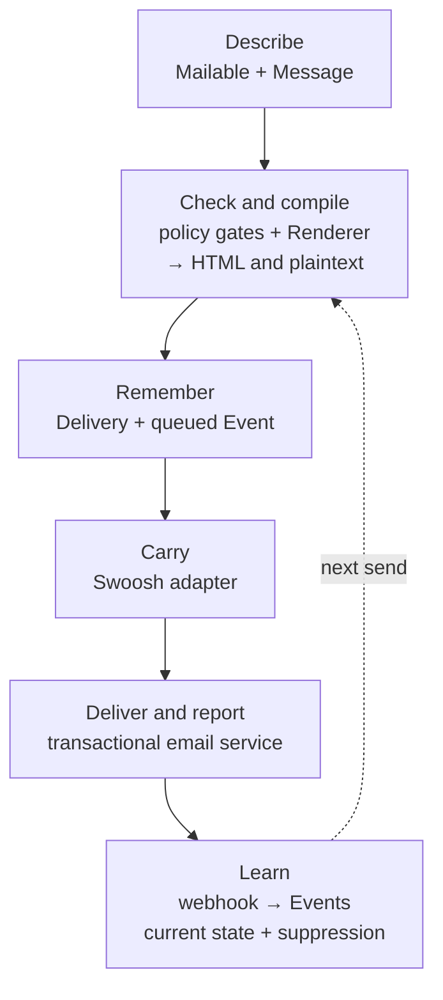
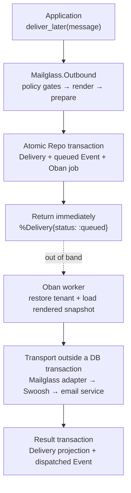
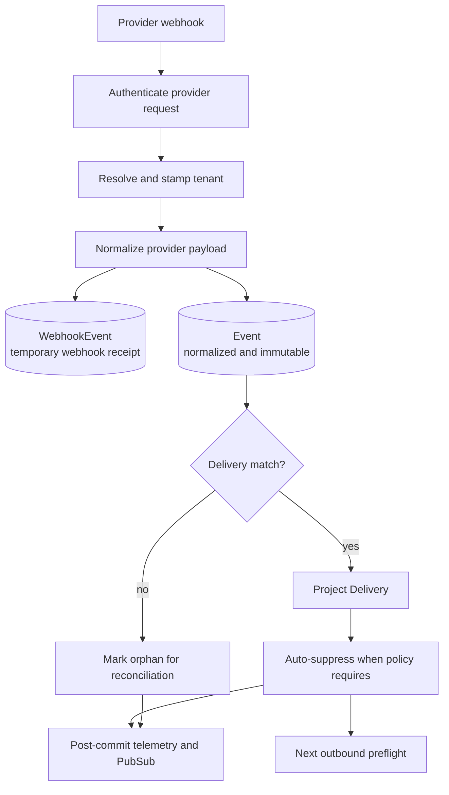
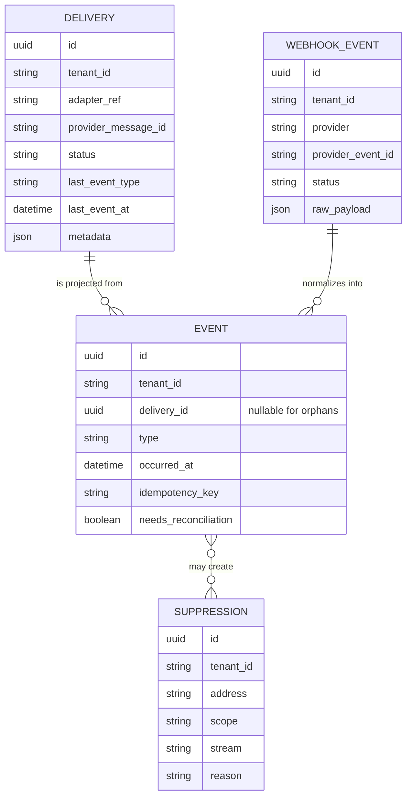

# How Mailglass Works

**Mailglass turns an email from a one-way send call into a lifecycle.**

Follow one welcome email. It begins as intent in your Phoenix application. The
Renderer turns that intent into HTML and plaintext built for email clients;
the outbound pipeline makes it a recorded attempt; and the webhook pipeline
turns what the email service reports into memory. That memory can change the
next attempt.

From the calling side, the durable loop starts with one public call:

```elixir
{:ok, %Mailglass.Outbound.Delivery{status: :queued}} =
  MyApp.UserMailer.welcome(user)
  |> Mailglass.deliver_later()
```

Mailglass does not replace Swoosh. It builds on Swoosh's common email envelope,
`%Swoosh.Email{}`, and its integrations with services such as Postmark and
Amazon SES. Once Mailglass has checked, rendered, and recorded the message, a
Swoosh adapter turns that finished envelope into the service's HTTP or SMTP
request. **Mailglass owns the lifecycle; Swoosh carries the email.**

This guide calls that external transactional email service the **email
service**. Later implementation-focused sections also use the conventional
term **provider**.

## Mailglass in one picture

Read the solid arrows as one message going out. Read the dotted arrow as what
Mailglass learns shaping the next send.



The Renderer appears before transport because it is part of Mailglass's core
job, not presentation sugar. It derives plaintext, inlines CSS, preserves
email-client compatibility output, and removes authoring-only hints. Swoosh
does not perform that compilation; it receives the finished envelope.

The rest of the guide follows the loop in two journeys: first the message goes
out, then the email service reports back. The later sections turn that story
into a data model, a module map, and rules for changing the system safely.

## Vocabulary for the trip

These are the only nouns needed to start. The journeys introduce the sharper
distinctions when they matter.

| Noun | Keep this picture in your head |
|---|---|
| Mailable | Adopter-defined recipe for constructing one kind of email. |
| Message | In-memory work item carrying a `%Swoosh.Email{}` plus Mailglass context. |
| Renderer | Pure compiler from logical email HTML to wire-ready HTML and plaintext. |
| Delivery | Mutable snapshot of one outbound attempt and its latest known state. |
| Event | Immutable fact such as queued, dispatched, delivered, bounced, or opened. |
| WebhookEvent | Temporary receipt containing the provider payload and ingest status. |
| Suppression | Future-send rule answering “may this recipient be contacted?” |

## Journey 1: an outbound message

The recommended production path is `Mailglass.deliver_later/2` backed by Oban:
the request records durable work without waiting for network delivery. That is
the path in the diagram.



Synchronous `deliver/2` and the supervised Task fallback share these policy,
rendering, and adapter boundaries. Shorter notes below cover the places where
their durability differs.

### 1. Authoring produces intent

A mailable is a reusable recipe for one kind of email, not a persisted record.
The macro supplies a constructor, common setters, and delivery delegates. Its
options become policy defaults for every Message the recipe builds:

```elixir
defmodule MyApp.AccountMailer do
  use Mailglass.Mailable,
    stream: :transactional,
    tracking: false
end
```

Every message from this mailable bypasses rate limiting and leaves open/click
tracking disabled. A bulk mailable instead gains bulk-delivery behavior such
as one-click unsubscribe. Declare that policy once on the recipe, not on every
Message.

Those setters update the wrapped Swoosh email while retaining tenant, stream,
mailable, tags, and metadata on the Message. Direct Swoosh operations remain
available through `Mailglass.Message.update_swoosh/2` when an uncommon header
or service-specific option needs them.

`Mailglass.Components` provides HEEx email components, including the
table-based and MSO/VML output hostile email clients still require. Components
also emit temporary `data-mg-*` hints that tell the Renderer how logical
content should appear in plaintext. The current common path renders dynamic
Phoenix components to HTML while building the Message; Mailglass then compiles
that logical HTML into its final email forms.

### 2. Preflight is ordered policy

The single-message path applies five policy gates, in order:

1. tenant context is stamped;
2. tracking is safe for the mailable and stream;
3. the recipient is not suppressed;
4. rate limits allow the attempt;
5. stream policy allows the message.

This ordering is intentional. Policy failures happen before persistence and
before provider work. A stream describes why the mail exists:
`:transactional` for security- and account-critical mail, `:operational` for
product operations, and `:bulk` for mail that needs bulk policy such as
one-click unsubscribe. Streams drive behavior; they are not analytics labels.
The transactional stream bypasses rate limiting so a campaign cannot consume
the budget for password resets or login links.

Only after those gates pass does rendering run. Rendering is a transformation
boundary, not a sixth policy check. If it succeeds, Mailglass allocates the
delivery ID, applies required and Mailglass-specific headers through
`Mailglass.Compliance`, and performs any enabled tracking rewrite before the
first transaction. Authentication-shaped transactional messages are guarded
against unsafe tracking both statically and at runtime.

### 3. Rendering compiles content into an email artifact

“Compiler” is a mental model for a deterministic, ordered transformation—not a
claim that Mailglass compiles HEEx source at runtime. Phoenix has already
compiled HEEx function components. `Mailglass.Renderer.render/2` performs the
email-specific runtime work without database or network access:

1. accept the common-path HTML string, or evaluate a precompiled component
   function;
2. derive plaintext from the logical HTML;
3. inline CSS while preserving email-client conditionals; and
4. remove temporary `data-mg-*` authoring attributes from the wire HTML.

The output is another Message whose inner `Swoosh.Email` contains binary HTML
and plaintext bodies. Outbound preparation may still add compliance headers
and rewrite enabled tracking links before transport.

The boundary is callable on its own—the admin preview uses it without entering
outbound delivery:

```elixir
message = MyApp.UserMailer.welcome(user)
{:ok, rendered} = Mailglass.Renderer.render(message)

%Swoosh.Email{html_body: html, text_body: text} = rendered.swoosh_email
true = is_binary(html) and is_binary(text)
```

That gives the same struct two moments in its life. Before rendering, its body
is logical HTML plus routing and policy context. After rendering, its body is
the email-client-ready artifact. Neither form is evidence that a send was
persisted or dispatched.

Plaintext is generated before CSS inlining. Otherwise the walker would see
VML and inliner artifacts instead of the logical message structure. A render
failure stops before any Delivery, Event, or provider call exists.

This pure boundary is shared by production delivery and admin preview. Preview
therefore proves the same rendered HTML and plaintext, but it does not claim to
show later outbound-only compliance or tracking changes.

> #### Current template boundary {: .info}
>
> Template resolution and dynamic assign binding are also still adopter-owned.
> The direct function path is implementation-facing today: it invokes
> `component_fn.(%{})`, not `component_fn.(Message.assigns)`.

### 4. Persistence brackets, but never contains, transport

The durable Oban path has two persistence boundaries:

- The enqueue transaction inserts the Delivery, appends its `:queued` Event,
  and inserts the Oban job atomically.
- The worker loads the rendered snapshot and calls the adapter with no database
  transaction held open.
- A second transaction applies the `:dispatched` projection and appends the
  matching Event. Adapter failures project and append failure state instead.

Holding a Repo connection while waiting on a provider would turn provider
latency into pool starvation and lock amplification. Synchronous `deliver/2`
uses the same persistence → transport → persistence shape in the caller's
process, without the durable job between the first commit and transport.

### 5. Adapters normalize transport

`Mailglass.Adapter` is the outbound transport behaviour. An adapter accepts a
rendered Message and returns a provider message ID plus an opaque provider
response.

The default bridge, `Mailglass.Adapters.Swoosh`, unwraps the completed
`%Swoosh.Email{}` and calls the configured `Swoosh.Adapter` directly. That
Swoosh adapter knows how to perform the service-specific HTTP or SMTP work.
The bridge then normalizes Swoosh's success and error shapes for the rest of
Mailglass. It does not render content, write records, or handle the service's
later webhooks. `Mailglass.Adapters.Fake` exercises the same Mailglass contract
without external credentials.

The configuration makes the bridge explicit without introducing a Swoosh
Mailer module:

```elixir
config :mailglass,
  adapter:
    {Mailglass.Adapters.Swoosh,
     swoosh_adapter:
       {Swoosh.Adapters.Postmark,
        api_key: System.fetch_env!("POSTMARK_API_KEY")}}
```

Routing can choose the default adapter, a named adapter ref, or a ref returned
by the tenancy callback. The chosen ref is persisted with the Delivery. This
keeps async work deterministic and prevents job arguments from becoming a
serialization format for adapter configuration.

### 6. Dispatched is not delivered

This distinction is load-bearing:

- **Dispatched** means the adapter accepted the handoff and returned a provider
  message ID.
- **Delivered** means a later webhook says the receiving mail system accepted
  the message.

Read these as three snapshots of the same row, not as one value mutating in the
caller's process:

```elixir
# deliver_later/2 returns after the enqueue transaction
%Mailglass.Outbound.Delivery{status: :queued, last_event_type: :queued}

# The Oban worker handed the envelope to the email service
%Mailglass.Outbound.Delivery{status: :sent, last_event_type: :dispatched}

# A later webhook advanced the projection
%Mailglass.Outbound.Delivery{status: :sent, last_event_type: :delivered}
```

The struct returned by `deliver_later/2` cannot update itself when the worker or
a webhook runs. A later query sees the newly projected state.

Four Delivery fields deliberately answer different questions:

| Field | Meaning |
|---|---|
| `status` | Local dispatch outcome such as queued, sent-to-provider, failed, or suppressed. `:sent` does **not** mean delivered. |
| `last_event_type` / `last_event_at` | Newest observed lifecycle fact by event time. Equal or older timestamps do not replace the pointer. |
| Lifecycle timestamps | First known dispatched, delivered, bounced, complained, or suppressed time; each is set once. |
| `terminal` | One-way latch set by terminal evidence; later opens or clicks never clear it. |

Concurrent projection writers use optimistic locking. A loser retries or
fails visibly instead of silently overwriting a newer snapshot.

### 7. Oban moves identity, not an executable Message

Functions, PIDs, and arbitrary assigns make `%Mailglass.Message{}` a poor job
argument. Mailglass instead persists the rendered HTML, text, subject, headers,
routing ref, and delivery identity with the Delivery. The job payload is
deliberately boring:

```elixir
%{
  "delivery_id" => delivery.id,
  "mailglass_tenant_id" => delivery.tenant_id
}
```

This is the handoff from pure compilation to durable execution. Background
workers never rerun adopter template logic; they rehydrate the already-rendered
artifact and continue at the transport boundary. Oban middleware restores the
tenant, then `Mailglass.Outbound.dispatch_by_id/1` loads the row, reconstructs
the minimal Message, resolves its persisted adapter ref, dispatches, and writes
the second transaction.

That list describes the current internal snapshot, not a promise that every
field on `Swoosh.Email` is serialized. A change that makes another field
adapter-relevant must update both snapshot creation and rehydration and prove
their parity in async tests. Reading only one side of that pair is unsafe.

When the Oban dependency is loaded and the host has configured its Oban
runtime, inserting the job is part of the first Multi and gives the durable
path. Mailglass defines the worker, queue, retry policy, and unique job shape;
the host owns the Oban instance.

> #### Other delivery modes {: .warning}
>
> Synchronous `deliver/2` performs transport in the caller after the first
> commit. Without Oban, `deliver_later/2` falls back to a supervised Task and
> warns that delivery is best-effort: a task crash, node shutdown, or VM loss
> can leave a queued Delivery with no automatic retry. If Oban is installed and
> selected but not running, enqueue fails rather than silently downgrading.

`deliver_many/2` is asynchronous and returns
`{:ok, [%Mailglass.Outbound.Delivery{}]}` when batch persistence succeeds. It
performs per-message preflight, records eligible rows in bulk, represents
rejected messages as non-persisted failed result entries, and enqueues only
fresh queued rows. A batch database failure returns one batch-level error.
Database idempotency prevents a replay from silently enqueueing already-settled
deliveries again.

The result list deliberately uses one struct shape for two kinds of result:

| Result entry | Persisted? | Meaning |
|---|---|---|
| `%Delivery{status: :queued}` | Yes | Delivery, queued Event, and durable job exist. |
| `%Delivery{status: :failed}` | No | Synthetic result whose `last_error` reports a per-message preflight rejection. |

Querying the generated ID of a synthetic failure finds nothing.
`{:error, %Mailglass.Error{}}` is reserved for a batch-level database failure.

When an adapter fails, the worker projects a failed Delivery and Event, then
returns the error so Oban can retry according to the job policy.

### 8. Commit first, notify second

`Mailglass.Outbound.Projector.broadcast_delivery_updated/3` publishes to both
tenant-wide and per-delivery topics only after persistence succeeds. PubSub
failure never rolls back a delivery. Consumers that miss a notification can
re-read PostgreSQL, which is why PubSub is acceleration rather than truth.

## Journey 2: the email service reports back

Dispatch opens a second, asynchronous story. The email service reports
deliveries, bounces, complaints, opens, clicks, and unsubscribes through
webhooks. Mailglass turns five service-specific dialects into one event
language.



After a successful ingest, the same request is represented at two different
retention boundaries. These are illustrative value shapes, not structs an
adopter constructs directly:

```elixir
# Temporary receipt for the provider payload and ingest status
%Mailglass.Webhook.WebhookEvent{
  provider: "postmark",
  raw_payload: raw_payload,
  status: :succeeded
}

# Normalized, append-only history
%Mailglass.Events.Event{
  type: :delivered,
  delivery_id: delivery.id,
  normalized_payload: normalized_payload
}
```

### 1. Preserve the original request bytes

Some providers sign the raw body; others authenticate headers, credentials, or
canonical fields decoded from it. Phoenix parsing can change the original
representation, so `Mailglass.Webhook.CachingBodyReader` captures the bytes
while `Plug.Parsers` reads them. This gives every provider verifier the exact
input its protocol requires, and `Mailglass.Webhook.Plug` fails clearly when
that endpoint wiring is missing.

Each `verify!/3` authenticates the provider-defined signed material before
normalization. The persisted WebhookEvent payload is a decoded JSON object, a
decoded batch under `"_batch"`, or the undecodable body under `"_raw"`; it is
replay evidence, not a byte-for-byte signature archive in every case.

### 2. Verify before doing tenant work

The plug resolves provider configuration and calls the provider verifier
before tenant lookup, normalization, or persistence. A forged request receives
no tenant-scoped work and no durable row.

The provider modules isolate two concerns:

- `verify!/3` owns authentication, replay windows, and provider trust rules;
- `normalize/2` is pure mapping into `Mailglass.Events.Event` values.

The behaviour is an internal choke point rather than a promised third-party
provider plugin API. First-party Postmark, SendGrid, Mailgun, SES, and Resend
implementations can therefore evolve with their security requirements without
accidentally widening the stable surface.

### 3. Normalize under tenant scope

Once verification succeeds, `Mailglass.Tenancy.resolve_webhook_tenant/1`
maps request context to a tenant. `with_tenant/2` stamps that identity around
normalization and ingest, ensuring both queries and writes operate in the same
tenant context.

Provider event names and payload shapes disappear at this boundary. Downstream
code works with the common Event taxonomy and provider identifiers carried in
normalized metadata.

### 4. Ingest is one transaction

`Mailglass.Webhook.Ingest.ingest_multi/3` composes a flat Multi that:

1. detects a duplicate provider envelope;
2. inserts or reuses the raw WebhookEvent identity;
3. appends each normalized Event idempotently;
4. matches Events to Deliveries when possible;
5. updates Delivery projections through the Projector;
6. creates any suppression implied by the Event; and
7. marks the webhook envelope succeeded.

The transaction uses local statement and lock timeouts. Projection and
suppression steps use the same outer transaction rather than starting nested
transactions that could commit independently.

After the transaction returns, Mailglass emits duplicate/orphan/normalization
telemetry and broadcasts matched delivery changes. A 200 response acknowledges
both new work and idempotent replays.

Known request failures are classified at the edge: signature failures return
401, an unresolved tenant returns 422, and configuration or ingest persistence
failures return 500. Replay and verified provider control-plane messages are
200 no-ops. This keeps retry signals separate from durable lifecycle Events.

> #### Failure-state reality {: .warning}
>
> The current synchronous ingest path commits `:processing → :succeeded` in
> one transaction. If any ingest step fails, that whole transaction—including
> the new WebhookEvent—rolls back and the provider receives 500. Although the
> schema and operator queries understand `:received`, `:failed`, and `:dead`,
> core ingest does not currently populate a durable webhook DLQ. Do not assume
> a failed request left an evidence row to replay.

### 5. Events can arrive before their Delivery is matchable

A provider may deliver a webhook before the dispatch transaction has stored
its provider message ID. Mailglass does not reject this valid race. It appends
the Event with no delivery ID and marks it as needing reconciliation.

`Mailglass.Events.Reconciler` owns the orphan query and Delivery matching
primitives. `Mailglass.Webhook.Reconciler` orchestrates the sweep: because the
ledger cannot be updated, successful reconciliation appends a `:reconciled`
Event and applies the original fact to the Delivery projection. With Oban,
this can run as scheduled work. Without Oban, `mix mailglass.reconcile`
exposes the same sweep for an external scheduler.

### 6. Evidence can become policy

`Mailglass.Suppression.AutoSuppress` runs inside webhook ingest for matched
events:

- complaints create address suppressions;
- unsubscribes create address-and-stream suppressions; and
- hard bounces create address suppressions.

Deferred and unrelated events do not suppress. Inserts use a conflict target,
so repeated provider evidence converges on the same policy row. The next
outbound preflight consults that row before rendering or provider work.

> #### Orphan policy is a separate concern {: .warning}
>
> Auto-suppression currently runs only when ingest matches an Event to a
> Delivery. Reconciliation projects an orphan's lifecycle fact later, but does
> not retroactively run `Mailglass.Suppression.AutoSuppress`. Preserve that
> distinction when debugging, and treat changing it as an explicit policy
> change with replay/idempotency coverage.

## The data model is the architecture

The four core tables have different mutability and retention rules because
they answer different questions.



The diagram shows logical relationships, not only stored foreign keys. Event
to Suppression is causal; the rows do not carry a direct relational link. The
Event-to-Delivery reference is deliberately not a database foreign key. A
nullable FK could represent an orphan, but it would couple ledger retention to
Delivery retention and prevent the immutable ledger from outliving a deleted
Delivery.

### Delivery: mutable read model

Delivery is optimized for lists, operator views, and fast state checks. The
Projector owns lifecycle changes so write rules do not fragment across send,
webhook, fake-adapter, and reconciliation paths. The field rules summarized in
“Dispatched is not delivered” are enforced there rather than as a fictional
database lifecycle order: an `:opened` Event may legitimately arrive before
`:delivered`.

### Event: immutable normalized ledger

Event has no update API and no `updated_at`. A PostgreSQL trigger raises
Mailglass-specific SQLSTATE `45A01` on UPDATE or DELETE, and `Mailglass.Repo`
translates that database failure into `Mailglass.EventLedgerImmutableError`.

The ledger excludes raw provider bodies. It retains normalized payload and
audit metadata needed to understand the fact without giving permanent
retention to every byte a provider sent.

### WebhookEvent: mutable evidence inbox

WebhookEvent keeps the decoded provider payload, provider-supplied event ID,
and processing state. The payload is redacted from struct inspection but
remains available for support, replay, and targeted erasure. Retention jobs may
prune successful or dead inbox rows without touching the normalized ledger.
The state vocabulary is wider than today's synchronous ingest path; as
described above, a transaction failure rolls back its new receipt rather than
advancing it to `:failed`.

### Suppression: durable policy

Suppressions are tenant-scoped and case-insensitive. Scope distinguishes a
global address block, domain block, and address-within-stream block.
The public removal path refuses complaint- and unsubscribe-derived rows; a
database constraint additionally protects permanent complaint policy. This is
stronger than the removal behavior for a temporary operational suppression.

The default store is `Mailglass.SuppressionStore.Ecto`, which persists these
rows in PostgreSQL. `Mailglass.SuppressionStore.ETS` is a configurable
single-node alternative intended primarily for tests and narrow, small-list
deployments. It is not a cache in front of Ecto and it does not provide durable
policy across node loss.

### Idempotency closes retry loops

Idempotency is enforced at persistence boundaries, not trusted to caller
discipline:

- outbound keys include tenant, mailable, recipient, and rendered content;
- Delivery and Event tables use partial unique indexes when a key is present;
- webhook envelopes are unique by provider and provider event ID; and
- provider batches derive stable per-event keys.

The current webhook-envelope unique index does not include tenant ID. Mailglass
therefore treats a provider event ID as globally unique within that provider,
even when several tenant accounts use it. Changing that assumption requires a
migration and matching replay/idempotency changes, not just a query edit.

On conflict, code either refetches the existing row or treats the insert as a
no-op. That makes provider retries, Oban retries, and explicit replays converge
instead of multiplying side effects.

## Cross-cutting mechanics

The two journeys share a small set of infrastructure rules. These are common
sources of subtle bugs because they do not belong to only one subsystem.

### Tenancy is process context plus query scope

`Mailglass.Tenancy` stores the current tenant in the process dictionary,
provides `with_tenant/2` to stamp and restore it safely, scopes Ecto queries,
and delegates routing decisions to the configured tenancy implementation.
Single-tenant applications use the default implementation without losing the
same internal shape.

Process context does not cross Tasks or Oban jobs. Every async entrypoint must
carry a tenant identifier and re-stamp it before querying. Webhook handlers
must verify authenticity before asking the tenancy resolver to do work.

### Mailglass uses the host Repo through a prefix-aware facade

Mailglass does not start or own an Ecto Repo. `Mailglass.Repo` resolves the
host-configured Repo at runtime and injects `Mailglass.Config.schema/0` into
ordinary reads and writes. Version 2 defaults that schema to `"mailglass"` so
library tables are isolated from the host application's public namespace.

Ecto.Multi does not propagate executor options to each SQL statement. Every
Mailglass table step must therefore use `Mailglass.Repo.multi_opts/1`. Raw SQL
that touches Mailglass tables must qualify the schema explicitly. Forgetting
either rule can appear green in a public-schema test setup while writing to the
wrong place in production.

### The supervision tree owns only library-local processes

`Mailglass.Application` validates configuration, then starts Phoenix PubSub
and the Task supervisor. It conditionally adds owners for the Fake adapter,
rate-limit ETS table, ETS suppression store, Mailgun replay cache, and SES
certificate cache.

These GenServers own tables and lifecycle; they are not serialized hot paths.
For example, the rate limiter updates ETS counters directly rather than
routing every send through a GenServer mailbox.

Oban is an optional dependency owned by the host application. Mailglass
defines workers and middleware when Oban is available, but does not hide an
Oban instance inside its own supervision tree.

### Optional dependencies disappear cleanly

Oban, OpenTelemetry, MJML, gen_smtp, and Sigra are gated behind
`Mailglass.OptionalDeps.*` modules and conditional compilation. The project
maintains a no-optional-dependencies compile lane so merely referencing an
optional integration cannot make the base package fail to compile.

Fallback does not imply equivalence. Most notably, Task-supervised dispatch is
useful and observable but not durable in the way an Oban job is.

### Compliance, tracking, and suppression are different policy layers

These modules are easy to conflate:

- `Mailglass.Compliance` adds protocol and identification headers, including
  RFC 8058 unsubscribe headers where stream policy requires them.
- `Mailglass.Tracking` signs and rewrites enabled open/click tracking through a
  separately configured host.
- `Mailglass.Suppression` decides whether a recipient may be contacted at all.

They meet in outbound preparation but have separate security and lifecycle
concerns. In particular, tracking is off by default, authentication-shaped mail
is guarded, and an unsubscribe is durable policy rather than a tracking event.

### Telemetry describes work without carrying the message

Telemetry follows named families under `[:mailglass, ...]` for rendering,
outbound work, persistence, webhooks, suppression, and reconciliation. Metadata
is intentionally limited to identifiers, enums, counts, outcomes, and timing.
Recipient addresses, subjects, headers, and bodies are forbidden.

Telemetry handlers are observers. They cannot be allowed to determine whether
a committed email operation succeeds.

## How the sibling packages fit

| Package | Package dependencies | Owns |
|---|---|---|
| `mailglass` | No sibling package | Outbound runtime, rendering, provider-delivery webhooks, core persistence and policy |
| `mailglass_admin` | Core; inbound is optional | Phoenix mounts, preview UI, outbound operator UI, and optional inbound operator UI |
| `mailglass_inbound` | Core | Received-message ingress, storage, routing, execution, replay, and inbound telemetry |

Inbound's core dependency is concrete but bounded. It reuses core tenancy and
error conventions, broadcasts through the core `Mailglass.PubSub` instance,
and can reuse core provider-security and Oban tenancy machinery. It owns its
own config, prefix-aware Repo facade, schemas, supervisor, rate limiter,
records, evidence, router, and telemetry. Neither core nor inbound writes the
other package's ledger.

### mailglass_admin: a view over real semantics

`MailglassAdmin.Router` mounts preview and operator surfaces. Preview discovers
Mailables and invokes `Mailglass.Renderer` directly, so it exercises the same
render pipeline as production while structurally avoiding
`Mailglass.Outbound`. It offers render-pipeline confidence, not proof of every
mail client's behavior or a view of later outbound-only compliance and
tracking preparation.

The operator surface consumes core read models such as
`Mailglass.Operator.Deliveries`, `Mailglass.Operator.Timeline`, replay history,
and suppressions. `MailglassAdmin.Auth` leaves authorization with the host
application. LiveViews, components, DOM shape, and CSS remain implementation
details even when the semantic mount and authorization seams are stable.

When `mailglass_inbound` is installed, the admin package reaches it through a
conditional gateway. The optional dependency remains genuinely optional; the
admin base package does not take a hard compile-time dependency on inbound
internals.

### mailglass_inbound: a separate receive lifecycle

Inbound mail is not inserted into the outbound Event ledger. The inbound
package has its own normalized `MailglassInbound.InboundMessage`, durable
record and raw evidence split, routing DSL, execution history, replay
semantics, and telemetry namespace.

Its conceptual journey is:

1. `MailglassInbound.Ingress.Plug` verifies the provider request;
2. it resolves tenant context and normalizes the message;
3. rate limits protect authenticated ingress;
4. normalized records and raw evidence commit before execution;
5. `MailglassInbound.Router` matches recipient, subject, or headers; and
6. execution invokes one `MailglassInbound.Mailbox.process/1` callback.

Oban is the durable execution path. The Task supervisor fallback is bounded
best-effort. Provider acknowledgement reflects durable receipt, not whether
the adopter's mailbox business logic later succeeded.

## Module atlas

This is a reading map, not a new compatibility promise. “Stable” follows the
package stability inventories; “internal” means the module is important to
understand but may change without becoming adopter API.

| Area | Start here | Important entrypoints | Contract posture |
|---|---|---|---|
| Public send facade | `Mailglass`, `Mailglass.Outbound` | `deliver/2`, `deliver_later/2`, `deliver_many/2`, `dispatch_by_id/1` | Delivery APIs stable; worker-oriented helpers are implementation-facing |
| Authoring | `Mailglass.Mailable`, `Mailglass.Message` | `new/1`, native setters, `update_swoosh/2`, `put_function/2` | Stable |
| Rendering | `Mailglass.Renderer`, `Mailglass.Components` | `render/2`, `to_plaintext/1`, email-oriented HEEx components | Body transformation semantics are stable; template resolution and assign binding remain adopter-owned; pipeline helpers are internal |
| Transport | `Mailglass.Adapter`, `Mailglass.Adapters.Swoosh`, `Mailglass.Adapters.Fake` | `deliver/2`, fake event/test helpers | Stable behaviours and shipped adapters |
| Outbound state | `Mailglass.Outbound.Delivery`, `Mailglass.Outbound.Projector` | delivery changesets, `update_projections/2`, `broadcast_delivery_updated/3` | Delivery data is documented; Projector is internal |
| Durable history | `Mailglass.Events`, `Mailglass.Events.Event` | `append/1`, `append_multi/3` | Stable event surface |
| Webhook edge | `Mailglass.Webhook.Router`, `Mailglass.Webhook.Plug` | route macro, `call/2` | Stable mount and request semantics |
| Webhook internals | `Mailglass.Webhook.Provider`, provider modules, `Mailglass.Webhook.Ingest` | `verify!/3`, `normalize/2`, `ingest_multi/3` | Internal first-party machinery |
| Reconciliation | `Mailglass.Events.Reconciler`, `Mailglass.Webhook.Reconciler` | orphan lookup/linking, `reconcile/2` | Mix-task behavior stable; implementation internal |
| Send policy | `Mailglass.Suppression`, `Mailglass.RateLimiter`, `Mailglass.Stream` | `check_before_send/1`, `check/1`, `policy_check/1` | Stable semantics |
| Headers and tracking | `Mailglass.Compliance`, `Mailglass.Compliance.Unsubscribe`, `Mailglass.Tracking` | outbound headers, token signing, tracking rewrite | Stable seams |
| Runtime context | `Mailglass.Config`, `Mailglass.Tenancy`, `Mailglass.Clock` | boot validation, schema/adapter resolution, `with_tenant/2`, `utc_now/0` | Stable seams |
| Persistence mechanics | `Mailglass.Repo`, `Mailglass.Schema`, migration modules | facade operations, `multi_opts/1`, versioned migrations | Internal infrastructure unless explicitly listed otherwise |
| Runtime processes | `Mailglass.Application`, `Mailglass.PubSub`, ETS owners | application boot, topic broadcast, table ownership | Internal infrastructure |
| Observability | `Mailglass.Telemetry`, `Mailglass.Webhook.Telemetry` | named spans and event families | Event contracts stable; emitters internal |
| Preview and operations | `MailglassAdmin.Router`, `MailglassAdmin.Auth` | route macros and authorization callbacks | Narrow stable admin seams |
| Inbound | `MailglassInbound.Ingress.Plug`, `MailglassInbound.Router`, `MailglassInbound.Mailbox` | request ingest, route DSL, `process/1` | Stable inbound seams |

Three edge subsystems are useful but intentionally outside the two central
journeys:

- The installer and versioned migration dispatcher wire Mailglass into a host
  Phoenix application. They create configuration, routes, and schema objects;
  they are not part of every send at runtime.
- `mix mail.doctor` and the `Mailglass.Deliverability` modules perform DNS-only
  SPF, DKIM, DMARC, MX, and BIMI diagnosis. They do not grade inbox placement
  or participate in delivery.
- `Mailglass.TestAssertions` and the Fake adapter make the production pipeline
  observable in tests rather than inventing a second testing-only send path.

## Code-reading routes

When debugging, follow a value through modules instead of reading the tree
alphabetically.

### Trace an Oban send

Start with `Mailglass.Outbound.deliver_later/2` and follow its Oban enqueue
path through the Delivery snapshot, queued Event, and job insertion. Then read
`Mailglass.Outbound.Worker`, the Oban tenancy middleware, and
`dispatch_by_id/1`. That last function uses `rehydrate_message/1` before
adapter-ref resolution and the adapter/projector path. Read the Task branch
only when debugging the non-durable fallback.

The `Mailglass.Outbound.DeliverLaterTest` and
`Mailglass.Outbound.WorkerTest` modules cover enqueue and execution. Add an
explicit snapshot round-trip assertion when changing serialized fields.

### Trace a synchronous send

Read `Mailglass.deliver/2` and `Mailglass.Outbound.deliver/2` for the public
handoff and preflight path, then follow `Mailglass.Renderer.render/2`,
`Mailglass.Compliance`, `Mailglass.Tracking`, the adapter call, and finally
`Mailglass.Events.append_multi/3` with
`Mailglass.Outbound.Projector.update_projections/2`.

### Trace a webhook

Follow `Mailglass.Webhook.Router` → `Mailglass.Webhook.Plug` → the selected
provider's verify/normalize functions → `Mailglass.Webhook.Ingest` →
`Mailglass.Events` → `Mailglass.Outbound.Projector` →
`Mailglass.Suppression.AutoSuppress`. If no Delivery matched, continue into the
two Reconciler modules.

### Trace preview

Follow `MailglassAdmin.Router` → `MailglassAdmin.Preview.Discovery` → the chosen
Mailable → `Mailglass.Renderer`. If the trace enters `Mailglass.Outbound`,
preview has crossed a boundary it is designed not to cross. Compare rendered
HTML and plaintext here; trace Compliance and Tracking separately for the
post-render form used by an actual send.

### Trace a blocked recipient

For a pre-send block, start at `Mailglass.Suppression.check_before_send/1` and
the configured suppression store. For how the row appeared, trace backward
from `Mailglass.Suppression.Entry` to auto-suppression or the unsubscribe
path through `Mailglass.Compliance.UnsubscribeController` and the configured
`Mailglass.Lifecycle` callback.

### Trace tenancy or schema isolation

Start with `Mailglass.Tenancy` for process context, query scoping, webhook
resolution, and adapter-ref routing. Then read `Mailglass.Config.schema/0`,
the `Mailglass.Repo` facade, `Mailglass.Schema`, and the versioned migrations.
For writes, inspect every Ecto.Multi step for `Mailglass.Repo.multi_opts/1` and
inspect raw SQL separately for explicit schema qualification. Use `rg` on the
module name or function to jump from this map into source.

### Trace inbound mail

Follow `MailglassInbound.Ingress.Plug` → provider verification and
normalization → persistence → `MailglassInbound.Execution` →
`MailglassInbound.Router` → the adopter's Mailbox. Keep fresh receive, replay,
and mailbox execution as distinct operations while reading.

## Changing it safely

Before changing a subsystem, write down which durable fact, projection, and
external boundary the change touches. Then preserve these rules:

1. **Never call an email provider inside a database transaction.** Persist
   intent, release the connection, call the adapter, then persist the result.
2. **Never mutate Event history.** Append a new fact; let the Projector update
   the Delivery snapshot, and keep the Event append and its projection in one
   transaction when they represent the same operation.
3. **Keep Delivery projection writes centralized.** New event types must define
   monotonic and terminal behavior in the Projector without collapsing
   dispatch into delivery.
4. **Preserve original webhook bytes and authenticate the provider-defined
   signed material before tenant resolution or persistence.** Authentication
   ordering is a security boundary, not a performance tweak.
5. **Carry tenant identity across every async boundary.** Stamp it again in the
   executing process before scoped queries.
6. **Thread the schema prefix into every Multi step.** The transaction-level
   options are not enough.
7. **Make retries converge in PostgreSQL.** Add or reuse an idempotency key and
   unique constraint before relying on code-level checks.
8. **Broadcast and emit only after commit.** Realtime observers must never see
   work that can still roll back.
9. **Keep provider payloads out of the immutable ledger and telemetry.** They
   belong in the temporary, redacted WebhookEvent store.
10. **Keep rendering pure and preview on the render side of the boundary.** It
    may construct and render Messages; it must not dispatch them or invent a
    preview-only template-binding path. Async changes must keep snapshot
    creation and rehydration deterministic together.
11. **Keep optional dependencies optional at compile time and preserve package
    direction.** Verify normal and no-optional-dependencies builds; core must
    not acquire a dependency on admin or inbound.
12. **Do not infer stability from reachability.** Check the package's API
    stability inventory before asking adopters to call a module directly.
13. **Keep inbound receipt separate from outbound history.** Provider
    acknowledgement follows durable inbound persistence, not later Mailbox
    execution success.

The intended extension points are deliberately narrower than the internal
architecture:

- implement `Mailglass.Adapter` for a new outbound transport;
- implement `Mailglass.Tenancy` for tenant resolution and adapter routing;
- configure or implement the documented clock and compliance lifecycle seams;
- build on stable operator read models rather than querying internal tables
  from UI code; and
- use the inbound Router and Mailbox contracts for received-mail behavior.

Provider webhook behaviours, projection helpers, Repo internals, worker
modules, and admin LiveViews are useful reading surfaces but are not general
extension APIs.

## Where to go next

Use this guide to choose the subsystem; use the focused guide to perform the
work:

- [Code walkthrough](code-walkthrough.md) to trace the architecture through
  representative modules, functions, persistence boundaries, and tests.
- [Getting started](getting-started.md) for installation and a first send.
- [Authoring mailables](authoring-mailables.md) and
  [Components](components.md) for Message construction and rendering.
- [Jobs](jobs.md) for the adopter-facing capability map.
- [Webhooks](webhooks.md) for provider setup and operations.
- [Multi-tenancy](multi-tenancy.md) for tenant resolution and adapter routing.
- [Testing](testing.md) for the Fake adapter, assertions, async ownership, and
  webhook tests.
- [Telemetry](telemetry.md) for event names and metadata contracts.
- [API stability](../docs/api_stability.md) for the authoritative distinction
  between stable, internal, and sibling-package-only surfaces.
